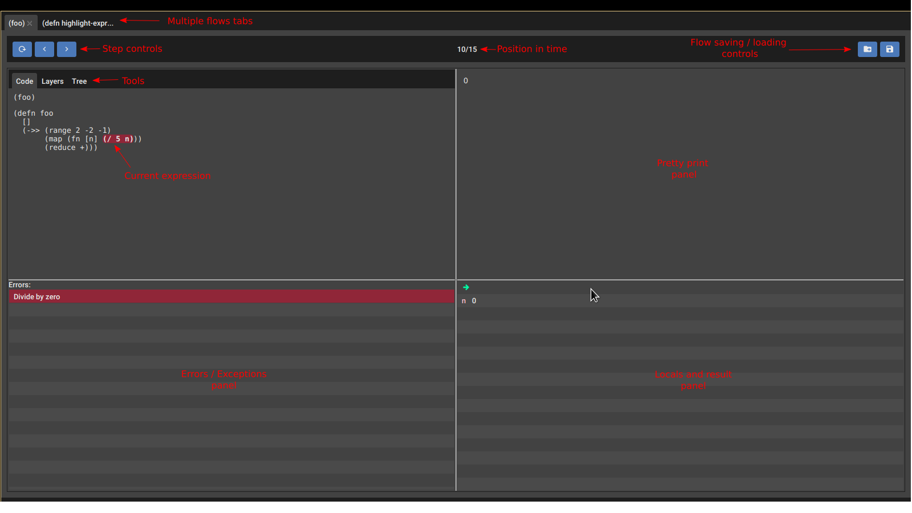
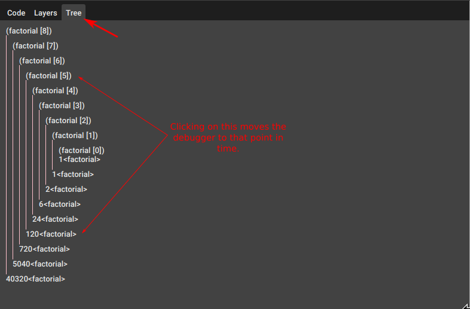
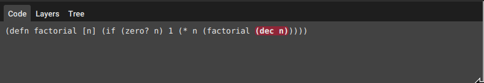
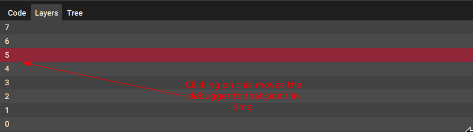
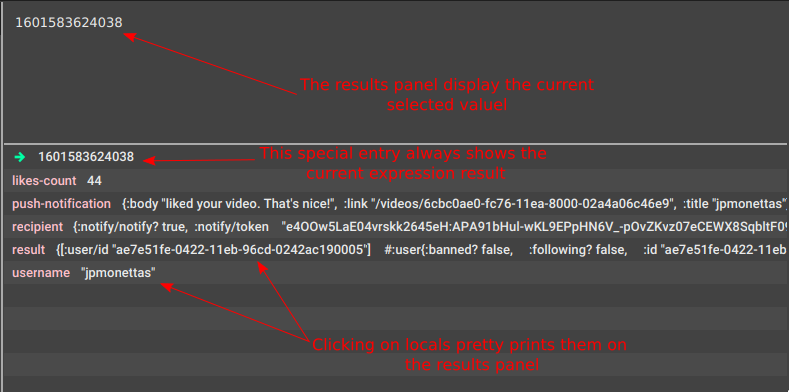

# Flow-storm debugger

A Clojure and ClojureScript debugger with some unique features.


[](https://clojars.org/jpmonettas/flow-storm-debugger)

## Features

- **Clojure and ClojureScript** (browser, nodejs and react-native) support.
- **Step** through expressions **forward and backward in time**.
- **Exceptions** debugging.
- **Locals** inspection.
- **Multiple flows** tracing (see [flows](#flows)).
- **Save, load and share** your debugging sessions (see [saving and loading](#saving-and-loading)).
- Trace **reference state changes**.
- **Call tree** execution analyzer (see [call tree](#call-tree)).
- **Layers** execution analyzer (see [layers](#layers)).
- **Inspect and explore** large expression **results** by pprinting and a collapsible tree.
- Multiple ways of **jumping in time**.
- Library code tracing.

## Running the debugger

```bash
clj -Sdeps '{:deps {jpmonettas/flow-storm-debugger {:mvn/version "0.4.1"}}}' -m flow-storm-debugger.main
```

And that's it !! One instance of the debugger is enough for all your Clojure and ClojureScript projects.

## Instrumenting your code

#### TLDR;

Add [](https://clojars.org/jpmonettas/flow-storm) to your project.

```clojure
(require '[flow-storm.api :as fsa])

;; connect to the debugger
(fsa/connect)

;; trace something
#trace
(->> (range)
	 (map inc)
	 (take 10)
	 (reduce +))

```

For more details on connecting to the debugger and instrumenting your code check [flow-storm](https://github.com/jpmonettas/flow-storm).

## Users Guide

### General overview

Flow-storm is a trace based debugger. This means when you run your instrumented code it will not block execution,
instead, it will trace what is happening as it execute.

It is made of two components :

- a [instrumentation library](https://github.com/jpmonettas/flow-storm), which you will need to add to your dev dependencies
in order to instrument your code.
- this debugger, which you will use to analyze your traces.

This is a overview of the main screen layout :



### Stepping forward and backward in time

You can use the three buttons in the top left corner to move forward and backward in time.

Press the reset button to move the debugger to the first trace of the flow.

There are other ways of moving through time, see [layers](#layers) and [call tree](#call-tree).

### Exploring expressions results

You can explore your expressions results using the top right panel. By default results are displayed pretty printed but you can toggle this 
panel to also display values using a collapsible tree, just buy clicking the button that contains a tree icon.

### <a name="flows"></a> Flows

A flow is a set of traces created by forms executions and all
the traced forms down the same call stack.

This is maybe easier to understand by looking at a example.

```clojure
 #trace
 (defn foo [a b]
	(+ a b))

 #trace
 (defn bar []
   (let [a 10
		 b (foo a a)]
	 (->> (range)
		  (map inc)
		  (filter odd?)
		  (take b)
		  (reduce +))))

 (defn baz []
	#trace (+ 1 2 (+ 3 4))
	#trace (bar))

 (baz)
```

In this example we have 3 functions, the first two of them are entirely traced while for the last one we are just separately tracing two sub forms.

When `baz` executes the first traced form is going to generate one flow, while the second one is going to generate different one.

Observe the traces generated by all this functions are going to belong to the second flow since they are part of the same call stack.

### <a name="saving-and-loading"></a> Saving and loading flows

One nice thing about flows is that you can save and load them. This can be useful for comparing it with other executions of the same code,
share them so other people can take a look and maybe help you debug something or just because you want to analyze them later.

For saving a flow, just click the save button on the top right corner. A popup should show asking for a file name.
Type the file name and hit enter. The flow will be stored in the same folder you are running the debugger.

For loading a stored flow, click the load button, select the flow file, and you will
have the flow loaded in the debugger ready for you to start analyzing.

### <a name="call-tree"></a> Call tree

Calls tree is the tool located under the `Tree` tab. 



It shows how functions are being called, their arguments and their return values.

It is useful as a overview of a complicated flow, I use it also as the starting point when
chasing a bug that involves multiple functions calls.

Clicking on function calls or returns will moves the debugger to that position in time.

*Note:* The calls tree call is showing parametes as they were mapped by the function and not as they were called.

So if we are tracing a fn like : `#trace (defn foo [f & r] (count r))`

When called like `(foo 1 2 3 4)`

it will show : `(foo [1 (2 3 4)])` instead.

### <a name="layers"></a> Layers

Layers is the tool located under the `Layers` tab.

It is useful for analyzing iterations, doesn't matter if they are loops or recursive functions.

When loops are executed, expressions inside a loop are executed multiple times, possibly returning
different values or "layers" in time.

The layers tools allows you to inspect all the values the current expression evaluated to.

Imagine you just traced the factorial function and stepped to the `(dec n)` expression like this :



Now clicking on the `Layers` tab will show you all the traced executions for that form :



Clicking on any layer will also move the debugger to that point in time.

### Locals

The locals panel is the one located in the bottom right corner. It shows the current values
of your local bindings.



Clicking on any locals open a pop up showing the binding value pretty printed.

### Errors and Exceptions

If a exception is throwed during the execution of a flow the debugger will automatically 
get positioned on that trace, so you can move around and figure out what caused the exception.

A new `Errors` panel will show at the bottom left corner displaying all the exceptions captured for this flow.


Clicking on errors will move the debugger to that point in time.

### Reference state changes tracing

You can trace references (like atoms) by using `flow-storm.api/trace-ref` like :

```clojure
user> (fsa/trace-ref re-frame.db/app-db {:ref-name "re-frame-state"})
```

### Library code tracing

See https://github.com/jpmonettas/flow-storm#instrumenting-library-code-with-trace-var

### Keyboard commands

You can use your keyboard to execute some actions :

 Key | Command 
-----|---------------------
x    | Close selected flow
X    | Close all flows

### Working at the repl

Tracing with `#ztrace` instead of `#trace` can be handy when working at the repl.

`#ztrace` will trace all forms with flow-id 0, so the debugger will smash the new traces over the
same flow tab instead of creating multiple tabs.

Only the form that "fires the flow" needs to be traced with `#ztrace`, the rest of the form can be just
traced with a normal `#trace`.

### Themes and font-size

You can choose your theme and font size by providing --theme and --font-size on the command line.

## Developers section

If you are interested in developing flow-storm-debugger take a look at [here](./docs/devs.md).
