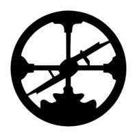

# Flow-storm debugger

A tracing debugger for Clojure and ClojureScript

The idea behind FlowStorm is pretty simple :

  - Instrument Clojure code
  - Run it
  - Record everything that happens during execution
  - Provide a GUI to explore your values and execution flow

There are two ways of using it for Clojure :

  - [With ClojureStorm](https://jpmonettas.github.io/flow-storm-debugger/user_guide.html#_clojurestorm) (recommended) : Swap your dev Clojure compiler by ClojureStorm and get everything instrumented automatically
  - [Vanilla FlowStorm](https://jpmonettas.github.io/flow-storm-debugger/user_guide.html#_vanilla_flowstorm) : Just add FlowStorm to your dev classpath and instrument by re-evaluating forms
	
ClojureStorm is a fork of the official Clojure compiler that adds automatic instrumentation so you don't need to think about it (you can still disable it when you don't need it).

You use it by swapping the official Clojure compiler by ClojureStorm at dev time, using dev aliases or profiles. 

If you are looking for ClojureStorm sources here they are : https://github.com/jpmonettas/clojure/commit/31783717ba6bbf67604179d36c8bf67afe3c53cd
	
# Artifacts

FlowStorm latest stable releases :

- [com.github.jpmonettas/flow-storm-dbg "3.6.3"] The complete debugger (includes flow-storm-inst)
- [com.github.jpmonettas/flow-storm-inst "3.6.3"] A slimmer version with no GUI, to use it for Clojure or ClojureScript remote debugging

ClojureStorm latest stable releases : 

- Clojure 1.12.0 [com.github.jpmonettas/clojure "1.12.0-alpha3_1"]
- Clojure 1.11.1 [com.github.jpmonettas/clojure "1.11.1-3""]

FlowStorm <-> ClojureStorm compatibility table

| FlowStorm/ClojureStorm | 1.12.0-alpha3 | 1.11.1-2 | 1.12.0-alpha3_1 | 1.11.1-3 |
|------------------------|---------------|----------|-----------------|----------|
| > 3.6.0                |               |          | ✓              | ✓       |
| 3.5.1                  | ✓            | ✓       |                 |          |

# Prerequisites

  - jdk11+
  - clojure 1.10.0+

# QuickStart and Documentation

If you want to use it with Clojure checkout the [Clojure QuickStart guide](https://jpmonettas.github.io/flow-storm-debugger/user_guide.html#_clojure)
or the [ClojureScript QuickStart Guide](https://jpmonettas.github.io/flow-storm-debugger/user_guide.html#_clojurescript) if you are using ClojureScript.

Please refer to the [user guide](https://jpmonettas.github.io/flow-storm-debugger/user_guide.html) for a list of features and how to use them.

# Features

Flow storm debugger is packed with a ton of features, here is a non-comprehensive list in no particular order :

- Instrument any Clojure and ClojureScript form (single, namespace or entire codebases)
- A time travel stepper allows you to jump around your execution
- Execution call tree explorer
- Functions calls explorer
- Inspect any values with the value inspector
- Define any value and take it to your repl
- Multi-threaded execution support
- Tap values to the inspector (via `tap>`, `#tap`, and `#tap-stack-trace`)
- Loop debugging
- Infinite loop fuse (via `:thread-trace-limit`)
- Remote Clojure and ClojureScript debugging
- A namespace browser
- Mutable value debugging
- Two instrumentation profiles (:light, :full)
- Conditional tracing
- Customizable mutable value snapshoting (via `flow-storm.runtime.values/snapshot-value` multi-method)

# Clojure has the repl, does it need a debugger?

I gave a talk recently for the London Clojurians, the first slide goes about my answer to this :
https://www.youtube.com/watch?v=A3AzlqNwUXc&t=934s

## Some more demo videos

- [Show me your REPL episode](https://www.youtube.com/watch?v=2nH59edD5Uo)
- [Debugging Clojure with FlowStorm](https://www.youtube.com/watch?v=PbGVTVs1yiU)
- [Debugging ClojureScript with FlowStorm](https://www.youtube.com/watch?v=jMYl32lnMhI)
- [Presentation at London Clojurians](https://www.youtube.com/watch?v=A3AzlqNwUXc)
- [Flows basics](https://www.youtube.com/watch?v=YnpQMrkj4v8)
- [Instrumenting libraries](https://youtu.be/YnpQMrkj4v8?t=332)
- [Debugging the ClojureScript compiler](https://youtu.be/YnpQMrkj4v8?t=533)
- [Browser](https://www.youtube.com/watch?v=cnLwRzxrKDk)
- [Def button](https://youtu.be/cnLwRzxrKDk?t=103)
- [Conditional tracing](https://youtu.be/cnLwRzxrKDk?t=133)

## FAQ

### Why did you build this?

In [this  talk](https://www.youtube.com/watch?v=A3AzlqNwUXc) I tried to argument that even as amazing as it is to have a repl to poke around when trying to understand a piece of code, there are some inconveniences, that I think can be greatly improved by a debugger.

   - Adding prints (or tap>) is inconvenient because you need to guess where the problem probably is first. Also need to type it (and then remove it), and exploring complex values is annoying in the console, that is why tools like portal, reveal, rebl, etc exist.
   - Defining function parameters and locals with def (for sub form execution) isn't easy for complex values
   - When functions contains loops, maps, filters, etc with anonymous functions is hard to capture every value for further inspection.
   - Being Clojure a dynamic lang, running the program in my head isn't easy if I'm not familiar with the code base

So I want to stop guessing and want a tool that allows me to see what is happening when a program runs (small expression or entire code bases), for when I'm hunting a bug or when I just want to understand how something works.

But also I think some Clojure constraints (immutability and being expression based) allows us to go beyond steppers.
We can trace everything that happened when a program run and then inspect the execution using multiple tools, being a stepper one of them.

### How does it compare to other Clojure debuggers?

FlowStorm uses the same technique for instrumenting code that Cider uses, they both instrument by code rewriting, and they don't need source maps, they use a custom coordinates system instead.

Cursive is different since uses JDI (Java Debugging Interface) which is more limited for Clojure since it is line, statement and place oriented instead of expression oriented like FlowStorm and Cider.

So how it compares with Cider debugger (which I used full time before FlowStorm) :

   - FlowStorm is a tracing debugger, while Cider is a blocking one
   - FlowStorm supports Clojure and ClojureScript, while Cider only Clojure
   - FlowStorm supports time travel, Cider just step forward
   - FlowStorm provide multiple tools to understand execution, Cider provides forward stepping and some tracing
   - FlowStorm is IDE independent, so if you switch editors/ide you can keep using it
   - Both have data inspection capabilities
   - Both are the same regarding macros, pretty good IMHO
   - Cider is more integrated into the editor oc, while you need a separate window for FlowStorm

## What to do when things don't work?

Please create a [issue](https://github.com/jpmonettas/flow-storm-debugger/issues) if you think you found a bug.

If you are not sure you can ask in :
 - [#flow-storm slack channel](https://clojurians.slack.com/archives/C03KZ3XT0CF)
 - [github discussions](https://github.com/jpmonettas/flow-storm-debugger/discussions)

## Acknowledgements

Big thanks to [Roam Research](https://roamresearch.com/) for sponsoring this and other of my projects!

Thanks to [Cider](https://github.com/clojure-emacs/cider/) debugger for inspiration and some clever ideas for code instrumentation.
