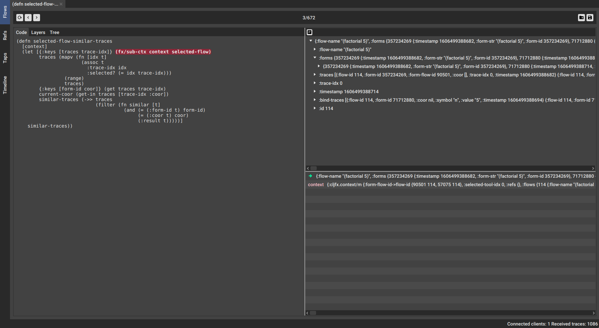
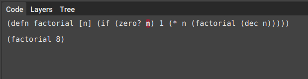
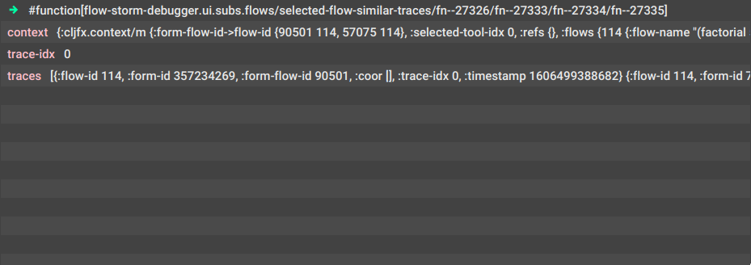
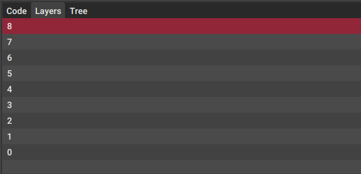
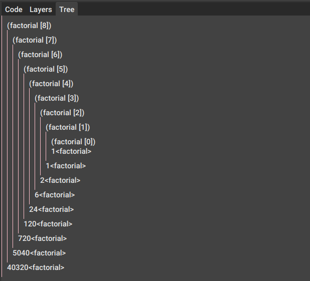
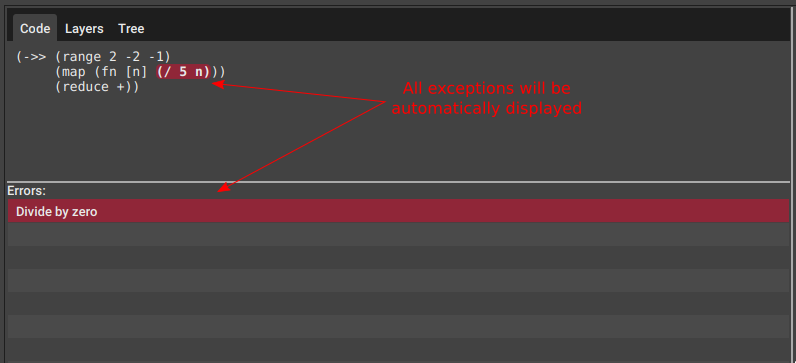
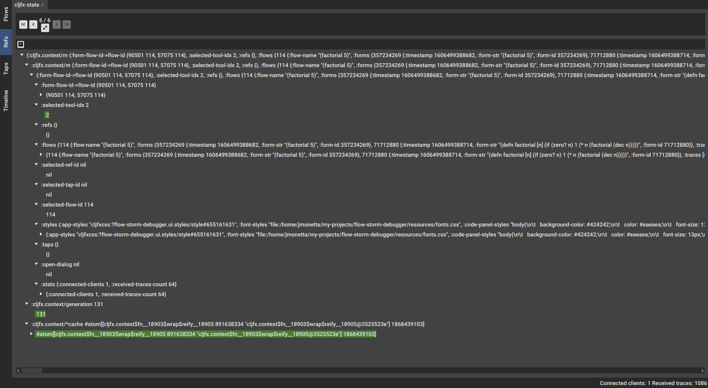
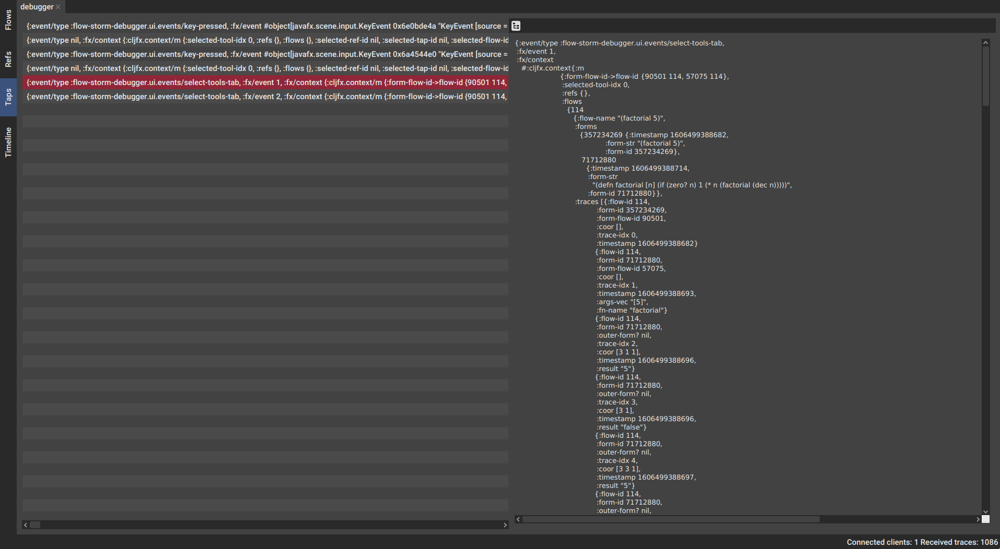
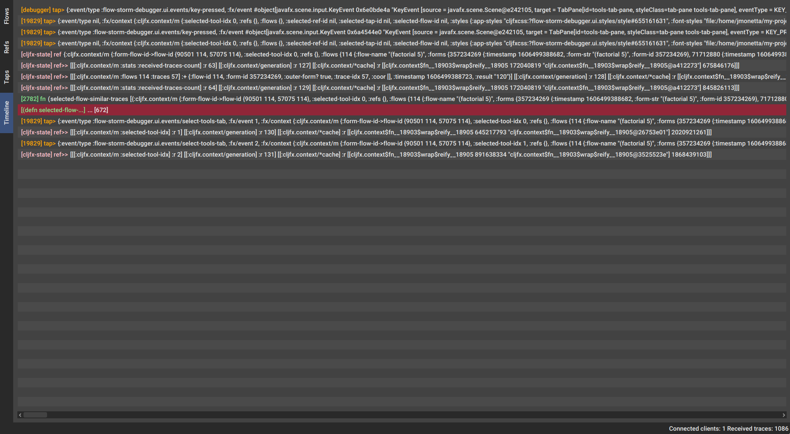
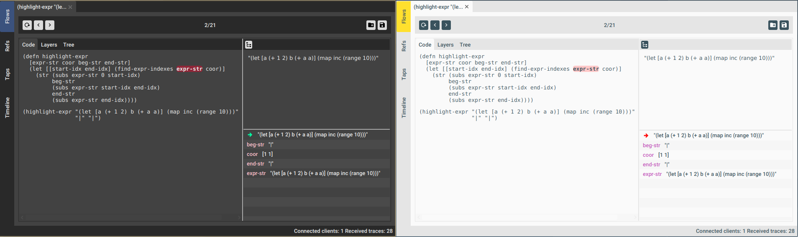

# Flow-storm debugger

A Clojure and ClojureScript debugger with some unique features.


[](https://clojars.org/jpmonettas/flow-storm-debugger)

## Features

- **Clojure and ClojureScript** (browser, nodejs and react-native) support.
- **Step** through expressions **forward and backward in time**.
- **Exceptions** debugging.
- **Locals** inspection.
- **Multiple flows** tracing (see [flows](#flows)).
- **Save, load and share** your debugging sessions.
- Trace **reference state changes**.
- **Call tree** execution analyzer.
- **Inspect and explore** large expression **results** by pprinting and a collapsible tree.
- Multiple ways of **jumping in time** (see call tree and layers).
- Library code tracing.
- And more...

## Running the debugger

```bash
clj -Sdeps '{:deps {jpmonettas/flow-storm-debugger {:mvn/version "0.5.0"}}}' -m flow-storm-debugger.main
```

And that's it !! One instance of the debugger is enough for all your Clojure and ClojureScript projects.

## Instrumenting your code

#### TLDR;

Add [](https://clojars.org/jpmonettas/flow-storm) 
to your Clojure and ClojureScript projects dev dependencies and then :

```clojure
(require '[flow-storm.api :as fsa])

;; connect to the debugger
(fsa/connect)

;; trace something
#trace
(->> (range)
	 (map inc)
	 (take 10)
	 (reduce +))

```

For more details on connecting to the debugger and instrumenting your code check [flow-storm](https://github.com/jpmonettas/flow-storm).

## Users Guide

### General overview

Flow-storm is a trace based debugger. This means when you run your instrumented code it will not block execution,
instead, it will trace what is happening as it execute.

It is made of two components :

- a [instrumentation library](https://github.com/jpmonettas/flow-storm), which you will need to add to your project dev dependencies
in order to instrument your code.
- this debugger, which will collect the traces and provide you tools to analyze them.

### Debugger Tools

The debugger currently provides four tools to help you analyze your instrumented code traces. 

Each tool will be explained in more detail in the next sections but this is a small summary of how they can help you :

- [Flows](#flows) will help you analyze how your code executes. Provides stepper like functionality, function call analisys, locals, expressions results and a bunch of ways for moving through time.
- [Refs](#refs) will help you analyze your refs (atoms, vars, ...) state changes by allowing you to step through them and see the differences.
- [Taps](#taps) shows you all values your connected processes generated via clojure `tap>`. You can inspect them pprinted or with a collapsible tree.
- [Timeline](#timeline) shows you a overview of everything the debugger has received ordered by their timestamps. It also allows you to jump into deeper analysis of whatever you are interested in.

#### Flows <a name="flows"></a>

Flows is going to be your stepper, but a stepper that can jump around in time.



There are a bunch of tools packed in that screenshot, so I will try to explain them separately.

First, every execution of your instrumented code will get its own tab, and can be analyzed independently.

**The top bar** contains the main flow controls and is divided in three.

The top left buttons let you step the execution forward and backwards by one step. You can also quickly restart
the execution by using the restart button.

The middle part shows the current position in the flow, so `3/672` means that 672 traces had been collected for this flow and
we are currently on trace `3`.

Finally the top right buttons let you load or save flows to files. This can be useful for sharing them so other people can take a look
or just because you want to analyze them later.

Next we have the **code panel**.



The code panel shows the relevant code for this flow, marking in red the current expression.

You can analyze the current expression result by using the **result panel** at the top right corner.

Any value in the result panel can be visualized pprinted or with a collapsible tree. 
This can be toggled on/off by the small button in its top left corner.

The bottom right panel contains the **locals panel** which shows the bindings values available for the current expression.



The first row (the one with the right arrow) is special, and always shows the current expression result.
Clicking on any row will show that value in the result panel.

In a different tab next to the **code panel** lays the **layers** and **tree** panels.



The **layers panel**  is useful for analyzing iterations, doesn't matter if they are loops or recursive functions.

When loops are executed, expressions inside it are executed multiple times, possibly returning
different values or "layers" in time.

The layers tools allows you to inspect all the values the current expression evaluated to in different iterations.

Clicking on any layer will also move the debugger to that point in time.

The **tree panel** shows how all the functions in this flow are being called, their arguments and their return values.



Clicking on function calls or returns will moves the debugger to that point in time.

In case any errors or exceptions happen while executing traced code, the **errors panel** will popup and 
the debugger will automatically position itself right on the expression that throwed the error.



Clicking on errors will move the debugger to that point in time.

##### Flows keyboard bindings

Key | Command 
-----|---------------------
x    | Close selected flow
X    | Close all flows

#### Refs <a name="refs"></a>

The refs tool  will help you analyze your refs (atoms, vars, ...) state changes by allowing you to step over the states and see how they change.



Like in the flows tool, every traced reference gets its own tab.

The **top bar** contains some useful controls. You can move to the first, prev, next or last state by using the arrows.
The `6/6` label in the screenshot shows how many state changes you have for this reference and what is the current state being
shown in the panel below.

The small button in the middle allows you to squash your states. After a while you probably don't need all states and are
just interested in the latest ones, this will squash all but the latest 4 states into the initial state.

I find this tool super useful when working with re-frame or cljfx applications.

For re-frame you can instrument the db like :
```clojure
(fsa/trace-ref re-frame.db/app-db {:re-name "browser-app-db-state"})
```

while for cljfx applications I tend to do like :

```clojure
(def *context (atom (fx/create-context {...})))

(fsa/trace-ref *context {:re-name "desktop-app-db-state"})
```

You can add those on you main or init code, right after you execute `(fsa/connect)` and then just have a 
debugger instance open while you use the application.

##### Refs keyboard bindings

Key | Command 
-----|---------------------
x    | Close selected ref
X    | Close all refs


#### Taps <a name="taps"></a>

The taps tool is a tap> value visualizer.



Every connected process gets its own tap tab. This allows you to easily work with values coming from 
different applications.

Clicking on any value on the left will expand it on the right, so you can use your normal pprint or collapsible tree
to explore it.

##### Taps keyboard bindings

Key | Command 
-----|---------------------
x    | Close selected tap
X    | Close all taps

#### Timeline <a name="timeline"></a>

The timeline tool shows you an overview of everything the debugger has received sorted by time.



It merges all the information (every flow, ref, tap) available in the debugger in one view.

I find this useful when debugging distributed applications. Let's say you connected your mobile react-native application
and a couple of services to the debugger. Then you can fire some action on the client and view all the events in the order they
execute.

From there you can click on any row to jump into the right tool for a deeper analysis.

### Debugger command line options and customizations

The debugger accept some command line options you can use to configure some aspects of it :

```bash
clj -Sdeps '{:deps {jpmonettas/flow-storm-debugger {:mvn/version "0.5.0-SNAPSHOT"}}}' -m flow-storm-debugger.main --help

Usage : flow-storm-debugger [OPTIONS]
  -fs, --font-size size  13     Font Size
  -p, --port PORT        7722   Port number
  -t, --theme THEME      :dark  Theme, can be light or dark
  -h, --help

```

For example you can choose between light or dark themes :



## Developers section

If you are interested in developing flow-storm-debugger take a look at [here](./docs/devs.md).

## More ideas to explore

- Try leverage re-frame traces and implemet a UI providing the same utilities re-frame10x provides.
- Implement a interactive code display so you can move in time by clicking over expressions.
- Connect to a socket repl and maybe instrument stuff thru it?
