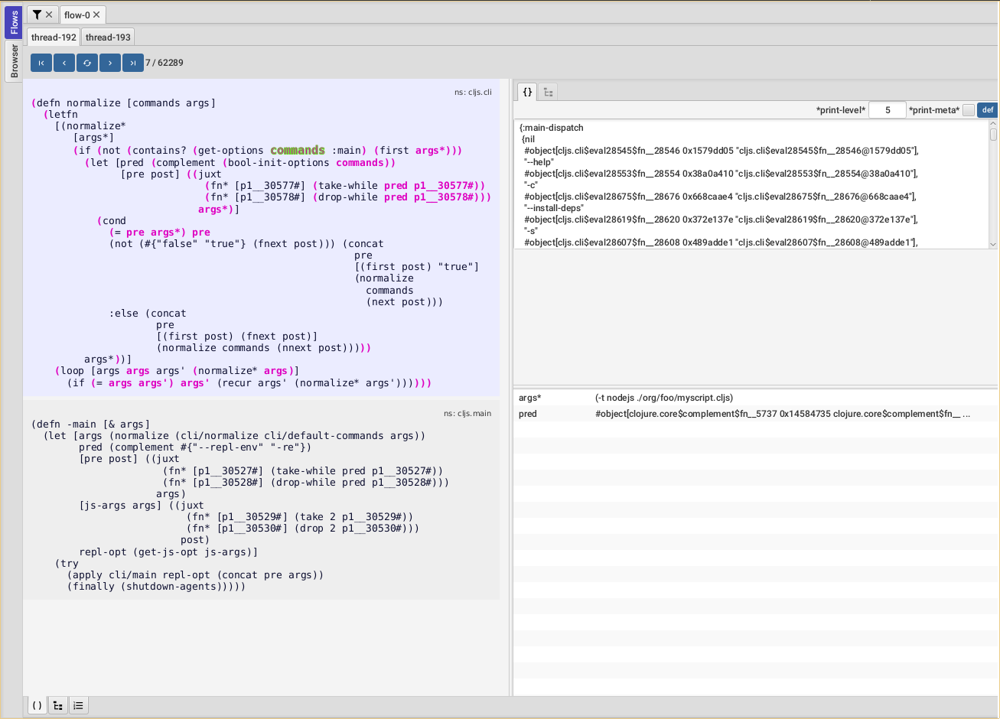

# Flow-storm debugger


This is the central repository for [FlowStorm](http://www.flow-storm.org/) an omniscient time travel debugger for Clojure and ClojureScript.



There are two ways of using it :

  - [With ClojureStorm](https://flow-storm.github.io/flow-storm-debugger/user_guide.html#_clojurestorm) (recommended) : For dev, swap your Clojure compiler by ClojureStorm and get everything instrumented automatically
  - [Vanilla FlowStorm](https://flow-storm.github.io/flow-storm-debugger/user_guide.html#_vanilla_flowstorm) : Just add FlowStorm to your dev classpath and instrument by re-evaluating forms
	
ClojureStorm is a fork of the official Clojure compiler that adds automatic instrumentation so you don't need to think about it (you can still disable it when you don't need it).

You use it by swapping the official Clojure compiler by ClojureStorm at dev time, using dev aliases or profiles. 


	
# Artifacts

FlowStorm latest stable releases :

- The complete debugger (includes `flow-storm-inst`)
  - `[com.github.flow-storm/flow-storm-dbg "3.15.6"]`
- A slimmer version with no GUI, to use it for Clojure or ClojureScript remote debugging
  - `[com.github.flow-storm/flow-storm-inst "3.15.6"]`

ClojureStorm latest stable releases : 

- Clojure 1.12
  - `[com.github.flow-storm/clojure "1.12.0-alpha12"]`
- Clojure 1.11*)
  - `[com.github.flow-storm/clojure "1.11.3-1"]`

ClojureScriptStorm latest stable releases : 

- ClojureScript 1.11.132
  - `[com.github.flow-storm/clojurescript "1.11.132-3"]`

# Prerequisites

  - jdk17+ (if you still need to run it with jdk11 take a look at [here](https://flow-storm.github.io/flow-storm-debugger/user_guide.html#_run_with_jdk_11))
  - clojure 1.11.0+
  - clojure 1.10.* only supported if you use it from source, like `{:git/url "https://github.com/flow-storm/flow-storm-debugger" :git/sha "..."}`

# QuickStart and Documentation

If you want to use it with Clojure checkout the [Clojure QuickStart guide](https://flow-storm.github.io/flow-storm-debugger/user_guide.html#_clojure)

or the [ClojureScript QuickStart Guide](https://flow-storm.github.io/flow-storm-debugger/user_guide.html#_clojurescript) if you are using ClojureScript.

Please refer to the [user guide](https://flow-storm.github.io/flow-storm-debugger/user_guide.html) for a list of features and how to use them.

# ClojureStorm and ClojureScriptStorm

*ClojureStorm* is a dev compiler. It is a fork of the official Clojure compiler enhanced with automatic instrumentation.

To use it, you just swap it with your normal Clojure compiler at dev time (by using deps cli aliases or lein profiles) to improve 
your development experience, while making sure you use your normal compiler for everything else (tests and production).

*ClojureScriptStorm* is the same as ClojureStorm but for ClojureScript, so a fork of the official ClojureScript compiler is enhanced with automatic instrumentation.

ClojureStorm sources are here : https://github.com/flow-storm/clojure
ClojureScriptStorm sources are here : https://github.com/flow-storm/clojurescript

# Features

Flow storm debugger is packed with a ton of features :

- Instrument any Clojure and ClojureScript form (single, namespace or entire codebases)
- A [time travel stepper](https://flow-storm.github.io/flow-storm-debugger/user_guide.html#_code_tool) allows you to jump around your execution
- Many [power stepping](https://flow-storm.github.io/flow-storm-debugger/user_guide.html#_power_stepping) tools
- Value [searching](https://flow-storm.github.io/flow-storm-debugger/user_guide.html#_searching) capabilities
- [Loops](https://flow-storm.github.io/flow-storm-debugger/user_guide.html#_loops) debugging
- [Exception](https://flow-storm.github.io/flow-storm-debugger/user_guide.html#_exception_debugging) debugging
- [Locals](https://flow-storm.github.io/flow-storm-debugger/user_guide.html#_locals) explorer
- [Stack](https://flow-storm.github.io/flow-storm-debugger/user_guide.html#_stack) explorer
- Execution [call tree explorer](https://flow-storm.github.io/flow-storm-debugger/user_guide.html#_call_stack_tree_tool)
- Functions [calls explorer](https://flow-storm.github.io/flow-storm-debugger/user_guide.html#_functions_tool)
- [Inspect any values](https://flow-storm.github.io/flow-storm-debugger/user_guide.html#_value_inspector) with the value inspector
- [Explore your exceptions](https://flow-storm.github.io/flow-storm-debugger/user_guide.html#_exceptions_debugging)
- [Define any values](https://flow-storm.github.io/flow-storm-debugger/user_guide.html#_define_value_for_repl) and take them to your repl
- [Multi-threading](https://flow-storm.github.io/flow-storm-debugger/user_guide.html#_timeline_tool) debugging with a timeline
- [Thread blocking](https://flow-storm.github.io/flow-storm-debugger/user_guide.html#_thread_breakpoints) support via thread breakpoints
- [Println](https://flow-storm.github.io/flow-storm-debugger/user_guide.html#_printer_tool) debugging
- [Tap](https://flow-storm.github.io/flow-storm-debugger/user_guide.html#_taps_tool) values inspection
- [Remote](https://flow-storm.github.io/flow-storm-debugger/user_guide.html#_remote_debugging) Clojure and ClojureScript debugging
- [Programmable](https://flow-storm.github.io/flow-storm-debugger/user_guide.html#_programmable_debugging) debugging
- A [namespace browser](https://flow-storm.github.io/flow-storm-debugger/user_guide.html#_browser_tool)
- [Mutable values](https://flow-storm.github.io/flow-storm-debugger/user_guide.html#_dealing_with_mutable_values) debugging
- [Keyboard](https://flow-storm.github.io/flow-storm-debugger/user_guide.html#_key_bindings) support
- [Themes and styling](https://flow-storm.github.io/flow-storm-debugger/user_guide.html#_styling_and_theming) support 

## Information for developers 

If you want to enhance, fix, debug, or just learn about the internals of FlowStorm take a look at
[here](./docs/dev_notes.md)

## Some demo videos (newers at the top)

- [Reifying execution, the interactive programming missing piece](https://www.youtube.com/watch?v=BuSpMvVU7j4&t=1394s)
- [FlowStorm printer demo](https://www.youtube.com/watch?v=06-MA4HSS24)
- [Smashing a real ClojureScript bug with FlowStorm](https://www.youtube.com/watch?v=4VXT-RHHuvI)
- [Debugging Clojure with FlowStorm 3.6](https://www.youtube.com/watch?v=Mmr1nO6uMzc)
- [Searching and following values](https://www.youtube.com/watch?v=CwXhy-QsZHw)
- [Show me your REPL episode](https://www.youtube.com/watch?v=2nH59edD5Uo)
- [Debugging Clojure with FlowStorm](https://www.youtube.com/watch?v=PbGVTVs1yiU)
- [Debugging ClojureScript with FlowStorm](https://www.youtube.com/watch?v=jMYl32lnMhI)
- [Presentation at London Clojurians](https://www.youtube.com/watch?v=A3AzlqNwUXc)
- [Flows basics](https://www.youtube.com/watch?v=YnpQMrkj4v8)
- [Instrumenting libraries](https://youtu.be/YnpQMrkj4v8?t=332)
- [Debugging the ClojureScript compiler](https://youtu.be/YnpQMrkj4v8?t=533)
- [Browser](https://www.youtube.com/watch?v=cnLwRzxrKDk)
- [Def button](https://youtu.be/cnLwRzxrKDk?t=103)

## FAQ

### Clojure has the repl, why does it need a debugger?

In [this talk](https://www.youtube.com/watch?v=A3AzlqNwUXc&t=934s) I tried to argue that even as amazing as it is to have a repl to poke around,
there are some inconveniences that I think can be greatly improved by a debugger.

   - Defining function parameters and locals with def (for sub form execution) isn't easy for complex values
   - When functions contains loops, maps, filters, etc with anonymous functions is hard to capture every value for further inspection.
   - Being Clojure a dynamic lang, running the program in my head isn't easy if I'm not familiar with the code base
   - Adding prints (or tap>) is inconvenient because you need to guess where the problem probably is first. 
   - Debugging statements needs to be constantly typed and removed which gets repetitive and annoying 
   - Exploring complex values at the console is tedious, that is why tools like portal, reveal, rebl, etc exist.
   
Some of the issues there can be alleviated by adding libraries like scope capture, and portal but it isn't straight forward to integrate them
and even if it was IMHO there is a lot to be gained from a proper integrated debugging system.

So I want to stop guessing and a tool that allows me to see what is happening when a Clojure program runs, be it a small expression or an entire codebase.
I want it to be useful for cases when I'm chasing a bug or when I just want to understand how something works.

I also think some Clojure constraints, like immutability and being expression based, allows us to go beyond repl poking and steppers.

We can record everything that happens when a program runs and then inspect the execution using multiple tools (being a stepper one of them) and fully
integrating it with the repl which also enhance the repl poking experience. 

### What's that magic? How does it work?

The idea behind FlowStorm is pretty simple :

  - Instrument Clojure code
  - Run it
  - Record everything that happens on each thread during execution into timelines
  - Provide a GUI with multiple tools to explore the recorded values and execution flows
  
The interesting part here I guess are instrumentation and recording.

FlowStorm can instrument your code in two ways :

- The ClojureStorm way (recommended for Clojure) which swaps your official Clojure compiler with a patched one (only for dev) that emits extra JVM bytecode everytime you compile something
  to record everything that is happening. This method provides automatic instrumentation everywhere, which is very practical. You still get to un-instrument things if you need to do
  things like measure performance, which isn't going to be accurate with the extra bytecode.
     
- The vanilla way (can be used for Clojure and is the only option for ClojureScript), that just grabs the Clojure source expressions you are interested in, walks the AST, instruments it, and re-evals the 
  instrumented version through the repl. You do this by using reader tags (like `#trace (defn foo [...] ...)`) or by using the FlowStorm browser tab to instrument entire namespaces.
      
Doesn't matter which method instrumented the code, when it runs it will record every expression in a timeline. 

Because Clojure is expression based and most data is immutable, recording is just retaining JVM references together with the source coordinate of each expression. This is pretty fast and a simple way of recording execution.

The timeline is a structure that provides efficient insertion, and efficient access sequentially and as a functions call tree. 

You can see some diagrams here : https://flow-storm.github.io/flow-storm-debugger/user_guide.html#_internals_diagrams_and_documentation

### Isn't recording everything too expensive? Like, does it work with something like a game loop?

The answer here is it depends. First, not everything needs to be recorded all the time. FlowStorm provides easy controls for start/stop recording, instrumenting/un-instrumenting stuff,
freeing recordings, and for keeping an eye on the heap space which you can also control via JVM parameters.

For a lot of applications it is probably fine even if you keep recording everything. For applications that generate a lot of recordings you can keep the recording off and just enable it 
with one click right before executing the action you want to record, and then turn it off again.

For things like game loops you can also use the thread breakpoints functionality which provides a way of pausing/resuming threads at specific points so you have more control on how they 
execute. Combining that with start/stopping recording is probably enough to debug this kind of application.

### Aren't omniscient debuggers slow?

Omniscient debuggers have a reputation of being slow, and I think a bunch of them are. IMHO a lot of the slowness comes from how things need to be recorded and replayed on mutable languages.

For Clojure, just retaining references is enough, and looking into a value at any point in time is just looking at it. Since most references point to immutable values, they don't need to be
reconstructed by applying state changes for each step.

There are mutable language omniscient debuggers that implement stepping backwards fast enough to be useful, but trying to implement things like searching or following values is probably going to be
much slower since everything needs to be reconstructed at each step.

### How does it compare to other Clojure debuggers?

There are many comparison points with different Clojure debugging tools, I'll try to list some of them here. 

If you feel something here is unfair or needs to be clarified please open an issue or submit a PR. Also if you would like to see here how it compares with any other debugging tool let me know.

The first big difference is that FlowStorm works for Clojure and ClojureScript while most debuggers like Cider/VSCode/Cursive only work for Clojure. So once you learn 
to use FlowStorm you can use it with both languages.

The second imho big difference is that most debugging tools are designed to understand small pieces of execution you could be interested in, while FlowStorm
is designed to look at a program execution as a whole, to be used not only while chasing bugs but also as a development companion to help you reason about whatever 
system you are running.

Most tools like Cider, Cursive or VScode debuggers are blocking steppers and require you to add breakpoints to specific places, which is okay if you have an idea
already of where the bug could be located, but they fall short if you aren't sure, or you just want to use the tool to understand an entire codebase execution.

#### FlowStorm VS Cursive (or Browser's for ClojureScript) debuggers

I think the main difference here is FlowStorm being expression and value oriented while the Cursive and Browser's one being line and memory poking oriented,
which I don't think is very useful in Clojure[Script]. If you want to experience what I mean, try to debug this exception using Cursive vs FlowStorm/Cider/VSCode :

```
(defn foo [n]
  (->> (range n)
       (filter odd?)
       (partition-all 2)
       (map second)
       (drop 10)
       (reduce +)))

(foo 70)
```

On the other side, the nice thing about the Cursive debugger is that you can use it to step over Java code which is useful if you have a mixed lang codebase. But for those cases
you can always use both.

#### FlowStorm VS Cider/VSCode debuggers

Cider and VSCode debuggers are steppers, so I'll only be comparing it against the stepping and value inspection capabilities of FlowStorm, but keep in mind that FlowStorm provides
many more features than stepping. Cider provide some tracing capabilities to trace entire namespaces but it relies on printing to the console which I haven't found useful outside of very specific situations, so
I don't think it is useful to understand an entire codebase.

For the steppers, the main difference is that Cider/VSCode are blocking debuggers, which are nice in some situations but only provide stepping forward, while FlowStorm allows you to
step in many different ways.

Another difference is that currently on Cider/VSCode you can't step into functions unless you have previously instrumented them, which for the most isn't a problem in FlowStorm if you are using ClojureStorm.

A nice thing about Cider/VSCode steppers is that you get to step over your editor source code, which can also be done in FlowStorm if you use an integration like CiderStorm.

There is also some code that currently can't be stepped with Cider/VSCode that can be with FlowStorm. This is code that happens to be inside literal sets of maps with more than 8 keys.

If you want to compare it try stepping code like this in both debuggers :

```
(defn bla []
  {(+ 1 2) (first #{3})
   2       (+ 1 1)
   4       (+ 2 2)
   6       (+ 3 3)
   8       (+ 4 4)
   10      (+ 5 5)
   12      (+ 6 6)
   14      (+ 7 7)
   16      (+ 8 8)})

(bla)

```

   
## What to do when things don't work?

Please create a [issue](https://github.com/flow-storm/flow-storm-debugger/issues) if you think you found a bug.

If you are not sure you can ask in :
 - [#flow-storm slack channel](https://clojurians.slack.com/archives/C03KZ3XT0CF)
 - [github discussions](https://github.com/flow-storm/flow-storm-debugger/discussions)

## Acknowledgements

Big thanks to [Roam Research](https://roamresearch.com/) for sponsoring this and other of my projects!


Thanks to [Cider](https://github.com/clojure-emacs/cider/) debugger for inspiration and some clever ideas for code instrumentation.
