= FlowStorm debugger User's Guide
:source-highlighter: rouge
:author: By Juan Monetta
:lang: en
:encoding: UTF-8
:doctype: book
:toc: left
:toclevels: 3
:sectlinks:
:sectanchors:
:leveloffset: 1
:sectnums:

_FlowStorm_ is a tracing debugger for Clojure and ClojureScript.

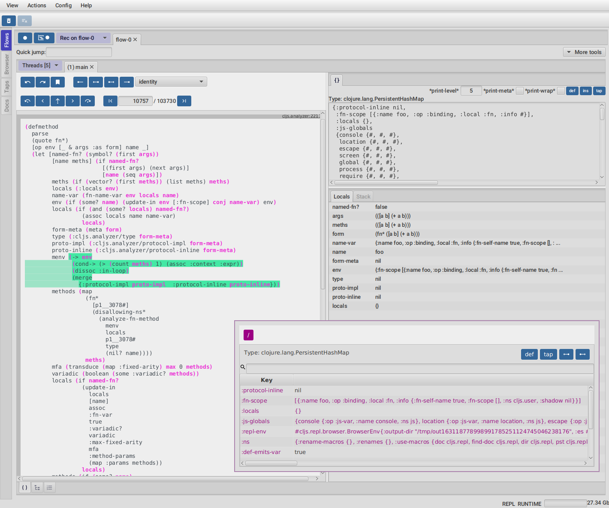

It can instrument any Clojure code and provides many tools to explore and analyze your programs executions.

= Quick start

Before you start check _FlowStorm_ minimum requirements.

[IMPORTANT]
.Minimum requirements
====
	- jdk >= 17 (if you still need to run it with jdk11 take a look at <<#_run_with_jdk_11,here>>)
	- Clojure >= 1.10.0
====

== Clojure

There are two ways of using _FlowStorm_ for Clojure :

	- With <<#_clojurestorm,ClojureStorm>> (recommended) : Swap your Clojure compiler at dev time by ClojureStorm and get everything instrumented automatically
	- <<#_vanilla_flowstorm,Vanilla FlowStorm>> : Just add FlowStorm to your dev classpath and instrument by tagging and re-evaluating forms
    
=== ClojureStorm

This is the newest and simplest way of using _FlowStorm_. It requires you to swap your official Clojure compiler by _ClojureStorm_ only at dev time.

Swapping compilers sounds like a lot, but don't worry, _ClojureStorm_ is just a patch applied over the official compiler with some
extra stuff for automatic instrumentation. You shouldn't encounter any differences, it is only for dev, and you can swap it back
and forth by starting your repl with a different alias or lein profile.

The easiest way to run and learn _FlowStorm_ with _ClojureStorm_ is by running the repl tutorial.

==== Try it with no project and no config

You can start a repl with FlowStorm with a single command like this :

[%nowrap,bash]
----
;; on Linux and OSX
clj -Sforce -Sdeps '{:deps {} :aliases {:dev {:classpath-overrides {org.clojure/clojure nil} :extra-deps {com.github.flow-storm/clojure {:mvn/version "1.12.1"} com.github.flow-storm/flow-storm-dbg {:mvn/version "4.4.6"}}}}}' -A:dev

;; on Windows
clj -Sforce -Sdeps '{:deps {} :aliases {:dev {:classpath-overrides {org.clojure/clojure nil} :extra-deps {com.github.flow-storm/clojure {:mvn/version """1.12.1"""} com.github.flow-storm/flow-storm-dbg {:mvn/version """4.4.6"""}}}}}' -A:dev
----

Pasting that command on your terminal will bring up a repl with _FlowStorm_ and the compiler swapped by _ClojureStorm_. When the repl comes up
evaluate the `:dbg` keyword to bring up the UI and then click on  `Help->Tutorial` on the menu for a tour of the basics.

After the tutorial you may want to use it on your projects. You use it by adding a deps.edn alias or  lein profile.

The simplest way is to setup it globally, so that is what we are going to do next. You can also add it only
to specific projects if they require special configurations.

==== Global setup as deps.edn aliases

You can setup your global `~/.clojure/deps.edn` (on linux and macOS) or `%USERPROFILE%\.clojure\deps.edn` (on windows) like this :

[%nowrap,clojure]
----
{...
 :aliases
 {:1.12-storm {:classpath-overrides {org.clojure/clojure nil}
               :extra-deps {com.github.flow-storm/clojure {:mvn/version "1.12.1"}
                            com.github.flow-storm/flow-storm-dbg {:mvn/version "4.4.6"}}}

  ;; Optional plugins you find yourself using regularly 
  :fs-web-plugin {:extra-deps {com.github.flow-storm/flow-storm-web-plugin {:mvn/version "1.0.0-beta"}}
                  :jvm-opts ["-Dclojure.storm.instrumentOnlyPrefixes.webPlugin=org.httpkit.server,ring.adapter.jetty,next.jdbc.result-set"
                             "-Dflowstorm.plugins.namespaces.webPlugin=flow-storm.plugins.web.all"]}
  
  ...}}
----

Then you can start your repls with the `:1.12-storm` alias (like `clj -A:1.12-storm`). When the repl comes up evaluate the `:dbg` keyword to bring up the UI,
then click on  `Help->Tutorial` on the menu for a tour of the basics.

==== Global setup as leiningen profiles

You can setup your global `~/.lein/profiles.clj` (on linux and macOS) or `%USERPROFILE%\.lein\profiles.clj` (on windows) like this :

[%nowrap,clojure]
----
{:1.12-storm
 {:dependencies [[com.github.flow-storm/clojure "1.12.1"]
                 [com.github.flow-storm/flow-storm-dbg "4.4.6"]]
  :exclusions [org.clojure/clojure]}

 ;; Optional plugins you find yourself using regularly 
 :fs-web-plugin
 {:dependencies [[com.github.flow-storm/flow-storm-web-plugin "1.0.0-beta"]]
  :jvm-opts ["-Dclojure.storm.instrumentOnlyPrefixes.webPlugin=org.httpkit.server,ring.adapter.jetty,next.jdbc.result-set"
             "-Dflowstorm.plugins.namespaces.webPlugin=flow-storm.plugins.web.all"]}
...}
----

Then you can start your project repls with `+1.12-storm` profile (like `lein with-profile +1.12-storm repl`). When the repl comes up evaluate the `:dbg` keyword to bring up the UI,
then click on  `Help->Tutorial` on the menu for a tour of the basics.

[NOTE]
.Running lein repl without a project
====
For some reason if you run `lein with-profile +1.12-storm repl` outside of a project it will not run with the profile
activated correctly.
====

==== Per project setup with deps.edn

If your project is using deps.edn, you can add an alias that looks like this :

[%nowrap,clojure]
----
{...
 :aliases {:1.12-storm
           {;; for disabling the official compiler
            :classpath-overrides {org.clojure/clojure nil} 
            :extra-deps {com.github.flow-storm/clojure {:mvn/version "1.12.1"}
                         com.github.flow-storm/flow-storm-dbg {:mvn/version "4.4.6"}}}}}
----

Once you have setup your deps.edn, start your repl with the `:1.12-storm` alias and run the debugger by evaluating
the `:dbg` keyworkd on your repl (this means just type `:dbg` and hit return).

If it is your first time using FlowStorm, when the UI comes up click on `Help->Tutorial` on the menu for a tour of the basics.

If you need more fine control over instrumentation see <<#_controlling_instrumentation,controlling instrumentation>>.

==== Setup with leiningen

If your project uses lein, you can add a profile that looks like this :

[%nowrap,clojure]
----
(defproject my.project "1.0.0"
  :profiles {:1.12-storm
             {:dependencies [[com.github.flow-storm/clojure "1.12.1"]
                             [com.github.flow-storm/flow-storm-dbg "4.4.6"]]
              :exclusions [org.clojure/clojure]}}
  ...)
----

Once you have setup your lein profile globally or per project, start your repl with the `1.12-storm` profile and run the debugger by evaluating
the `:dbg` keyworkd on your repl (this means just type `:dbg` and hit return).

Make sure you activate the profile with `lein with-profile +1.12-storm repl`. 

If it is your first time using FlowStorm, when the UI comes up click on `Help->Tutorial` on the menu for a tour of the basics.

If you need more fine control over instrumentation see <<#_controlling_instrumentation,controlling instrumentation>>.

[NOTE]
.lein dependencies
====
If you are using lein < 2.11.0 make sure your global :dependencies don't include the official org.clojure/clojure dependency.
Moving to lein latest version should work ok even if your global :dependencies contains the Clojure dep.
====

=== Vanilla FlowStorm

If you use the https://clojure.org/guides/deps_and_cli[clojure cli] you can start a repl with the _FlowStorm_ dependency loaded like this :

[,bash]
----
;; on Linux and OSX
clj -Sforce -Sdeps '{:deps {com.github.flow-storm/flow-storm-dbg {:mvn/version "4.4.6"}}}'

;; on Windows
clj -Sforce -Sdeps '{:deps {com.github.flow-storm/flow-storm-dbg {:mvn/version """4.4.6"""}}}'
----

If you are a https://leiningen.org/[lein] user add the dependency to your project.clj `:dependencies` and run `lein repl`.

Then require the api namespace and start the debugger :

[%nowrap,clojure]
----
user> (require '[flow-storm.api :as fs-api]) ;; the only namespace you need to require

user> (fs-api/local-connect) ;; will run the debugger GUI and get everything ready
----

You should now see a empty debugger window. Click on the recording button to leave the debugger in
recording mode and the let's debug something:

[%nowrap,clojure]
----
user> #rtrace (reduce + (map inc (range 10))) ;; #rtrace will instrument and run some code
----

After running it, you should get the return value of the expression (as if #rtrace wasn't there),
but now you will also have the debugger UI showing your recordings.

From here you probably want to check out the <<#_flows_tool, Flows tool>> which contains a lot of information
about exploring your recordings.

== ClojureScript

Debugging ClojureScript is a case of remote debugging in _FlowStorm_. This means the debugger
will run in a separate process and connect to the debuggee (your browser or nodejs runtime) via a websocket and optionally
an nrepl server.

There are two ways of using _FlowStorm_ with ClojureScript :

    - With <<#_clojurescriptstorm_with_shadow_cljs,ClojureScriptStorm>> (recommended) : Swap your ClojureScript compiler by ClojureScriptStorm at dev and get everything instrumented automatically
	- <<#_clojurescript_vanilla_flowstorm,Vanilla FlowStorm>> : Just add FlowStorm to your dev classpath and instrument by tagging and re-evaluating forms
    
_ClojureScriptStorm_ is a fork of the official ClojureScript compiler that adds automatic instrumentation so you don't need to think about it (you can still disable it when you don't need it).

You use it by swapping the official ClojureScript compiler by _ClojureScriptStorm_ at dev time, using dev aliases or profiles.

[NOTE]
.Repl connection
====
For enabling every debugger feature, _FlowStorm_ needs to connect to a cljs repl.
Currently only shadow-cljs repl over nrepl is supported.
====

=== ClojureScriptStorm with shadow-cljs

[IMPORTANT]
.Minimum requirements
====
    - For ClojureScript 1.11.* shadow-cljs >= 2.25.4,  For ClojureScript 1.12.* shadow-cljs >= 3.1.1
    - FlowStorm >= 3.7.4
====

For setting up _FlowStorm_ with shadow-cljs you need to modify two files, your `shadow-cljs.edn` and your `deps.edn`.
This is setup once and forget, so once you have configured _FlowStorm_ you can do everything from the UI, without
any other sources modifications.

If you want a shadow-cljs template to play with, take a look at https://github.com/jpmonettas/shadow-flow-storm-basic/[this repo].

[NOTE]
.shadow-cljs
====
Currently you can only use _ClojureScriptStorm_ with shadow-cljs if you are resolving your
dependencies with deps.edn. This means having `:deps true` or similar in your shadow-cljs.edn.
If you have your dependencies directly in your shadow-cljs.edn you will have to use <<#_clojurescript_vanilla_flowstorm,Vanilla FlowStorm>>
for now.
This is because there is currently no way to swap the ClojureScript compiler in shadow-cljs.edn.
====

First, make your shadow-cljs.edn looks something like this :

[%nowrap,clojure]
----
{:deps {:aliases [:dev]}
 :nrepl {:port 9000}
 ... 
 :builds
 {:my-app {...
           :devtools {:preloads [flow-storm.storm-preload]
                      :http-port 8021}}}}
----

So, the important parts are: you need to tell shadow to apply your deps.edn dev alias, set up a nrepl port,
and also add `flow-storm.storm-preload` to your preloads. If you have other preloads make sure `flow-storm.storm-preload`
is the first one.

Then, modify your `deps.edn` dev profile to look like this :

[%nowrap,clojure]
----
{...
 :aliases
 {:dev {:classpath-overrides {org.clojure/clojurescript nil} ;; disable the official compiler
        :extra-deps {thheller/shadow-cljs {:mvn/version "3.1.1" 
                                           :exclusions [org.clojure/clojurescript]}
                     ;; bring ClojureScriptStorm
                     com.github.flow-storm/clojurescript {:mvn/version "1.12.42-0"}
                     ;; add FlowStorm runtime dep
                     com.github.flow-storm/flow-storm-inst {:mvn/version "4.4.6"}}
       :jvm-opts ["-Dcljs.storm.instrumentOnlyPrefixes=your-app-base-ns"
                   "-Dcljs.storm.instrumentEnable=true"
                   "-Dflowstorm.startRecording=false"]}}}
----

There are lots of things going on there, but the main ones are: disabling the official compiler, adding
_ClojureScriptStorm_ and _FlowStorm_ dependencies, and then configuring what you want _ClojureScriptStorm_ to automatically
instrument.

It is important to configure what namespaces you want to instrument, and you do this by setting the
`cljs.storm.instrumentOnlyPrefixes` jvm property.

This is a comma separated list of namespaces prefixes, you normally want your app namespaces plus some libraries, like :
`cljs.storm.instrumentOnlyPrefixes=org.my-app,org.my-lib,hiccup`

And this is it. Once you have it configured, run your shadow watch as you normally do, load your app on the browser (or nodejs).

Whenever your need the debugger, on a terminal run the ui with your shadow-cljs.edn data :

[,bash]
----
clj -Sforce -Sdeps '{:deps {com.github.flow-storm/flow-storm-dbg {:mvn/version "4.4.6"}}}' -X flow-storm.debugger.main/start-debugger :port 9000 :repl-type :shadow :build-id :my-app
----

and then reload you page so it connects to it.

Since we started the app with `flowstorm.startRecording=false` you will have to click on the record button once to start recording.
Whenever recording is enable and something executes under an instrumented namespace you should see the recordings appear in the debugger
under the main thread.

[NOTE]
.recording expressions typed on the repl
====
If you type at the repl something like `(defn foo [a b] (+ a b))` under an instrumented ns, the `foo` function will get instrumented
automatically and you will able to explore the recordings after the function is called.
On the other side, typing a simple expression like `(+ 1 2)` will not show anything, this is currently a limitation but you can
still make that work by wrapping the expression on a fn and immediately calling it, like `((fn [] (+ 1 2)))`
====

=== ClojureScriptStorm with cljs.main

You can use _FlowStorm_ and _ClojureScriptStorm_ with cljs.main.

To compile instrumented files :

[%nowrap,bash]
----
clj -J-Dcljs.storm.instrumentOnlyPrefixes=org.foo -J-Dcljs.storm.instrumentEnable=true -Sdeps '{:paths ["src"] :deps {com.github.flow-storm/clojurescript {:mvn/version "1.11.132-9"} com.github.flow-storm/flow-storm-inst {:mvn/version "4.4.6"}}}' -M -m cljs.main -co '{:preloads [flow-storm.storm-preload] :main org.foo.core}' --compile
----

To run a repl that instrument everything under org.foo :

[%nowrap,bash]
----
clj -J-Dcljs.storm.instrumentOnlyPrefixes=org.foo -J-Dcljs.storm.instrumentEnable=true -Sdeps '{:paths ["src"] :deps {com.github.flow-storm/clojurescript {:mvn/version "1.11.132-9"} com.github.flow-storm/flow-storm-inst {:mvn/version "4.4.6"}}}' -M -m cljs.main -co '{:preloads [flow-storm.storm-preload] :main org.foo.core}' --repl
----

Then run the _FlowStorm_ UI :

[%nowrap,bash]
----
clj -Sforce -Sdeps '{:deps {com.github.flow-storm/flow-storm-dbg {:mvn/version "4.4.6"}}}' -X flow-storm.debugger.main/start-debugger
----

And now refresh your browser page so your browser app connects to the UI.

=== ClojureScript vanilla FlowStorm

Let's say you are using https://github.com/thheller/shadow-cljs[shadow-cljs] to start a ClojureScript repl.

First you need to add _FlowStorm_ dependency to your project dependencies, like this :

[%nowrap,clojure]
----
$ cat shadow-cljs.edn

{...
 :dependencies [... [com.github.flow-storm/flow-storm-inst "4.4.6"]]

 ;; the next two lines aren't needed but pretty convenient
 :nrepl {:port 9000}
 :my-build-id {:devtools {:preloads [flow-storm.preload]}}
 ...} 
----

Then let's say you start your repl like :

[,bash]
----
npx shadow-cljs watch :my-build-id

shadow-cljs - config: /home/jmonetta/demo/shadow-cljs.edn
shadow-cljs - server version: 2.19.0 running at http://localhost:9630
shadow-cljs - nREPL server started on port 9000
shadow-cljs - watching build :my-build-id
[:my-build-id] Configuring build.
[:my-build-id] Compiling ...
[:my-build-id] Build completed. (127 files, 0 compiled, 0 warnings, 6.19s)

cljs.user=> 
----

As you can see from the output log shadow-cljs started a nrepl server on port 9000, this is the port _FlowStorm_ needs to connect to,
so to start the debugger and connect to it you run :

[,bash]
----
;; on linux and mac-os
clj -Sforce -Sdeps '{:deps {com.github.flow-storm/flow-storm-dbg {:mvn/version "4.4.6"}}}' -X flow-storm.debugger.main/start-debugger :port 9000 :repl-type :shadow :build-id :my-build-id

;; on windows
clj -Sforce -Sdeps '{:deps {com.github.flow-storm/flow-storm-dbg {:mvn/version """4.4.6"""}}}' -X flow-storm.debugger.main/start-debugger :port 9000 :repl-type :shadow :build-id :my-build-id
----

And that is all you need, the debugger GUI will pop up and everything will be ready.

Try tracing some code from the repl :

[%nowrap,clojure]
----
cljs.user> #rtrace (reduce + (map inc (range 10))) ;; #rtrace will instrument and run some code
----

After running it, you should get the return value of the expression (as if #rtrace wasn't there).

The debugger thread list (the one on the left) shows all the threads it has recordings for. Because we are
in javascript land there will always be just one thread, called `main`.
Double clicking it should open the "thread exploring tools" for that thread in a new tab.

This guide will cover all the tools in more detail but if you are interested in code stepping for example you will find
it in the `code stepping tool` at the bottom left corner of the thread tab, the one that has the `()` icon.

Click on it and use the stepping controls to step over the code.

Now that everything seems to be working move on and explore the many features _FlowStorm_ provides. There are many ways of instrumenting
your code, and many ways to explore its executions.

If you are not using a repl or the repl you are using isn't supported by _FlowStorm_ yet you can still use the debugger
but not all features will be supported (mainly the browser features).

For this you can start the debugger like before but without any parameters, like this :

[,bash]
----
clj -Sforce -Sdeps '{:deps {com.github.flow-storm/flow-storm-dbg {:mvn/version "4.4.6"}}}' -X flow-storm.debugger.main/start-debugger
----

And then go to your app code and call `(flow-storm.runtime.debuggers-api/remote-connect)` maybe on your main, so every time your program starts
will automatically connect to the repl.

[NOTE]
.ClojureScript environments
====

_FlowStorm_ is supported for ClojureScript in :

		  - Browsers
		  - NodeJS
		  - React native
====

[NOTE]
.NodeJs and react-native
====
On NodeJs and react-native you need to install the `websocket` library.
Do this by running `npm install websocket --save`

For react-native if your app is running inside a cellphone you will have to also provide the `:debugger-host` key
to `flow-storm.debugger.main/start-debugger` with your box ip address, unless you are using adb reverse with your ports for
which you will have to `adb reverse tcp:7722 tcp:7722` (the debugger websocket port)
====

[NOTE]
.App initialization debugging
====
If you need to debug some app initialization, for adding `#trace` tags before the debugger is connected you
will have to require flow-storm.api yourself, probably in your main. All the tracing will be replayed to the debugger
once it is connected.
====

Here is a repo you can use if you want to try _FlowStorm_ with shadow-cljs https://github.com/flow-storm/shadow-flow-storm-basic

=== Multiple ClojureScript builds

You can setup FlowStorm to debug multiple ClojureScript builds. This can be useful when your application is made up of multiple parts,
like when you have web workers.

Debugging multiple builds require multiple debugger instances, one per build.

The FlowStorm UI will start a websocket server, by default on 7722, so if you want to run multiple instances of it, you need
to run each instance under a different port. You can do this by providing a `:ws-port` to the startup command.

So let's say you want to run two debuggers, one for your page and one for a webworker, your can run them like this :

[,bash]
----
# on one terminal start your app debugger instance
clj -Sforce -Sdeps '{:deps {com.github.flow-storm/flow-storm-dbg {:mvn/version "4.4.6"}}}' -X flow-storm.debugger.main/start-debugger :port 9000 :repl-type :shadow :build-id :my-app :ws-port 7722

# on a second terminal start your webworker debugger instance
clj -Sforce -Sdeps '{:deps {com.github.flow-storm/flow-storm-dbg {:mvn/version "4.4.6"}}}' -X flow-storm.debugger.main/start-debugger :port 9000 :repl-type :shadow :build-id :my-web-worker :ws-port 7733
----

Now you also need to configure your builds to tell them what port they should connect to.
You do this by writing different preloads for each of your builds, and then using them instead of your `flow-storm.storm-preload`, like:

`my_app.main_storm_preload.cljs`

[%nowrap,clojure]
----
(ns my-app.main-storm-preload
  (:require [cljs.storm.tracer]
            [flow-storm.tracer :as tracer]
            [flow-storm.runtime.debuggers-api :as dbg-api]))

(dbg-api/start-runtime)
(tracer/hook-clojurescript-storm)
(dbg-api/remote-connect {:debugger-host "localhost" :debugger-ws-port 7722})
----

`my_app.webworker_storm_preload.cljs`

[%nowrap,clojure]
----
(ns my-app.webworker-storm-preload
  (:require [cljs.storm.tracer]
            [flow-storm.tracer :as tracer]
            [flow-storm.runtime.debuggers-api :as dbg-api]))

(dbg-api/start-runtime)
(tracer/hook-clojurescript-storm)
(dbg-api/remote-connect {:debugger-host "localhost" :debugger-ws-port 7733})
----

They are the same as `flow-storm.storm-preload` just with different port numbers.

Now you can configure your shadow-cljs.edn like this :
[%nowrap,clojure]
----
{...
 :builds
 {:app
  {:target :browser
   ...
   :modules
   {:my-app {:init-fn my.app/init
           :preloads [my-app.main-storm-preload]}
    :my-webworker {:init-fn my.app.worker/init
                   :preloads [my-app.webworker-storm-preload]
                   :web-worker true}}}}}
----

[NOTE]
.Multiple debuggers tips
====
You can change the theme or customize the styles of different instances to make it easier to
know which debugger instance is connected to which application.
====

== Babashka

You can debug your babashka scripts with FlowStorm using the JVM. The process is quite simple.

Let's say we want to debug this example script https://raw.githubusercontent.com/babashka/babashka/master/examples/htmx_todoapp.clj
which runs a webserver with a basic todo app.

First we need to generate a deps.edn by running `bb print-deps > deps.edn`

Then modify the resulting deps.edn to add the FlowStorm alias like this :

[%nowrap,clojure]
----
{...
 :aliases {:dev {:classpath-overrides {org.clojure/clojure nil} ;; for disabling the official compiler
                 :extra-deps {com.github.flow-storm/clojure {:mvn/version "1.12.1"}
                              com.github.flow-storm/flow-storm-dbg {:mvn/version "4.4.6"}}
                 :jvm-opts ["-Dclojure.storm.instrumentOnlyPrefixes=user"]}}}
----

With `clojure.storm.instrumentOnlyPrefixes=user` we are telling ClojureStorm to instrument everything inside
the `user` namespace since the script doesn't contain any namespace declaration.

And that is it, you can now start your clojure repl as usual, with `clj -A:dev` and then eval the `:dbg` keyword to
start the debugger UI.

Then eval the entire file to compile everything. To start the server in this example you will have to remove the wrapping
that is basically only allowing the server to run if we are running from babashka, like this :

[%nowrap,clojure]
----
(when true #_(= *file* (System/getProperty "babashka.file"))
  ...)
----

so we can also start it from Clojure.

After the server has started, you can use the app from the browser and everything will get recorded as usual.

= The tool bar

The toolbar as well as the menu provides quick access to some general commands.

image::user_guide_images/toolbar.png[]

From left to right:

- Cancel current running task. Whenever you a running a task that can take some time, this button will be red, and you can use it to cancel the task.
- The `Inst enable` button allows to enable/disable instrumentation when in a Storm environment. A change on instrumentation will only affect newly compiled code.

= Flows tool

The `Flows` vertical tab contains a bunch of tools for recording and analyzing your programs executions.

First of all, what are Flows?

A Flow is an "execution flow" recording unit. The only purpose of a flow is to group recording activity.
This grouping allows us for example to run some code and record it under `flow-0`, then modify our code, run it again, and
record this second run (or flow) under `flow-1`. Now we can access both recordings separately.

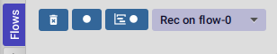

When you first open FlowStorm UI you will see four things, from left to right :

- Clear your recordings if any.
- Start/Stop recording. You can keep your heap from growing by stopping recording when you don't need it.
- Start/Stop recording the multi-thread timeline. Check out the <<#_multi_thread_timeline, multi-thread timeline>> tool.
- The `Rec on` combo-box to select under what flow new recordings are going to be stored.

Whenever there is something recorded for a flow, a new tab with the flow name will appear.

Execution inside a flow will be grouped by threads. So the first thing you will see on a flow is a menu of threads
we have recordings for so far. This threads will be referred sometimes as timelines, since they are a sequence of
recorded execution steps.

Let's say for example we have selected to record under `flow-1` and run some multi threaded code.

We are going to see something like this :

image::user_guide_images/multi_flows_1.png[]

There is a lot going on in the screenshot above, but the most important are :

      - we have configured FlowStorm to record new executions under `flow-1`
      - we have recorded stuff under `flow-1` and there are also some previous recordings under `flow-0`       
      - we are currently looking at `flow-1`, we have opened to explore the thread with id `1` called `main` and we are exploring it in <<#_code_stepping,the code stepper>>
      - `Threads [4]` indicates we have recorded activity in 4 threads, which we can access via this menu

Now for a different example :

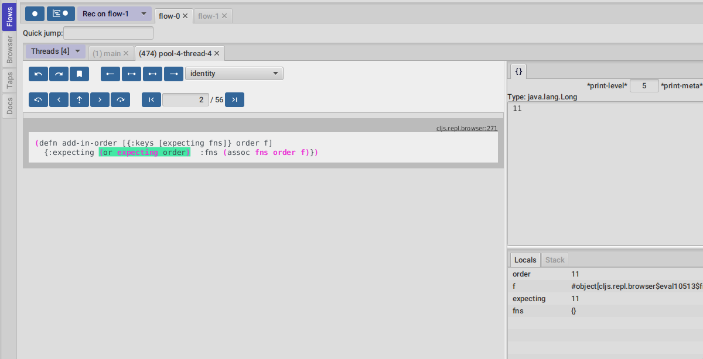

This second image shows us exploring the recordings of a thread with id `474`, called `pool-4-thread-4` on `flow-0`.

image::user_guide_images/flows_toolbar.png[]

The `Flows tool` also contains a toolbar that contains the Quick jump box.
Use it for quickly opening the first recording of a function in <<#_code_stepping,the code stepper>>.
Will autocomplete the first 25 matches.

In the screenshot above we see analyzing the recordings in <<#_code_stepping,the code stepper>> but there are many tools to explore the recorded timelines,
which we are going to describe next.

== Code tool

image::user_guide_images/code_tool_tab.png[]

The code tool is the first of the `Flows` tab. It provides most of the functionality found in a traditional debugger.
You can use it to step over each expression, visualize values, locals and more.

=== Code stepping

The code tool allows you to step and "travel throught time" in two ways:

- Use the controls at the top to step over your code in different ways.
- Click on the highlighted forms to position the debugger at that point in time.

image::user_guide_images/controls.png[]

For moving around using the controls we have two rows of buttons.

The second row of controls, the most important one, are the stepping controls.

From left to right they are :

- Step over backwards, will make one step backwards always staying on the same frame.
- Step backwards, will step backwards in time going into sub functions.
- Step out, will position the debugger in the next step after this function was called.
- Step forward, will step forward in time going into sub functions.
- Step over forward, will make one step forwards always staying on the same frame.

The numbers at the center show `current_step_index / total_steps`. This means that a total of `total_steps` has been recorded
for this thread so far. Write any number (less than total_steps) on the text box to jump into that position in time.

The buttons around the step counter are :

- Jump to the first step of the recording.
- Jump to the last step of the recording.

On the first row we have more controls, also for moving around in time.

From left to right we have :

- Undo navigation
- Redo navigation
- Add a <<#_bookmarks, bookmark>>
- The last stepping controls to the right are the <<#_power_stepping, power stepping>> controls.

[NOTE]
.Highlighting
====
Only the forms that were executed at least once for the current function frame will be highlighted.
====

This means that code can be un-highlighted for two reasons:

- there isn't any recording for that part of the code
- there is a recording but doesn't belong to this function frame.

image::user_guide_images/stepper_highlighting.png[]

In the contrived example above we see we are stepping the `foo` function. All inside this function
body is highlighted but the bodies of the two anonymous functions for mapping and reducing. This
will only get highlighted once you step into their bodies.

In this case you are sure there are recordings for these functions bodies because the reduce is
non lazy, so if you keep stepping eventually you will get into their bodies, but there is a faster way.

image::user_guide_images/stepper_highlighting_2.png[]

For this you can right click on any un-highlighted expression that you think there could be a recording for and
select `Jump forward here`.

image::user_guide_images/stepper_highlighting_3.png[]

This will make FlowStorm scan from the current point of the timeline searching forward for a value
recorded at that coordinate (if any) and move the stepper to that point in time.

You also have `Jump to first record here` which will scan from the beginning of the timeline and `Jump backwards here`
which will search backwards from the current position.

=== Power stepping

image::user_guide_images/controls_power_custom.png[]

The controls at the right are power stepping controls. They provide more powerfull ways of stepping through the code.

Clicking on the first, back, next or last buttons will navigate the timeline using the selected power stepping tool in the dropdown.

There are currently six power stepping tools :

- `identity`, will step to the prev/next value which identity is the same as the current value.
- 'equality', will step to the prev/next value which is equals (clojure equality) to the current value.
- `same-coord` will step to the prev/next value for the same coordinate. This means it will move to the next recording in
  the timeline for this exact place in the code you are currently in. You can also see it as take me to all the situations
  when the current expression executed doesn't matter how we got to it.
- `custom`, allows you to provide a predicate, which will be used to find the next step.
  If you define it like `(fn [v] (map? v))` will make the power stepper step over all map values.
- `custom-same-coord`, the same as `custom` but fixed on the current coordinate like `same-coord`.
- `identity-other-thread`, will step to a position which identity is the same as the current value in a different thread.
  Here the prev and next arrows do the same thing, it will just jump to the first position that matches this value on a
  different thread. This has some limitations. If there are more than two threads working with this identity there is no way
  of choosing which thread to go. If you need more control, checkout the <<#_programmable_debugging,programmable debugging>>
  section, specially the `find-expr-entry` function.
- `fn-call`, allows you to provide a function to step to.

[NOTE]
.Custom stepping
====
Custom power stepping is only supported in Clojure now.
====

Power stepping automatically skips all values equals to `:flow-storm.power-step/skip`. This can be useful when combined
with <<#_dealing_with_mutable_values, snapshot-value>> as a way of ignoring some of them, which provides a way of sampling
tight loops like in games.

=== Searching

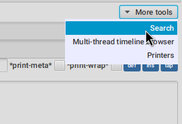

You can use the search tool to search over all your flow recorded expressions and then make the stepper jump to them.
You can find the search tool under `More tools -> Search`.

There are multiple ways of searching:

- By pr-str
- By data window current value
- By predicate

==== Searching by pr-str

image::user_guide_images/search_pr_str.png[]

This type of search will walk over the selected threads expressions, converting their values to strings with `pr-str` up to the selected level and depth
and then checking if the resulting string contains your provided query string.

==== Searching by DataWindow value

image::user_guide_images/search_data_window.png[]

Searching by data window value allows you to select any of the current data windows and will search for the current selected data window value
over the selected threads expressions values using identity.

==== Searching by predicate

image::user_guide_images/search_pred.png[]

Searching by predicate allows you to provide a Clojure predicate which will be used over all selected threads expressions values.

=== Loops

Whenever you click a highlighted form that has been executed multiple times inside the same function call (any kind of loop),
instead of immediately jumping into it, FlowStorm will popup a menu, like in the picture below :

image::user_guide_images/loops.png[]

This is the loops navigation menu. It allows you to quickly move around interesting iterations of the loop.

The menu will display slightly different options depending on you current position. The `[FIRST] ...` and `[LAST] ...`
entries will always show, which allows you to quickly jump to the first and last iteration of the loop.

If you are currently before the loop, clicking into any expression inside the loop will show the first 20
values for the clicked expression.

If instead you are currently in a expression after the loop, clicking back to an expression inside the loop,
will show the last 20 values for the clicked expression.

Now if you are currently stepping inside the loop, clicking any other expression inside it will show you 10 values
before and 10 values after of your current position.

Clicking on any of this entries will take you to that position in time.

If this is not enough, and you want to see all the values taken by some expression along the loop, you can always
use the <<#_printer, printer tool>>.

=== Exceptions debugging

`FlowStorm` will capture all functions that didn't return because an exception unwind the stack, even
when that exception was captured further and it didn't bubble up.

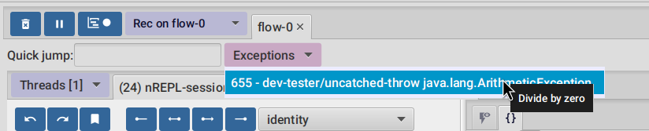

When an unwind situation is recorded a combobox will show up in the toolbar, containing the functions names
together with the exceptions types. If you hover the mouse over any of them, a tooltip will display the exception message.

Clicking on any of them will position the stepper at that point in time so you can explore what happened before.

You can configure FlowStorm to automatically jump to exceptions with the `Config` menu by checking `Auto jump to exception`
which is disabled by default.

=== Locals

The locals panel will show the locals visible for the current point in time and their values at binding time.

image::user_guide_images/locals.png[]

Right clicking on them will show a menu where you can :

      - define all
	  - define the value with a name, so you can use it at the repl
	  - inspect the value with a <<#_data_windows,data window>>
	  - tap the value as with `tap>`

`Define all` will define all the bindings currently visible in the locals pane in the current form namespace.
This is useful for trying things at your editor as described here https://www.cognitect.com/blog/2017/6/5/repl-debugging-no-stacktrace-required

[NOTE]
.Locals and mutable values
====
The Locals pane will show the value of each binding for a symbol at binding time, which are the same thing
no matter where you are in the current block when working with immutable objects, but not when working with mutable ones.
If what was bound was muttable in any way, you will be seeing the value at binding time, and not at current time. 
====

=== Stack

The stack panel will always show the current stacktrace. Be aware that the stacktrace
only include functions calls that had been recorded, so if you aren't recording everything
there will be gaps.

image::user_guide_images/stack.png[]

Double clicking on any of the stack entries will make the debugger jump to that point in time.

=== Value panels

Value panels show in many places in _FlowStorm_.

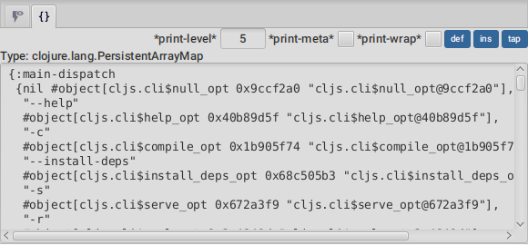

The value panel in the code tool always display a pretty print of the current expression value.

You can configure the print-level and print-meta for the pretty printing by using the controls at the top.

The value panel showing the current expression in the code stepper is a little bit special since it also
contains a <<#_data_windows,data window>> tab which allows you to quickly navigate the value or give it custom
visualizations.

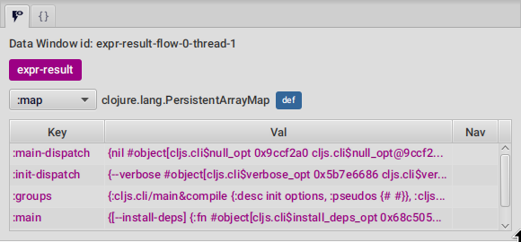

==== Define value for repl

Use the `def` button to define a var pointing to the current inspector value.

You can use / to provide a namespace, otherwise will be defined under [cljs.]user

=== Goto to file:line

Clicking on the `Actions->Goto file:line` menu allows you to search and jump to the first recording of a expression
with a file and line, given that one exists.

It will ask you for a file and line in the format of `<class-path-file-path>:<line>`.

If you have a file like `src/org/my_app/core.clj` and you are interested in expressions evaluating on like 42
you should search like `org/my_app/core.clj:42`.

== Call Stack tree tool

The call stack tree tool is the second one of the `Flows` tab. It allows you to see the execution flow by expanding its call stack tree.

image::user_guide_images/callstack_tool_tab.png[]

The call stack tree is useful for a high level overview of a complex execution and also as a tool for quickly moving through time.

You can jump to any point in time by double clicking on a node or by right clicking and on the context menu selecting `Step code`. 

image::user_guide_images/callstack_tree.png[]

Use the button at the top left corner of the tree tool to show the current frame of the debugger in the tree.

There are also two <<#_value_panels,value panels>> at the bottom that show the arguments and return value for the currently selected function call.

[NOTE]
.Disabling the call stack tree tool
====
The call stack tree tool can be enable/disable on the fly if you are not using it and performance is an issue,
since keeping it updated can be expensive.
You can disable it from the Config menu or via the `flowstorm.callTreeUpdate=false` JVM prop.
====

== Functions tool

The functions tool is the third one of the `Flows` tab.

image::user_guide_images/functions_tool_tab.png[]

It shows a list of all traced functions sort by how many times the have been called.

image::user_guide_images/functions_calls.png[]

Normal functions will be colored black, multimethods magenta and types/records protocols/interfaces implementations in green.

Together with the <<#_call_stack_tree_tool, call stack tree>> it provides a high level overview of a thread execution, and allows you to
jump through time much faster than single stepping.

You can search over the functions list by using the bar at the top.

=== Function calls

Clicking on the calls counter of any function will display all function calls on the right sorted by time.
Each line will show the arguments vector for each call, and their return value.
Use the check boxes at the top to hide some of the arguments.

image::user_guide_images/function_calls.png[]

Double clicking on any row in the functions call list will jump to the stepper at that point in time.

You can also use the `args` and `ret` buttons to open the values on the inspector.

== Multi-thread timeline

You can use this tool to record, display and navigate a total order of your recordings in a timeline.
This can be used, for example, to visualize how multiple threads expressions interleave, which is sometimes useful to debug race conditions.

You enable/disable the multi-thread timeline recording using its button on the toolbar. Recording on the multi-thread
timeline will make your program execution a little slower so it is recommended to have it paused unless you need it.

When you have something recorded on the multi-thread timeline you access the tool from the top right corner.

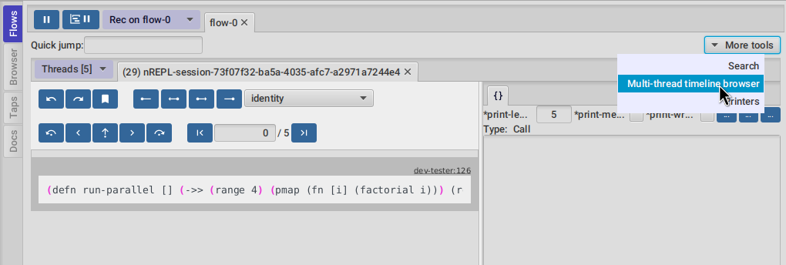

As an example, let's say you record the execution this function :

[,clojure]
----
(defn run-parallel []
  (->> (range 4)
       (pmap (fn [i] (factorial i)))
       (reduce +)))
----

By opening the tool a window like this should pop up :

image::user_guide_images/timeline.png[]

As you can see the timeline tool displays a linear representation of your expressions. Times flows from top to bottom and
each thread gets assigned a different color. Every time a function is called or returns you will see it under the `Function`
column, and for each expression executed you will see a row with its `Expression` and `Value`.

Double clicking any row will make your code stepper (on the main window) jump to the code at that point in time.

[NOTE]
.Big recordings timeline
====
Rendering the timeline needs some processing to render each sub-form and print each value so be aware it could be slow
if you try it on big recordings.
====

There is also a `Only functions?` checkbox at the top that will retrieve only function calls and can be used to visualize
the threads interleaving at a higher level.

== Printer

_FlowStorm_ has a lot of functionality to replace printing to the console as a debugging method since most of the time it is pretty
inefficient. Nonetheless, sometimes adding a bunch of print lines to specific places in your code is a very powerful way
of understanding execution.

For this cases _FlowStorm_ has the `Printer tool`, which allows you to define, manage and visualize print points, without the need
of re running your code. It will work on your recordings as everything else.

You can add and re run print points over your recordings as many times as you need. To add a print point, just right click on any
recorded expression.

image::user_guide_images/printer_add.png[]

It will ask you for a couple optional fields.

image::user_guide_images/printer_add_box.png[]

The `Message format` is the "println text". A message to identify the print on the printer output. Here you can use any text, in which you can
optionally use `%s` for the printed value, same as you would use it with format.

The `Expression` field can be use to apply a transformer function over the value before printing it. Useful when you want to see a part of the value.

image::user_guide_images/printer_access.png[]

After you add them, you can access the `Printers tool` by navigating to `More tools -> Printers`.

The threads selector allows you to select the thread the prints are going to run on.
Leaving it blank will run prints over all threads recordings (checkout the notes for caveats).
Clicking the `refresh` button will [re]run the printing again over the current recordings. 

image::user_guide_images/printer.png[]

You can tweak your prints at any time, like changing the print-length, print-level, message, transform-fn or just temporarily disable any of them.
When you are ok re-setting you prints, just click refresh and they will print again.

Double clicking on any printed line will jump to the Flows code tab, with the debugger pointed to the expression that generated the print.

[IMPORTANT]
.Multi-thread prints order
====
If you select `All` threads, and have a multi-thread timeline recording, then the printer will use it and you can use prints to debug threads
interleaving for example, but if you run your printers with `All` threads selected without a multi-thread timeline recording they will print
sorted by thread and not in the order they happened.
====

== Bookmarks

Bookmarks are another quick way of jumping around in code and they can be added from your code or the FlowStorm UI.

You can find you bookmarks on the top menu `View -> Bookmarks`.

image::user_guide_images/bookmarks.png[]

Double clicking on any bookmark will make the debugger jump back to its position.

=== Code bookmarks

You add code bookmarks by adding the `(bookmark)` statement to your code, which optionally accepts a label.

The first time a bookmark statement is executed it will make the FlowStorm UI jump to it. Since this behavior
is similar to a `debugger` statement in languages like Javascript, it is also aliased as `(debugger)` so you can
use whichever you prefer.

[NOTE]
.ClojureScript support
====
This is currently only supported when using ClojureScriptStorm >= 1.11.132-9 
====

=== UI bookmarks

UI bookmarks are useful when you find yourself jumping around, trying to understand a complex execution. They enable
you to mark execution positions so you can come back to them later.

image::user_guide_images/bookmarks_add_btn.png[]

You can bookmark the current position by pressing the bookmark button in the code tool, next to your stepping controls.
It will ask you the bookmark description.

= Browser tool

The browser tool is pretty straight forward. It allows you to navigate your namespaces and vars,
and provides ways of <<#_controlling_instrumentation,managing what gets instrumented>>.

= Outputs tool

image::user_guide_images/outputs.png[]

The outputs tool can be used instead of your normal IDE/Editor panel to visualize your evaluations
results, your taps outputs and your `*out*` and `*err*` streams writes (like printlns).

The advantages being :

- Custom visualizations
- Quick nested values navigation
- Quick taps values navigation
- Datafy nav navigation
- Access to all previously tapped values
- Access to the last 10 evaluated values (instead of just `*1` and `*2`)
- Ability to search tapped values in Flows

The taps visualization system works out of the box while the evals result and printing capture currently
depends on you using nrepl and starting with the flow-storm middleware. Checkout the outputs setup
section for instructions.

[NOTE]
.ClojureScript support
====
Only the taps viewer is currently supported on ClojureScript. The last evaluations
and the out and err streams capture aren't supported yet.
====

== Middleware setup

For using all the features in the Outputs tool you need to be using nrepl and start your repl with
`flow-storm.nrepl.middleware/wrap-flow-storm` middleware.

If you use Cider for example you can add it to `cider-jack-in-nrepl-middlewares` via customizing the global
value or by using `.dir-locals.el`.

== Output data window

The top panel is a <<#_data_windows,data window>> for displaying evaluations and taps.
As soon as you evaluate or tap something it will be displayed here.

== Last evals

The last evals pane gives you access to the last 10 evaluation results, same as `*1` and `*2`.

Click on any value to display it on the top data window.

== Taps

Everytime _FlowStorm_ starts, it will add a tap, so whenever you `tap>` something
it will show on the taps list.

Click on any value to display it on the top data window.

If the tapped value has also been recorded as an expression in Flows, you can right click on it
and run `Search value on Flows` to move the debugger to that point in time.

[NOTE]
.Search value on Flows
====
Be aware that if the code that taps your value is something like `(tap> :a-key)` you won't be able to jump
to it using this, because `:a-key` isn't a value recorded by _FlowStorm_, while if the tapping
code is like `(tap> some-bind)` or `(tap> (+ 2 3))` or the tapping of any other expression
you should be able to jump to it.
So if you want to use this functionality as a "mark" so you can quickly jump to different parts of
the recordings from the Taps tool, you can do it like `(tap> (str :my-mark))`
====

A `#tap` tag will also be available, which will tap and return so you can use it like `(+ 1 2 #tap (* 3 4))`
Use the `clear` button to clear the list.

There is also `#tap-stack-trace`. It will tap the current stack trace.

== Out and Err streams

Everything written on `*out*` or `*err*` will be captured and displayed on the bottom panel.
You can copy anything from this area with normal tools.

= Data Windows

image::user_guide_images/data_window.png[]

Data Windows are a user extensible tool to visualize and explore your data. Their role is to support :

- a way to navigate nested structures in a lazy way
- visualize and navigate metadata
- multiple visualizations for each value
- lazy/infinite sequences navigation
- a way to define the current sub-values so you can use them at the repl
- a mechanism for realtime data visualization
- clojure.datafy navigation out of the box
- tools for the user to add custom visualizations on the fly

The next sections will explore each of them.

== Data navigation

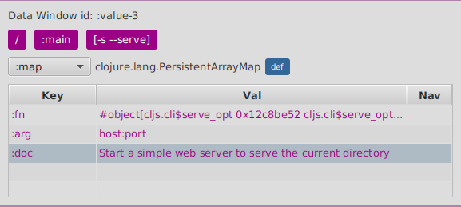

You can navigate into any key or value by clicking on it.

Use the breadcrumbs at the top to navigate back.

== Metadata navigation

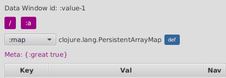

If any value contains metadata, it will be shown at the top. Clicking on it will make the data window
navigate into it.

== Multiple visualizers

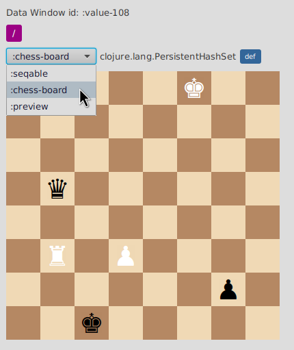

You can change how to display your current value by using the visualizers selector dropdown at the top.

== Sequences

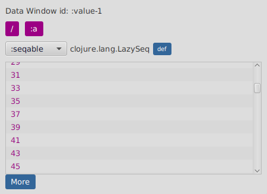

The seqable visualizer allows you to navigate all kind of sequences (even infinite ones) by bringing more pages on demand.

Click on `More` to bring the next page in.

== Defining values

You can always define a var for the current value being shown on any data window by clicking the `def` button.
Clicking on it will raise a popup asking for a symbol name. If you don't provide a fully qualified symbol
it will define the var under `user` or `cljs.user` if you are in ClojureScript.

A quick way to use it is to provide a short name, let's say `foo`, and then access it from your
code like `user/foo`.

== Realtime visualizations

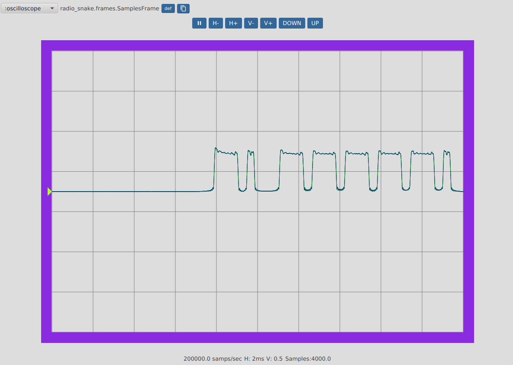

DataWindows not only support displaying and navigating values, but also updating them in real time from
your application.

From your program's code you can always create a data window with :

[,clojure]
----
(flow-storm.api/data-window-push-val :changing-long-dw-id 0 "a-long")
----

by providing a data window id, a value, and optionally the initial breadcrumb label.

But you can also update it (given that the selected visualizer supports updating like :scope for numbers) with :

[,clojure]
----
(flow-storm.api/data-window-val-update :changing-long-dw-id 0.5)
----

This `data-window-val-update` is pretty useful when called from loops or refs watches, specially paired
with a custom visualizer.

== Clojure datafy/nav

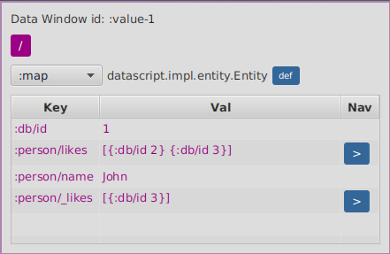

Data Windows support datafy nav out of the box. The data window will always be showing the result of
`clojure.datafy/datafy` of a value. For maps or vectors where keys provide navigation it will automatically
add a blue arrow next to the value.

Clicking on the value will just dig the data, while clicking on the blue arrow will navigate as with
`clojure.datafy/nav` applied to that collection on that key.

== EQL pprint visualizer

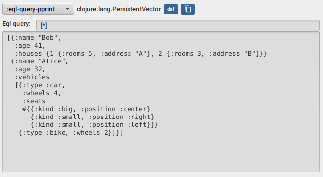
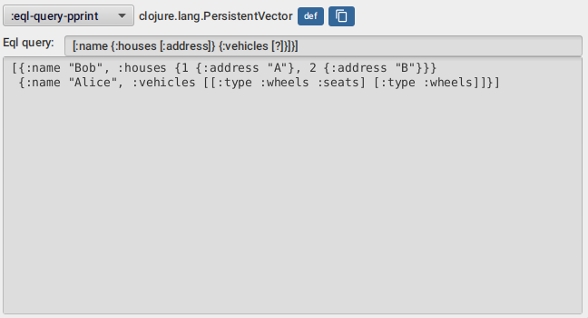

The `eql-query-pprint` visualizer allows you to explore your data "entities" by looking at subsets of it
using queries similar to datomic pull queries like in the screenshots above.

[NOTE]
.Disable by default
====
The EQL query pprint is disable by default. To enable it call `(flow-storm.runtime.values/register-eql-query-pprint-extractor)`.
====

By entities it means maps which contains only keywords as their keys. Every other collection
is just traversed.

This are all valid queries :

- `[*]`
- `[:name]`
- `[:name :age :vehicles]`
- `[:name :age {:vehicles [:type]}]`
- `[:name :age {:vehicles [?]}]`
- `[:name {:vehicles [*]}]`
- `[:name :age {:vehicles [:type {:seats [?]}]}]`
- `[:name :age {:vehicles [:type {:seats [:kind]}]}]`
- `[:name {:houses [:rooms]}]`

The `*` symbol means include all keys, while the `?` symbol means just list the keys, which helps
exploring big nested maps with many keys.

== Custom visualizers

An important aspect of Data Windows is to be able to provide custom visualizers on the fly.

Let's say we have model a chess board as a set of maps which represent our pieces.

[,clojure]
----
(def chess-board
  #{{:kind :king  :player :white :pos [0 5]}
    {:kind :rook  :player :white :pos [5 1]}
    {:kind :pawn  :player :white :pos [5 3]}
    {:kind :king  :player :black :pos [7 2]}
    {:kind :pawn  :player :black :pos [6 6]}
    {:kind :queen :player :black :pos [3 1]}})

(flow-storm.api/data-window-push-val :chess-board-dw chess-board "chess-board")
----

If we open a data window with `data-window-push-val` we are going to see something like this :

image::user_guide_images/data_window_custom1.png[]

but we can do better, we can create a custom visualizer so we can see it like this :

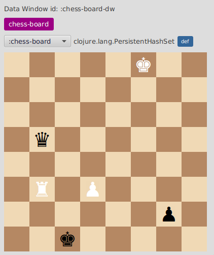

Data visualization in FlowStorm is composed of two things:

- a data aspect extractor, which runs on the runtime process, and will build data for the visualization part
- a visualizer, which runs on the debugger process, and will render extracted data for a value using javafx

For a basic Clojure session everything will be running under the same process, but this is not the case for ClojureScript
or remote Clojure.

First let's require some namespaces :

[,clojure]
----
(require '[flow-storm.api :as fsa])
(require '[flow-storm.debugger.ui.data-windows.visualizers :as viz])
(require '[flow-storm.runtime.values :as fs-values])
----

We can register a custom visualizer by calling `register-visualizer`.

[,clojure]
----
(viz/register-visualizer
     {:id :my-viz
      :pred (fn [val] )
      :on-create (fn [val] {:fx/node :any-java-fx-node-that-renders-the-value
                            :more-ctx-data :anything})
      ;; OPTIONALLY
      :on-update (fn [val created-ctx-map {:keys [new-val]}] )
      :on-destroy (fn [created-ctx-map] )
      })
----

The important part there are `:id`, `:pred`, and `:on-create`.

The `:id` will be the one displayed on the visualizers dropdown, and re-registering a visualizer
with the same id will replace the previous one.

`:pred` is a predicate on the data extracted from values, it should return true if this visualizer
can handle the value.

And `:on-create` will be a function that receives this value and renders a java fx node.

Optionally you can provide `:on-update` and `:on-destroy`.

`:on-update` will receive values from the runtime via `fsa/data-window-val-update`. It will also get a handle to
the original value (the one that created the DataWindow) and whatever map was returned by `:on-create`.

`:on-destroy` will be called everytime a visualizer gets removed, because you swapped your current visualizer
or because you went back with breadcrums. It can be useful in case you need to clear resources created by
`:on-create`.

`:pred` and `:on-create` will not receive the original value but the extracted aspects of it after
all registered extractors run.

You can check the data available to your visualizer for a value in a data window by calling :

[,clojure]
----
(viz/data-window-current-val :chess-board-dw)
----

If the data already extracted from your value is not enough for your visualizer you can register
another extractor.

=== Data aspect extraction

[,clojure]
----
(fs-values/register-data-aspect-extractor
   {:id :chess-board
    :pred (fn [val _]
            (and (set? val)
                 (let [{:keys [kind player pos]} (first val)]
                   (and kind player pos))))
    :extractor (fn [board _] {:chess/board board})})
----

In this case we are going to register and extractor that will only run for vals which are sets and
contains at least one element which is a map with `:kind`, `:player` and `:pos`.
The extracted data will be the entire board.

All ids of extractors that applied for a value will be appended under `::fs-values/kinds` of the value
as you will see next.

=== Visualizers

Now we can register a visualizer that will show only on values which contains a :chess-board kind.

[,clojure]
----
(import '[javafx.scene.layout GridPane])
(import '[javafx.scene.control Label])

(viz/register-visualizer
   {:id :chess-board
    ;; only be available if the chess-board data extractor run on this value
    :pred (fn [val] (contains? (::fs-values/kinds val) :chess-board))

    ;; use the chess/board info to render a board with java fx
    :on-create (fn [{:keys [chess/board]}]
                 (let [kind->sprite {:king "" :queen "" :rook "" :bishop "" :knight "" :pawn ""}
                       pos->piece (->> board
                                       (mapv #(vector (:pos %) %))
                                       (into {}))]
                   {:fx/node (let [gp (GridPane.)]
                               (doall
                                (for [row (range 8) col (range 8)]
                                  (let [cell-color (if (zero? (mod (+ col (mod row 2)) 2)) "#f0d9b5" "#b58863")
                                        {:keys [kind player]} (pos->piece [row col])
                                        cell-str (kind->sprite kind "")
                                        player-color (when player (name player))]
                                    (.add gp (doto (Label. cell-str)
                                               (.setStyle (format "-fx-background-color:%s; -fx-font-size:40; -fx-text-fill:%s; -fx-alignment: center;"
                                                                  cell-color player-color))
                                               (.setPrefWidth 50))
                                          (int col)
                                          (int row)))))
                               gp)}))})
----

== Default visualizers

You can make any visualizer the default by calling `add-default-visualizer` which takes a predicate on the val-data (the same received by :on-create) and
a visualizer key, like this :

[,clojure]
----
(viz/add-default-visualizer (fn [val-data] (contains? (:flow-storm.runtime.values/kinds val-data) :chess-board)) :chess-board)
----

For all FlowStorm provided visualizers take a look at `flow-storm.debugger.ui.data-windows.visualizers` namespace.

Default visualizers predicates are added in a stack, and tried from the top. This means that you can always overwrite a default by adding a
new one.

= Thread breakpoints

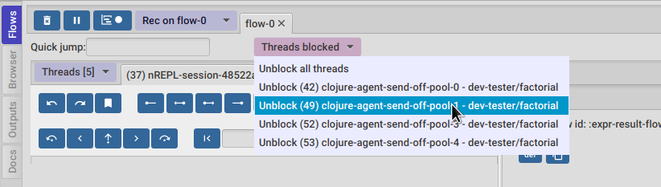

_FlowStorm_ is a tracing debugger, which means it can record what is happening without the need of stopping
your programs execution. This is all fine but doesn't cover every possible situation. There are
cases where recording everything is impractical, and even if you can start/stop recording whenever you want,
being able to automatically stop your threads at certain points is useful.

For these cases, _FlowStorm_ has the ability to set thread breakpoints, which means to define points (functions)
in the execution of your program where you want your threads to wait.
While the threads are waiting you can explore what happened so far.

As soon as a thread hits a break function, if recording is on, it will be blocked, and a "Threads blocked" menu will show up in the UI.
You can use this menu to unblock different threads.

Once you are done, you can pause recording using the pause button in the main toolbar and un-block every thread.

You can define thread breakpoints in two ways :

- Using the browser (like in the image below), you can navigate to any function and click on the `Break` button. This will block the calling
  thread every time the selected function gets called.
- Or you can also install a break by calling (flow-storm.api/break-at 'my-proj.core/some-fn)

image::user_guide_images/browser_breakpoints.png[]

[NOTE]
.Conditional threads breakpoints
====
The break-at fn accepts a second argument where you can provide a predicate that will be called with the same arguments
of the function you are breaking. It will only break when the predicate returns true. If you don't
provide a predicate it will default to `(constantly true)`
====

You can remove breakpoints by :

- Clicking on the browser instrumentation list delete buttons
- Calling `flow-storm.api/remove-break` to remove a single breakpoint
- Calling `flow-storm.api/clear-breaks` to remove all breakpoints

= Programmable debugging

_FlowStorm_ gives you full access to its internal indexes from the repl in Clojure and ClojureScript.
These allows you to explore your recordings using Clojure and write small programs to analyze
them if what's provided by the GUI is not enough.

Most of what is documented here is also documented in the `flow-storm.runtime.indexes.api` namespace docstring, which
you can retrieve by evaluating `(doc flow-storm.runtime.indexes.api)`. In fact, this is the only namespace you need to
require on your repl in order to work with your recordings.

Let's say you have recorded some execution and now you want to work with the recordings from the repl.

So first we require the api ns as `ia`.

[,clojure]
----
(require '[flow-storm.runtime.indexes.api :as ia])
----

Now from the UI, you can get the thread-id of your recordings (the number next to the thread name)
which you will need for accessing them from the repl.

== Timelines

Let's say you want to explore recordings on thread 32. You can retrieve its timeline by calling `ia/get-timeline` like this :

[,clojure]
----
(def timeline (ia/get-timeline 32))
----

Once you have the timeline you can start exploring it.

The timeline implements many of the Clojure basic interfaces, so you can :

[,clojure]
----
user> (count timeline)
798

user> (take 3 timeline)
; (#flow-storm/fn-call-trace [Idx: 0 org.my-app/run-server]
;  #flow-storm/fn-call-trace [Idx: 1 org.my-app/read-config]
;  #flow-storm/fn-call-trace [Idx: 2 org.my-app/check-config])
 
user> (get timeline 0)
; #flow-storm/fn-call-trace [Idx: 0 org.my-app/run-server]
----

The easiest way to take a look at a thread timeline is with some code like this :

[,clojure]
----
(->> timeline
     (take 3)
     (map ia/as-immutable))

; ({:type :fn-call,
;   :fn-ns "org.my-app",
;   :fn-name "run-server",
;   :ret-idx 797,
;   :fn-call-idx 0,
;   :parent-idx nil,
;   :fn-args [],
;   :form-id -798068730,
;   :idx 0}
;  ...
;  ...)
----

In most cases converting all entries into maps with `ia/as-immutable` is enough, but if you want a little bit more
performance you can access entries information without creating a immutable map first.

Timelines entries are of 4 different kinds: `FnCallTrace`, `FnReturnTrace`, `FnUnwindTrace` and `ExprTrace`.

You can access their data by using the following functions depending on the entry :
  
All kinds :

  - `as-immutable`
  - `fn-call-idx`

`ExprTrace`, `FnReturnTrace` and `FnUnwindTrace` :

  - `get-coord-vec`

`ExprTrace`, `FnReturnTrace` :

  - `get-expr-val`

`FnUnwindTrace` :

  - `get-throwable`
  
`FnCallTrace` :

  - `get-fn-name`
  - `get-fn-ns`
  - `get-fn-args`
  - `get-fn-parent-idx`
  - `get-fn-ret-idx`
  - `get-fn-bindings`

You can also access the timeline as a tree by calling :

  - `callstack-root-node`
  - `callstack-node-childs`
  - `callstack-node-frame-data`

Take a look at their docstrings for more info.

== Forms
  
You can retrieve forms by form id with `get-form` and then use `get-sub-form-at-coord` and a coordinate.

Here is a little example :

[%nowrap,clojure]
----
;; retrieve some expression entry into expr
user> (def expr (-> timeline
                    (get 3)
                    ia/as-immutable))

user> expr
{:type :expr, :coord [2 2 1], :result 4, :fn-call-idx 2, :idx 3}

;; retrieve the fn-call entry for our expr
user> (def fn-call (-> timeline
                       (get (:fn-call-idx expr))
                       ia/as-immutable))
user> fn-call
{:type :fn-call,
 :fn-ns "dev-tester"
 :fn-name "other-function",
 :form-id 1451539897,
 ...}

;; grab it's form
user> (def form (-> fn-call
                    :form-id
                    ia/get-form
                    :form/form))
user> form
(def other-function (fn [a b] (+ a b 10)))

;; lets look at the sub-form from form at our expr coordinate
user> (ia/get-sub-form-at-coord form (:coord expr))
a                    
----

== Multi-thread timeline
  
If you have recorded a multi-thread timeline, you can retrieve it with `total-order-timeline` like this :

[,clojure]
----
(def mt-timeline (ia/total-order-timeline))
----

which you can then iterate using normal Clojure functions (map, filter, reduce, get, etc).

The easiest way to explore it is again with some code like this :

[,clojure]
----  
user> (->> mt-timeline
           (take 3)
           (map ia/as-immutable))

({:thread-id 32,
  :type :fn-call,  
  :fn-call-idx 0,
  :fn-ns "org.my-app",
  :fn-name "run",
  :fn-args [],
  :ret-idx 797,
  :parent-idx nil,  
  :form-id -798068730,
  :idx 0}
  ...
  ...)
----

Notice that each of these entries contains a flow-id and thread-id also.

== Other utilities

There are other utitities in the api ns that could be useful, some of the most interesting ones :

- `find-expr-entry` useful for searching expressions and return values with different criteria.
- `find-fn-call-entry` useful for searching functions calls with different criteria.
- `stack-for-frame`
- `fn-call-stats`

Take a look at their docstrings for more info.
  
= Remote debugging

You can remotely debug any Clojure application that exposes a nrepl server.

In terms of dependencies, the debuggee side should be setup the same as a normal local setup, with the optional change that you can use
`flow-storm-inst` instead of `flow-storm-dbg`, being the former a slimmed down version of the later one that
doesn't contain some libraries used only by the UI, but using the full `flow-storm-dbg` is also ok.

== SSH tunnel

The easiest way to debug a remote application is via a ssh tunnel. You can create it from your dev box like this :

[,bash]
----
ssh -L 9000:localhost:9000 -R 7722:localhost:7722 my-debuggee-box.com
----

assuming your remote process at my-debuggee-box.com has started a nrepl server listening on port 9000 and 
that the debugger websocket server is running on the default port.

After the tunnel is established, you can run you debugger UI like this :

[,bash]
----
clj -Sforce -Sdeps '{:deps {com.github.flow-storm/flow-storm-dbg {:mvn/version "4.4.6"}}}' -X flow-storm.debugger.main/start-debugger :port 9000
----

and that is it.

If you need to connect the debugger to a remote process without a ssh tunnel or you need to configure the websocket server port you can do it like this :

[,bash]
----
clj -Sforce -Sdeps '{:deps {com.github.flow-storm/flow-storm-dbg {:mvn/version "4.4.6"}}}' -X flow-storm.debugger.main/start-debugger :port NREPL-PORT :runtime-host '"YOUR-APP-BOX-IP-ADDRESS"' :debugger-host '"YOUR-BOX-IP-ADDRESS"' :ws-port WS-SERVER-PORT
----

== Out of process

Sometimes you are not debugging across a network but you want to run the FlowStorm UI on a different process.

A couple of aliases that can help for this :

[,clojure]
----
{:aliases
 ;; for your system process
 {:runtime-storm {:classpath-overrides {org.clojure/clojure nil}
                  :extra-deps {com.github.flow-storm/clojure {:mvn/version "1.12.1"}
                               com.github.flow-storm/flow-storm-inst {:mvn/version "4.4.6"}}}
  ;; for the FlowStorm GUI process
  :ui-storm {:extra-deps {com.github.flow-storm/flow-storm-dbg {:mvn/version "4.4.6"}}
             :exec-fn flow-storm.debugger.main/start-debugger
             :exec-args {:port 7888}}}} ;; set your nrepl port here!
----

With those aliases you can start your application process by adding `:runtime-storm` and that is it.

To start the FlowStorm UI, go to another terminal and run `clj -X:ui-storm`.

== Docker

If you run you process inside a docker container, here is a basic template for using _FlowStorm_ with it
https://github.com/jpmonettas/docker-flow-storm-basic

= Dealing with too many traces

When recording an application's execution (specially when using _ClojureStorm_ or _ClojureScriptStorm_) it could happen
that your process starts running out of heap. This section documents some tools FlowStorm provides to deal with this situations.

Most of the time, having the recording paused and just enabling it right before executing the action you are interested in is enough, but
when it isn't, here are some other options.

A common situation is to see some high frequency functions adding a lot of noise to your recordings. For example a MouseMove event processing
will generate a lot of recordings while you use your app. There are a couple of ways to limit your functions calls by thread. You can identify
this kind of functions with the <<#_functions_tool,functions tool>>.

One tool you can use in this situations is the `flowstorm.threadFnCallLimits` JVM prop.

For example, you can add `"-Dflowstorm.threadFnCallLimits=org.my-app/fn1:2,org.my-app/fn2:4"` so every time the system starts, limits will be set for
`org.my-app/fn1` and `org.my-app/fn2`. The number next to them is the limit. When a function reaches the limit _FlowStorm_ will stop recording calls
to it and all the functions down its callstack.

You can also modify the limits from your repl, by calling `flow-storm.runtime.indexes.api/[add-fn-call-limit|rm-fn-call-limit|get-fn-call-limits]`.
In ClojureScript you need to call them via your cljs repl api.

All limits are per thread, so when a thread recording is created it will start with the current defined counters, and each time a function gets called
the counter will decrement. When it reaches zero the function and all functions calls under it will stop being recorded.

When you clear your threads you are also clearing its limit counters, so next time you record something new counters will be initialized from your
global limits definitions.

If you are tracing some code that ends up in a infinite loop the debugger will choke on
too many traces, making everything slow and your only option is probably to restart it.

For preventing this, _FlowStorm_ provides a fuse/breaker, called thread trace limit.
It is off by default but you can enable it from the Config menu.

image::user_guide_images/thread_trace_limit_menu.png[]

image::user_guide_images/thread_trace_limit_dialog.png[]

Let's say you added a limit of 1000. If you now run any code that generates more than a 1000 traces FlowStorm will only
record those first 1000 traces per thread and discard the rest as if recording is off.

Your code will continue execution as normal, which you can break using
your normal editor breaking commands if its an infinite loop, but now you have recordings to look at what is going on.

You can set a limit of 0 to disable it again.

You can set this limits at startup via the JVM options `"-Dflowstorm.threadTraceLimit=1000"` and
`"-Dflowstorm.throwOnThreadLimit=true"`.

This is not only useful for infinite loops. It can be used to limit your recordings if you think you can blow up your heap.

= Dealing with mutable values

_FlowStorm_ will retain all values pointers when code executes so you can analyze them later. This works great with immutable values but
when your code uses mutable values like this :

[,clojure]
----
(let [a (java.util.ArrayList.)]
  (count a)
  (.add a "hello")
  (count a)
  (.add a "world")
  (.add a "!"))
----  

then every time you step over `a` it will contain the last value ["hello" "world" "!"].

You can fix this situation by extending the flow-storm.runtime.values/SnapshotP protocol like this :

[,clojure]
----
(extend-protocol flow-storm.runtime.values/SnapshotP
  java.util.ArrayList
  (snapshot-value [a] (into [] a)))
----

to provide _FlowStorm_ a way of creating a snapshot of the mutable value.

[NOTE]
.ClojureStorm
====
If you are using _ClojureStorm_ evaluate the previous defmethod in a ns that is not being
instrumented to avoid an infinite recursion.
====

Be aware that this is tricky in multithreading situations, as always with mutable values.

[NOTE]
.Automatic derefing
====
FlowStorm will automatically deref Atoms, Refs, Agents, Vars and all pending-realized derefables on tracing
so no need to implement `flow-storm.runtime.values/snapshot-value` for them.
====

[NOTE]
.Snapshoting and nested values
====
Snapshoting only applies to direct references to mutable values.
For example if you have an atom inside a nested immutable collection, it will not be snapshoted every time
that collection expression is being recorded, because the value being recorded is not a reference to an atom.

If this is important to you, you can still define snapshot-value for clojure.lang.PersistentArrayMap, etc, and
walk it down snapshoting everything mutable inside.
====

[NOTE]
.snapshot-value and memory footprint
====
Although snapshot-value was created as a way to deal with mutable values it can be used to replace any value by another in the
recordings, which can be useful in other situations like reducing memory footprint when you don't need the entire
value to be recorded.
====

= Controlling instrumentation

If you are using _ClojureStorm_ or _ClojureScriptStorm_ it is important to learn how to control what gets instrumented and
how to uninstrument things. You can configure what gets instrumented automatically on startup via JVM properties but also
change this while your repl is running without the need to restart it.

FlowStorm by default will automatically figure out what to instrument from your project, which
you can always disable by setting the `-Dclojure.storm.instrumentAutoPrefixes=false`.

[NOTE]
.How are auto prefixes calculated?
====
When the process starts it will scan all source folders on the classpath (everything not inside a jar containing clojure files) and build
a set of all top level namespace. All namespaces under those will be instrumented.
Currently it doesn't detect single level namespaces, like when you have `src/core.clj`, if this is your case use
instrumentOnlyPrefixes.
====

If you prefer to be explicit about what gets instrumented you can use the JVM property `"-Dclojure.storm.instrumentOnlyPrefixes=YOUR_INSTRUMENTATION_STRING"`

where `YOUR_INSTRUMENTATION_STRING` should be a comma separated list of namespaces prefixes like :

	  my-project.,lib1.,lib2.core

which means automatically instrument my-project.* (which includes all sub namespaces), all lib1.* and only everything under lib2.core

All this can be changed after without restarting your repl from <<#_modifying_instrumentation_with_the_browser, FlowStorm browser>>.

== Turning instrumentation on an off

You can turn instrumentation on an off by using the button on <<#_the_tool_bar,the toolbar>>.
Remember that the change of this setting will only be effective on newly compiled code.

== Setup startup instrumentation

The first important thing is to setup your instrumentation correctly via JVM properties :

On _ClojureStorm_ :

[,clojure]
----
-Dclojure.storm.instrumentOnlyPrefixes=my-app,my-lib
-Dclojure.storm.instrumentSkipPrefixes=my-app.too-heavy,my-lib.uninteresting
-Dclojure.storm.instrumentSkipRegex=.*test.*
----

On _ClojureScriptStorm_ :

[,clojure]
----
-Dcljs.storm.instrumentOnlyPrefixes=my-app,my-lib
-Dcljs.storm.instrumentSkipPrefixes=my-app.too-heavy,my-lib.uninteresting
----

Apart from `instrumentOnlyPrefixes` which you probably already know, there is `instrumentSkipPrefixes` which also
accepts a comma separated list of namespaces prefixes to skip, and instrumentSkipRegex with accepts a regex for
namespaces to skip. All these together allows you to instrument you whole app but some undesired namespaces.

The next important thing is to be able to enable/disable instrumentation and add/remove prefixes without restarting the
repl. 

== Modifying instrumentation with the Browser

You can use the `Browser tool` to check and change on the fly the prefixes you configured in the previous section.

image::user_guide_images/browser_storm_instrumentation_1.png[]

Right clicking any namespace will give you options for what level of a namespace you want to instrument.

On the bottom pane (instrumentations) you will see your current instrumentation configuration (if any). Here we can see that everything under
`ring.middleware.anti-forgery` will be instrumented every time something inside it gets compiled.

You can remove entries using the `del` buttons or temporarily disable/enable them using the `Enable all` checkbox.

image::user_guide_images/browser_storm_instrumentation_2.png[]

You can use the `Add` menu in the picure above to add instrumentation prefixes.

After changing any prefix FlowStorm will ask if you want it to reload the affected namespaces for you. Namespace reloading will
all reload all namespaces it depends on in topological order, so it shouldn't break your system in any way.

image::user_guide_images/browser_storm_instrumentation_3.png[]

You can also provide functions to be called before and after reloading in case you need to stop and start your system with :

[,clojure]
----
(flow-storm.api/set-before-reload-callback! (fn [] (println "Before reloading")))
(flow-storm.api/set-after-reload-callback!  (fn [] (println "After reloading")))
----

[NOTE]
.Instrumentation
====
Just changing the prefixes without reloading will not make your currently loaded code [un]instrumented.
If you haven't let FlowStorm reload them for you, you can always recompile them as usual with your editor commands or
by executing something like `(require 'the-selected.namespace :reload)`.
====

== Instrumentation in Vanilla FlowStorm

[NOTE]
.ClojureStorm
====
Instructions here only apply to vanilla _FlowStorm_. If you are using _ClojureStorm_ or _ClojureScriptStorm_ (recommended)
this is done automatically for you, so just skip this section.
====

Code instrumentation in _FlowStorm_ is done by rewriting your code, in a way that doesn't change its behavior
but when executed will trace everything the code is doing.

=== Instrument any form with #trace

You can instrument any top level form at the repl by writing `#trace` before it, like this :

[,clojure]
----
#trace
(defn sum [a b]
  (+ a b))
----

and then evaluating the form.

important:: `#trace` is meant to be used with forms that don't run immediately, like: defn, defmethod, extend-type, etc.
Use `#rtrace` to trace and run a form, like `#rtrace (map inc (range 10))`.

=== Run code with #rtrace

`#rtrace` is useful in two situations :

First, when instrumenting and running a simple form at the repl, like:

[,clojure]
----
#rtrace (-> (range) (filter odd?) (take 10) (reduce +))
----

=== Instrument namespaces

_FlowStorm_ allows you to instrument entire namespaces by providing `flow-storm.api/instrument-namespaces-clj`.

You call it like this :

[,clojure]
----
(instrument-namespaces-clj #{"org.my-app.core" "cljs."})
----

The first argument is a set of namespaces prefixes to instrument. In the previous example it means
instrument all namespaces starting with `org.my-app.core`, and all starting with `cljs.`

The second argument can be a map supporting the following options :

- `:excluding-ns` a set of strings with namespaces that should be excluded
- `:disable` a set containing any of #{`:expr` `:binding` `:anonymous-fn`} useful for disabling unnecessary traces in code that generate too many
- `:verbose?` when true show more logging

=== What can't be instrumented?

These are some limitations when instrumenting forms :

1. Very big forms can't be fully instrumented. The JVM spec has a limit on the size of methods and instrumentation adds a lot of code.
When instrumenting entire namespaces, if you hit this limit on a form a warning will printed on the console saying `Instrumented expression is too large for the Clojure compiler`
and _FlowStorm_ automatically tries to instrument it with a lighter profile, by disabling some instrumentation.

2. Functions that call recur without a loop

3. Functions that return recursive lazy sequences. Like `(fn foo [] (lazy-seq (... (foo))))`

=== Un-instrument code

Un-instrumenting code that has been instrumented with `#trace` or `#ctrace` is straight forward, just remove the tag and re evaluate the form.

To un-instrument entire namespaces you can use `flow-storm.api/uninstrument-namespaces-clj` which accept a set of namespaces prefixes.

=== Instrument with the browser

Most of the time you can instrument code by just clicking in the browser. The only exceptions are functions that were just defined in the repl
and weren't loaded from a file. 

==== Instrument vars

Using the browser you can navigate to the var you are interested in and then use the instrument button to instrument it.

image::user_guide_images/browser_var_instrumentation.png[]

There are two ways of instrumenting a var :

- Instrument (instrument just the var source code)
- Instrument recursively (recursively instrument the var and all vars referred by it)

==== Instrument namespaces

Using the browser you can also instrument multiple namespaces. Do this by selecting the namespaces you are interested in
and then a right click should show you a menu with two instrumentation commands.

image::user_guide_images/browser_ns_instrumentation.png[]

- `Instrument namespace :light` - record function arguments and return values (not expressions, no bindings tracing)

- `Instrument namespace :full` fully instrument everything

Light instrumentation is useful when you know the functions generate too many traces, so you can opt to trace just functions
calls and returns. You can then <<#_fully_instrument_a_form_from_the_code_view, fully instrument>> whatever functions you are interested in.

==== Un-instrument code

The bottom panel shows all instrumented vars and namespaces.

image::user_guide_images/browser_uninstrument.png[]

You can un-instrument them temporarily with the enable/disable checkbox or
permanently with the del button.

==== Fully instrument a form from the code view

image::user_guide_images/fully_instrument_form.png[]

If you have instrumented a form with the <<#_instrument_namespaces_2, :light profile>> you can fully instrument it by right clicking on the current form
and then clicking `Fully instrument this form`.

= Plugins

FlowStorm plugins allows you to add specialized tools to visualize and interact
with your recordings.

== Using plugins

For using a pluggin follow each plugging instructions which should normally consists of adding
its dependency and then setting the jvm prop `flowstorm.plugins.namespaces` with all the main
namespaces of the plugins you want loaded at startup, like : `"-Dflowstorm.plugins.namespaces=flow-storm.plugins.my-plugin.all"`

After that you should see a new vertical tab with the plugin UI as you can see here :

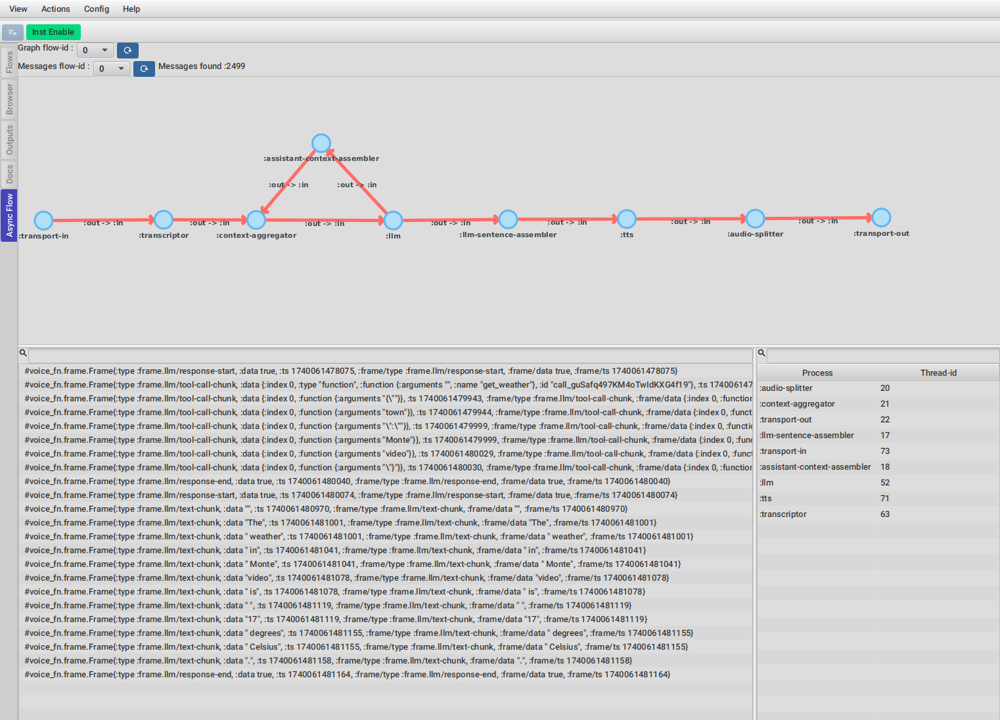

== Creating plugins

Creating a pluging consists of two parts :

- The runtime code that will analyze the recordings and expose an api for the UI
- The UI component which will visualize and interact with the data via the runtime api

This split is not required, but it is important if you want your plugin to support ClojureScript also or
remote Clojure debugging where the UI is not running in the same process as the runtime.

This components are normally split in two files, a runtime.clj and ui.clj, but you can name them however you
want.

We are going to go over each part in more detail but for a real plugin please checkout the https://github.com/flow-storm/flow-storm-async-flow-plugin[core.async.flow plugin].

=== Runtime

Here is a runtime file template you can use :

[%nowrap,clojure]
----
(ns flow-storm.plugins.my-plugin.runtime
  (:require [flow-storm.runtime.indexes.api :as ia]
            [flow-storm.runtime.debuggers-api :as dbg-api]))

(defn my-data-extraction [flow-id thread-id]
  (let [timeline (ia/get-timeline flow-id thread-id)]
    (reduce (fn [acc tl-entry]
              ;; extract some interesting info from the timeline
              )
            {}
            timeline)
    ))

;; Expose your function so it can be called from the UI part
(dbg-api/register-api-function :plugins.my-plugin/extract-data my-data-extraction)
----

=== UI

Here is a ui file template you can use :

[%nowrap,clojure]
----
(ns flow-storm.plugins.my-plugin.ui
  (:require [flow-storm.debugger.ui.plugins :as fs-plugins]
            [flow-storm.debugger.runtime-api :as runtime-api :refer [rt-api]])
  (:import [javafx.scene.control Label]))

(fs-plugins/register-plugin
 :my-plugin
 {:label "My plugin"
  :css-resource  "flow-storm-my-plugin/dark.css"
  :dark-css-resource  "flow-storm-my-plugin/dark.css"
  :light-css-resource "flow-storm-my-plugin/light.css"
  :on-focus (fn [{:keys [some-other-data]}]
              ;; This gets called everytime the plugin tab gets focused
              )
  :on-create (fn [_]
               {:fx/node (Label.
                          ;; You can call your runtime registered function
                          (str (runtime-api/call-by-fn-key rt-api :plugins.my-plugin/extract-data [0 10])))
                :some-other-data 42})
  :on-flow-clear (fn [flow-id {:keys [some-other-data]}]
                     ;; this gets called everytime a flow is discarded so you can update your plugin UI accordignly
                   )
  })
----

==== Styling plugins UIs

As you saw in the ui plugin registration, you can provide three resources related to styling :

- :css-resource If there is any, it will be loaded and applied. Here is where you put your JavaFX pluging styles
- :dark-css-resource This styles are going to be applied only in dark mode
- :light-css-resource This styles are going to be applied only in light mode

For making sure you plugin styles doesn't mix with other styles, your plugin is automatically wrapped in a pane
with your plugin key (my-plugin in the example above) as a class.

This means your plugin css can contain code like :

[%nowrap,clojure]
----
.my-plugin .table-view {
    -fx-font-family: 'monospaced';
}
----

== List of known plugins

- https://github.com/flow-storm/flow-storm-web-plugin
- https://github.com/flow-storm/flow-storm-flowbook-plugin
- https://github.com/flow-storm/flow-storm-cljs-compiler-plugin
- https://github.com/flow-storm/flow-storm-async-flow-plugin

= JVM options list

This section only collects the options, search for them in the User's guide for more context
and possible values.

== Clojure and ClojureScript

- `-Dflowstorm.startRecording=false`
- `-Dflowstorm.plugins.namespaces[.+]=ns1,ns2`
- `-Dflowstorm.threadFnCallLimits=org.my-app/fn1:2,org.my-app/fn2:4`
- `-Dflowstorm.title=FlowStormMainDebugger`
- `-Dflowstorm.theme=dark`
- `-Dflowstorm.styles=~/.flow-storm/big-fonts.css`
- `-Dflowstorm.fileEditorCommand=emacsclient -n +\<<LINE>>:0 \<<FILE>>`
- `-Dflowstorm.jarEditorCommand=emacsclient -n +\<<LINE>>:0 \<<JAR>>/\<<FILE>>`
- `-Dflowstorm.threadTraceLimit=1000`
- `-Dflowstorm.throwOnThreadLimit=true`
- `-Dflowstorm.autoUpdateUI=false`
- `-Dflowstorm.callTreeUpdate=false`
- `-Dflowstorm.uiTimeoutMillis=4000`

== Only Clojure

- `-Dclojure.storm.instrumentEnable=true`
- `-Dclojure.storm.instrumentOnlyPrefixes[.*]=ns-prefix1,ns-prefix2`
- `-Dclojure.storm.instrumentAutoPrefixes=false`
- `-Dclojure.storm.instrumentSkipPrefixes[.*]=my-app.too-heavy,my-lib.uninteresting`
- `-Dclojure.storm.instrumentSkipRegex=.\*test.*`

== Only ClojureScript 

- `-Dcljs.storm.instrumentEnable=true`
- `-Dcljs.storm.instrumentOnlyPrefixes=ns-prefix1,ns-prefix2`
- `-Dcljs.storm.instrumentOnlyPrefixes=my-app,my-lib`
- `-Dcljs.storm.instrumentSkipPrefixes=my-app.too-heavy,my-lib.uninteresting`

= Styling and theming

All functions that start the debugger ui (`flow-storm.api/local-connect`, `flow-storm.debugger.main/start-debugger`) accept a map
with the `:styles`, `:title` and `:theme` keywords. If `:styles` points to a css file it will be used to overwrite the default styles, in case you 
want to change colors, make your fonts bigger, etc. `:theme` could be one of `:auto` (default), `:light`, `:dark`. Title can be used to
distinguish between multiple debugger instances.

Like this :

[,clojure]
----
user> (local-connect {:styles "~/.flow-storm/big-fonts.css", :theme :dark, :title "FlowStormMainDebugger"})
----

If you are using _ClojureStorm_ you can also provide them with :

   -Dflowstorm.title=FlowStormMainDebugger
   -Dflowstorm.theme=dark
   -Dflowstorm.styles=~/.flow-storm/big-fonts.css
   
You can overwrite all the styles defined here https://github.com/flow-storm/flow-storm-debugger/blob/master/resources/flowstorm/styles/styles.css

= Key bindings

== General

- `Ctrl-g` Cancel any long running task (only search supported yet)
- `Ctrl-l` Clean all debugger state
- `Ctrl-d` Toggle debug-mode. Will log useful debugging information to the console
- `Ctrl-u` Unblock all breakpoint blocked threads if any
- `Ctrl-t` Rotate themes
- `Ctrl-plus` Increment font size
- `Ctrl-minus` Decrement font size
- `F`      "Select the Flows tool"
- `B`      "Select the Browser tool"
- `T`      "Select the Taps tool"
- `D`      "Select the Docs tool"

== Flows

- `0-9` Open focus flow-N threads menu, N being the pressed key
- `t` Select the tree tool (needs to be inside a thread)
- `c` Select the code tool (needs to be inside a thread)
- `f` Select the functions tool (needs to be inside a thread)

- `P` Step prev over. Go to previous step on the same frame
- `p` Step prev
- `n` Step next
- `N` Step next over. Go to next step on the same frame
- `^` Step out
- `<` Step first
- `>` Step last
- `Ctrl-f` Copy current function symbol
- `Ctrl-Shift-f` Copy current function call form
- `Ctrl-z` Undo navigation
- `Ctrl-r` Redo navigation

= Debugging react native applications

Debugging ClojureScript react native application needs a combination of ClojureScript and remote debugging.

Assuming you are using shadow-cljs, have added the `flow-storm-inst` dependency, and that it started a nrepl server on port 9000, you 
can start a debugger and connect to it by running :

[,bash]
----
clj -Sforce -Sdeps '{:deps {com.github.flow-storm/flow-storm-dbg {:mvn/version "4.4.6"}}}' -X flow-storm.debugger.main/start-debugger :port 9000 :repl-type :shadow :build-id :your-app-build-id :debugger-host '"YOUR_DEV_MACHINE_IP"'
----

You also need to make it possible for the device to connect back to the debugger on port 7722. You can accomplish this by running :

[,bash]
----
adb reverse tcp:7722 tcp:7722
----

Also remember that you need to have installed the `websocket` npm library. You can do this like :

[,bash]
----
npm install websocket --save
----

= Working on Windows with WSL2

For those using current versions of WSL2 on Windows it should be pretty straight forward.

    - export DISPLAY=:0
    - export WSL2_GUI_APPS_ENABLED=1

Font issues had been reported on some distros, like `java.lang.NullPointerException: Cannot read field "firstFont" because "<local4>" is null` which
seams to be solved just by installing font packages like `dejavu-fonts` or `ttf-dejavu` depending on the distro.
    
= Opening forms in editors

You can add this two jvm options to tell FlowStorm how to open forms in files and inside jars :

    - flowstorm.jarEditorCommand : a command with optional \<<JAR>>, \<<FILE>> and \<<LINE>> placeholders
    - flowstorm.fileEditorCommand : a command with optional \<<FILE>> and \<<LINE>> placeholders

If you define those, clicking on your forms namespaces link in the code tool should run the provided commands.
On expressions sub-forms that contains line meta you should also be able to right click and select "Open in editor"
which should open the file at that specific line (useful for long forms).

Here are some known setups for most common editors :

== Emacs

[,clojure]
----
;; for opening your project files
"-Dflowstorm.fileEditorCommand=emacsclient -n +<<LINE>>:0 <<FILE>>"

;; simple way for opening files inside jars (works on linux only)
"-Dflowstorm.jarEditorCommand=emacsclient -n +<<LINE>>:0 <<JAR>>/<<FILE>>"

;; for opening files inside jars that works on every OS (requires FlowStorm >= 3.17.3)
"-Dflowstorm.jarEditorCommand=emacsclient --eval '(let ((b (cider-find-file \"jar:file:<<JAR>>!/<<FILE>>\"))) (with-current-buffer b (switch-to-buffer b) (goto-char (point-min)) (forward-line (1- <<LINE>>))))'"
----

== VSCode

[,clojure]
----
"-Dflowstorm.fileEditorCommand=code --goto <<FILE>>:<<LINE>>"
----

== IntelliJ

[,clojure]
----
"-Dflowstorm.fileEditorCommand=idea --line <<LINE>> <<FILE>>"
----

== Vim

[,clojure]
----
"-Dflowstorm.fileEditorCommand=vim +<<LINE>> <<FILE>>"
----

= Editors/IDEs integration

== Emacs

Checkout https://github.com/flow-storm/cider-storm[Cider Storm] an Emacs Cider front-end with support for Clojure and ClojureScript.

== VSCode

With the following alias setup in deps.edn:

[source,clojure]
{:aliases {:flowstorm {:classpath-overrides {org.clojure/clojure nil}
                       :extra-deps {com.github.flow-storm/clojure {:mvn/version "1.12.1"}
                                    com.github.flow-storm/flow-storm-dbg {:mvn/version "4.4.6"}}
                       :jvm-opts ["-Dflowstorm.startRecording=true"
                                  "-Dclojure.storm.intrumentEnable=true"
                                  "-Dclojure.storm.intrumentAutoPrefixes=true"]}}}

Create a custom connect sequence in the VSCode settings.json:

[source,json]
{
      "name": "flowstorm",
      "projectType": "deps.edn",
      "cljsType": "none",
      "extraNReplMiddleware": ["flow-storm.nrepl.middleware/wrap-flow-storm"],
      "afterCLJReplJackInCode": "((requiring-resolve 'flow-storm.storm-api/start-debugger))",
      "menuSelections": {
        "cljAliases": ["flowstorm"]
      }
}

Jack-in using the `flowstorm` sequence from the menu.

== IntelliJ IDEA (Cursive)

= Tutorials and demos

https://github.com/flow-storm/flow-storm-debugger?tab=readme-ov-file#some-demo-videos-newers-at-the-top

= Known limitations

== Code with macros that don't preserve meta

FlowStorm works fine with most macros, except the ones that don't preserve meta at macroexpansion, which FlowStorm needs in their absence,
can cause GAPS IN EXECUTION TRACING AND PREVENT IT FROM LINKING THE EXECUTED CODE BACK TO THE ORIGINAL SOURCE.

When macros are involved, the forms compiled by the Clojure compiler aren't the ones on your source files, but the ones generated
by macro-expanding all the macros. In order to link the compiled forms back to the forms in your source code, for each instrumented form,
right after the form is read by the reader, FlowStorm will walk the form down, annotating with meta each sub-form with a coordinate,
which will then be used after macro expansion to link a compiled expression back to your source code.

Macros can be as simple as code reorganizing ones (like `->`, `when`, `and`, `defn`, etc) or whole compilers like `clojure.core.async/go` and
Electric, so it really depends on the macros.

If you see code inside a macro not being traced feel free to report an issue, there is nothing FlowStorm can do from its side but
we can work together with the macro developer making sure it preserves all meta after macro expansion, which sometimes may be possible.

== Locals pane and mutable values

The Locals pane will show the value of each binding for a symbol AT BINDING TIME, which is the same thing
no matter where you are in the current block when working with immutable objects, BUT NOT WHEN WORKING WITH MUTABLE ONES.

If what was bound was mutable in any way, you will be seeing the value at binding time, and not at current time which
could cause some confusion.

== Closed over bindings aren't displayed in Locals

The locals pane will only display bindings for the current function. Locals visible from the current function but not defined
in it (like in the case of closures) aren't shown.

== Don't instrument clojure.core or FlowStorm itself

Currently we can't instrument clojure.core or FlowStorm itself since they endup in infinite tracing recursions.
This can be solved, but it is currently a limitation. 

== IF test expressions tracing with intrinsics

When you have code like :
[,clojure]
----
(defn foo [^long l]
  (if (zero? l)
    (+ l 1)
    (+ l 2)))
----

because `l` is a primitive long, the compiler can replace the (zero? l) with intrinsics (LCONST_0, LCMP, IFNE) so the
(zero? l) isn't a expression anymore, just a statement. In these cases you will see the if test return un-highlighted, but
you can still tell which branch the code went thru because the chosen branch will be the highlighted one.

= Troubleshooting

== The outputs panel doesn't work

Checkout that you don't have piggieback on the classpath dragged by some dependency. Currently
if piggieback is pressent FlowStorm will assume a ClojureScript repl in which the outputs panel
isn't supported yet.

== Run with JDK 11

FlowStorm UI requires JDK >= 17. If you can't upgrade your JDK you can still use it by downgrading JavaFx.

If that is the case add these dependencies to your alias :

[,clojure]
----
org.openjfx/javafx-controls {:mvn/version "19.0.2"}
org.openjfx/javafx-base     {:mvn/version "19.0.2"}
org.openjfx/javafx-graphics {:mvn/version "19.0.2"}
org.openjfx/javafx-web      {:mvn/version "19.0.2"}
----

= Internals, diagrams and documentation

For people interested in enhancing, troubleshooting, fixing or just learning about FlowStorm internals take a look at here :

https://github.com/flow-storm/flow-storm-debugger/blob/master/docs/dev_notes.md

Some useful diagrams :

- https://raw.githubusercontent.com/flow-storm/flow-storm-debugger/master/docs/high_level_diagram.svg
- https://raw.githubusercontent.com/flow-storm/flow-storm-debugger/master/docs/timeline.svg
- https://raw.githubusercontent.com/flow-storm/flow-storm-debugger/master/docs/run_configs.svg
									   
////
Local Variables:
mode: outline
outline-regexp: "[=]+"
End:
////
