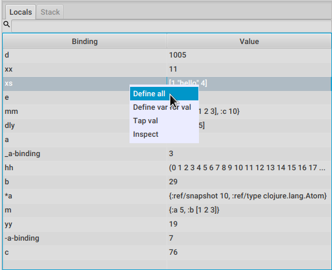

= FlowStorm debugger User's Guide
:source-highlighter: rouge
:author: By Juan Monetta
:lang: en
:encoding: UTF-8
:doctype: book
:toc: left
:toclevels: 4
:sectlinks:
:sectanchors:
:leveloffset: 1
:sectnums:

FlowStorm is a tracing debugger for Clojure and ClojureScript.

It can instrument any Clojure code and provides many tools to explore and analyze your programs executions.

== Quick start

Before you start check FlowStorm minimum requirements.

[IMPORTANT]
.Minimum requirements
====
	- jdk >= 11
	- Clojure >= 1.10.0
====

=== Clojure

There are two ways of using FlowStorm for Clojure :

	- With <<#_clojurestorm,ClojureStorm>> (recommended) : Swap your dev Clojure compiler by ClojureStorm and get everything instrumented automatically
	- <<#_vanilla_flowstorm,Vanilla FlowStorm>> : Just add FlowStorm to your dev classpath and instrument by re-evaluating forms
    
ClojureStorm is a fork of the official Clojure compiler that adds automatic instrumentation so you don't need to think about it (you can still disable it when you don't need it).

You use it by swapping the official Clojure compiler by ClojureStorm at dev time, using dev aliases or profiles.

==== ClojureStorm

This is the newest and simplest way of using FlowStorm, and requires you to swap your official Clojure compiler by ClojureStorm.
Swapping compilers sounds like a lot but don't worry, ClojureStorm is just a patch applied over the official compiler with some
extra stuff for automatic instrumentation, you shouldn't encounter any differences.

The easiest way to run and learn FlowStorm with ClojureStorm is by running the repl tutorial, like this :

[,bash]
----
;; on linux and mac-os
clj -Sforce -Sdeps '{:deps {} :aliases {:dev {:classpath-overrides {org.clojure/clojure nil} :extra-deps {com.github.jpmonettas/clojure {:mvn/version "RELEASE"} com.github.jpmonettas/flow-storm-dbg {:mvn/version "RELEASE"}} :jvm-opts ["-Dclojure.storm.instrumentEnable=true" "-Dclojure.storm.instrumentOnlyPrefixes=user"]}}}' -A:dev

;; on windows
clj -Sforce -Sdeps '{:deps {} :aliases {:dev {:classpath-overrides {org.clojure/clojure nil} :extra-deps {com.github.jpmonettas/clojure {:mvn/version """RELEASE"""} com.github.jpmonettas/flow-storm-dbg {:mvn/version """RELEASE"""}} :jvm-opts ["""-Dclojure.storm.instrumentEnable=true""" """-Dclojure.storm.instrumentOnlyPrefixes=user"""]}}}' -A:dev
----

[IMPORTANT]
.On using maven RELEASE as version
====
Be careful when using RELEASE as maven versions, since the first time is going to fetch the latest one
but it will be cached unless you run with -Sforce.
It is much safer to just write the latest versions. Check out  the https://github.com/jpmonettas/flow-storm-debugger/[github page] for the latest stable releases.
====

Pasting that command on your terminal will bring up a repl with FlowStorm and the compiler swapped by ClojureStorm. When the repl comes up just
evaluate the `:tut/basics` keyword on it for a tour of what it can do.

After the tutorial you would want to add it and configure it for your project, so here are the basics :

If your project is using deps.edn, your deps.edn file should look like this :
[,clojure]
----
{:paths ["src"]
 :deps {}
 :aliases {:dev {:classpath-overrides {org.clojure/clojure nil} ;; for disabling the official compiler
                 :extra-deps {com.github.jpmonettas/clojure {:mvn/version "RELEASE"}
                              com.github.jpmonettas/flow-storm-dbg {:mvn/version "RELEASE"}}
                 :jvm-opts ["-Dclojure.storm.instrumentEnable=true"
                            "-Dclojure.storm.instrumentOnlyPrefixes=YOUR_INSTRUMENTATION_STRING"]}}}
----

where `YOUR_INSTRUMENTATION_STRING` should be a comma separated list of namespaces prefixes like :

	  my-project.,lib1.,lib2.core

which means only instrument my-project.* (which includes all sub namespaces), all lib1.* and only everything under lib2.core

This is probably what most people want since you don't want to instrument things like nrepl, cider or any of your tooling stuff
although you can still do it if you need it. There are also other options you can check with `:help`.

If your project uses lein, your project.clj file should look something like this :

[,clojure]
----
(defproject my.project "1.0.0"
  :profiles {:dev {:dependencies [[com.github.jpmonettas/clojure "RELEASE"]
                                  [com.github.jpmonettas/flow-storm-dbg "RELEASE"] ]
                   :exclusions [org.clojure/clojure] ;; for disabling the official compiler
                   :jvm-opts ["-Dclojure.storm.instrumentEnable=true"
                              "-Dclojure.storm.instrumentOnlyPrefixes=YOUR_INSTRUMENTATION_STRING"]}}
  :main foo.core)
----

with `YOUR_INSTRUMENTATION_STRING` as described above.

[NOTE]
.#rtrace and #trace
====
When using FlowStorm with ClojureStorm it is a error to use #trace or #rtrace. They aren't needed since
everything you declared in `clojure.storm.instrumentOnlyPrefixes` will be automatically instrumented.
====

==== Vanilla FlowStorm

If you use https://clojure.org/guides/deps_and_cli[clojure cli] you can start a repl with the FlowStorm dependency loaded like this :

[,bash]
----
;; on linux and mac-os
clj -Sforce -Sdeps '{:deps {com.github.jpmonettas/flow-storm-dbg {:mvn/version "RELEASE"}}}'

;; on windows
clj -Sforce -Sdeps '{:deps {com.github.jpmonettas/flow-storm-dbg {:mvn/version """RELEASE"""}}}'
----

[IMPORTANT]
.On using maven RELEASE as version
====
Be careful when using RELEASE as maven versions, since the first time is going to fetch the latest one
but it will be cached unless you run with -Sforce.
It is much safer to just write the latest versions. Check out  the https://github.com/jpmonettas/flow-storm-debugger/[github page] for the latest stable releases.
====

If you are a https://leiningen.org/[lein] user add the dependency to your project.clj `:dependencies` and run `lein repl`.

Then require the api namespace and start the debugger :

[,clojure]
----
user> (require '[flow-storm.api :as fs-api]) ;; the only namespace you need to require

user> (fs-api/local-connect) ;; will run the debugger GUI and get everything ready
----

You should now see a empty debugger window.

Lets debug something :

[,clojure]
----
user> #rtrace (reduce + (map inc (range 10))) ;; #rtrace will instrument and run some code
----

image::user_guide_images/quick_start.png[]

After running it, you should get the return value of the expression (as if #rtrace wasn't there).
The debugger thread list (the one on the left) shows all the threads it has recordings for.
Double clicking on it should open the "thread exploring tools" for that thread in a new tab.

This guide will cover all the tools in more detail but if you are interested in code stepping for example
you will find it in the `code stepping tool` at the bottom left corner of the thread tab, the one that has the `()` icon.
Clicking on it will show you something like the picture above.

Go ahead and use the stepping controls to step over the code.

Now that everything seems to be working move on and explore the many features FlowStorm provides. There are many ways of instrumenting
your code, and many ways to explore its executions.
	
=== ClojureScript

Debugging ClojureScript is a case of remote debugging in FlowStorm. This means the debugger
will run in a separate process and connect to the debuggee by connecting to a repl.

For enabling every debugger feature, remote connections needs a repl. If you don't connect to a repl you
can still use the debugger but you will have to call `flow-storm.api/remote-connect` by hand on your app.

[NOTE]
.Repl connection limitations
====
Currently only shadow-cljs repl over nrepl is supported.
====

Lets say you are using https://github.com/thheller/shadow-cljs[shadow-cljs] to start a ClojureScript repl.

First you need to add FlowStorm dependency to your project dependencies, like this :

[,clojure]
----
$ cat shadow-cljs.edn

{...
 :dependencies [... [com.github.jpmonettas/flow-storm-inst "RELEASE"]]

 ;; the next two lines aren't needed but pretty convenient
 :nrepl {:port 9000}
 :my-build-id {:devtools {:preloads [flow-storm.api]}}
 ...} 
----

[IMPORTANT]
.On using maven RELEASE as version
====
Be careful when using RELEASE as maven versions, since the first time is going to fetch the latest one
but it will be cached unless you run with -Sforce.
It is much safer to just write the latest versions. Check out  the https://github.com/jpmonettas/flow-storm-debugger/[github page] for the latest stable releases.
====

Then lets say you start your repl like :

[,bash]
----
npx shadow-cljs watch :my-build-id

shadow-cljs - config: /home/jmonetta/demo/shadow-cljs.edn
shadow-cljs - server version: 2.19.0 running at http://localhost:9630
shadow-cljs - nREPL server started on port 9000
shadow-cljs - watching build :my-build-id
[:my-build-id] Configuring build.
[:my-build-id] Compiling ...
[:my-build-id] Build completed. (127 files, 0 compiled, 0 warnings, 6.19s)

cljs.user=> 
----

As you can see from the output log shadow-cljs started a nrepl server on port 9000, this is the port FlowStorm needs to connect to,
so to start the debugger and connect to it you run :

[,bash]
----
;; on linux and mac-os
clj -Sforce -Sdeps '{:deps {com.github.jpmonettas/flow-storm-dbg {:mvn/version "RELEASE"}}}' -X flow-storm.debugger.main/start-debugger :port 9000 :repl-type :shadow :build-id :my-build-id

;; on windows
clj -Sforce -Sdeps '{:deps {com.github.jpmonettas/flow-storm-dbg {:mvn/version """RELEASE"""}}}' -X flow-storm.debugger.main/start-debugger :port 9000 :repl-type :shadow :build-id :my-build-id
----

And that is all you need, the debugger GUI will pop up and everything will be ready.

Try tracing some code from the repl :

[,clojure]
----
cljs.user> #rtrace (reduce + (map inc (range 10))) ;; #rtrace will instrument and run some code
----

After running it, you should get the return value of the expression (as if #rtrace wasn't there).

The debugger thread list (the one on the left) shows all the threads it has recordings for. Because we are
in javascript land there will always be just one thread, called `main`.
Double clicking it should open the "thread exploring tools" for that thread in a new tab.

This guide will cover all the tools in more detail but if you are interested in code stepping for example you will find
it in the `code stepping tool` at the bottom left corner of the thread tab, the one that has the `()` icon.

Click on it and use the stepping controls to step over the code.

Now that everything seems to be working move on and explore the many features FlowStorm provides. There are many ways of instrumenting
your code, and many ways to explore its executions.

If you are not using a repl or the repl you are using isn't supported by FlowStorm yet you can still use the debugger
but not all features will be supported (mainly the browser features).

For this you can start the debugger like before but without any parameters, like this :

[,bash]
----
clj -Sforce -Sdeps '{:deps {com.github.jpmonettas/flow-storm-dbg {:mvn/version "RELEASE"}}}' -X flow-storm.debugger.main/start-debugger
----

And then go to your app code and call `(flow-storm.api/remote-connect)` maybe on your main, so every time your program starts
will automatically connect to the repl.

[NOTE]
.ClojureScript environments
====

FlowStorm is supported for ClojureScript in :

		  - Browsers
		  - NodeJS
		  - React native
====

[NOTE]
.NodeJs and react-native
====
On NodeJs and react-native you need to install the `websocket` library.
Do this by running `npm install websocket --save`

For react-native if your app is running inside a cellphone you will have to also provide the `:debugger-host` key
to `flow-storm.debugger.main/start-debugger` with your box ip address, unless you are using adb reverse with your ports for
which you will have to `adb reverse tcp:7722 tcp:7722` (the debugger websocket port)
====

[NOTE]
.App initialization debugging
====
If you need to debug some app initialization, for adding `#trace` tags before the debugger is connected you
will have to require flow-storm.api yourself, probably in your main. All the tracing will be replayed to the debugger
once it is connected.
====

Here is a repo you can use if you want to try FlowStorm with shadow-cljs https://github.com/jpmonettas/shadow-flow-storm-basic

== Remote debugging

You can remotely debug any Clojure application the exposes a nrepl server.
You can do remote Clojure debugging in two ways (the same as local debugging), with and without ClojureStorm.

The debuggee side should be setup the same as a normal local setup with the optional change that you can use
`flow-storm-inst` instead of `flow-storm-dbg` being the former a slimmed down version of the later one that
doesn't contain some libraries used only by the UI, but using the full `flow-storm-dbg` is also ok.

Once you have on your remote box your debuggee running and exposing a nrepl server you can connect to it by running :

[,bash]
----
clj -Sforce -Sdeps '{:deps {com.github.jpmonettas/flow-storm-dbg {:mvn/version "RELEASE"}}}' -X flow-storm.debugger.main/start-debugger :port 9000 :runtime-host '"YOUR-REPL-IP-ADDRESS"' :debugger-host '"YOUR-IP-ADDRESS"'
----

assuming your nrepl server is listening on port 9000.

If your application is running in a different box you can also provide two extra keys :

   - `:runtime-host` should be the ip of the debuggee (defaults to localhost)
   - `:debugger-host` should be the ip where the debugger is running, since the debuggee needs to connect back to it (defaults to localhost)"

=== SSH tunnel

You can debug remote process through a ssh tunnel by creating a tunnel like this :

[,bash]
----
ssh -L 9000:localhost:9000 -R 7722:localhost:7722 my-debuggee-box.com
----

assuming your remote process at my-debuggee-box.com has started a nrepl server listening on port 9000.

=== Docker

If you run you process inside a docker container, here is a basic template for using FlowStorm with it
https://github.com/jpmonettas/docker-flow-storm-basic

== Instrument code

[NOTE]
.ClojureStorm
====
Instructions here only apply to vanilla FlowStorm and ClojureScript debugging. If you are using ClojureStorm
this is done automatically for you, so just skip this section.
====

Code instrumentation in FlowStorm is done by rewriting your code, in a way that doesn't change its behavior
but when executed will trace everything the code is doing.

You can instrument code from the <<#_browser_tool,browser tool>> or the repl.

=== Instrument from the repl

==== Instrument any form with #trace

You can instrument any top level form at the repl by writing `#trace` before it, like this :

[,clojure]
----
#trace
(defn sum [a b]
  (+ a b))
----

and then evaluating the form.

important:: `#trace` is meant to be used with forms that don't run immediately, like: defn, defmethod, extend-type, etc.
Use `#rtrace` to trace and run a form, like `#rtrace (map inc (range 10))`.

==== Run code with #rtrace

`#rtrace` is useful in two situations :

First, when instrumenting and running a simple form at the repl, like:

[,clojure]
----
#rtrace (-> (range) (filter odd?) (take 10) (reduce +))
----

Second, when you want to run a form with a certain flow id (see <<#_flows_tool,flows>>).

`#rtrace` by default will instrument and run the form with flow id 0, but you can use
`#rtrace0`, `#rtrace1`, `#rtrace2`, `#rtrace3`, `#rtrace4`, `#rtrace5` to trace with flows ids [0..5].

==== Instrument namespaces

FlowStorm allows you to instrument entire namespaces by providing `flow-strom.api/instrument-namespaces-clj`.

You call it like this :

[,clojure]
----
(instrument-namespaces-clj #{"org.my-app.core" "cljs."})
----

The first argument is a set of namespaces prefixes to instrument. In the previous example it means
instrument all namespaces starting with `org.my-app.core`, and all starting with `cljs.`

The second argument can be a map supporting the following options :

- `:excluding-ns` a set of strings with namespaces that should be excluded
- `:disable` a set containing any of #{`:expr` `:binding` `:anonymous-fn`} useful for disabling unnecessary traces in code that generate too many
- `:verbose?` when true show more logging

==== What can't be instrumented?

This are some limitations when instrumenting forms :

1. Very big forms can't be fully instrumented. The JVM spec has a limit on the size of methods and instrumentation adds a lot of code.
When instrumenting entire namespaces, if you hit this limit on a form a warning will printed on the console saying `Instrumented expression is too large for the Clojure compiler`
and FlowStorm automatically tries to instrument it with a lighter profile, by disabling some instrumentation.

2. Functions that call recur without a loop

3. Functions that return recursive lazy sequences. Like `(fn foo [] (lazy-seq (... (foo))))`

==== Un-instrument code

Un-instrumenting code that has been instrumented with `#trace` or `#ctrace` is straight forward, just remove the tag and re evaluate the form.

To un-instrument entire namespaces you can use `flow-storm.api/uninstrument-namespaces-clj` which accept a set of namespaces prefixes.

=== Instrument with the browser

Most of the time you can instrument code by just clicking in the browser. The only exceptions are functions that were just defined in the repl
and weren't loaded from a file. 

==== Instrument vars

Using the browser you can navigate to the var you are interested in and then use the instrument button to instrument it.

image::user_guide_images/browser_var_instrumentation.png[]

There are two ways of instrumenting a var :

- Instrument (instrument just the var source code)
- Instrument recursively (recursively instrument the var and all vars referred by it)

==== Instrument namespaces

Using the browser you can also instrument multiple namespaces. Do this by selecting the namespaces you are interested in
and then a right click should show you a menu with two instrumentation commands.

image::user_guide_images/browser_ns_instrumentation.png[]

- `Instrument namespace :light` - record function arguments and return values (not expressions, no bindings tracing)

- `Instrument namespace :full` fully instrument everything

Light instrumentation is useful when you know the functions generate too many traces, so you can opt to trace just functions
calls and returns. You can then <<#_fully_instrument_a_form_from_the_code_view, fully instrument>> whatever functions you are interested in.

==== Un-instrument code

The bottom panel shows all instrumented vars and namespaces.

image::user_guide_images/browser_uninstrument.png[]

You can un-instrument them temporarily with the enable/disable checkbox or
permanently with the del button.

=== Fully instrument a form from the code view

image::user_guide_images/fully_instrument_form.png[]

If you have instrumented a form with the <<#_instrument_namespaces_2, :light profile>> you can fully instrument it by right clicking on the current form
and then clicking `Fully instrument this form`.

== Flows tool

The `Flows` tab contains a bunch of tools for analyzing all traced executions flows.

Flows are identified by a flow-id and can be started by running a form with `#rtrace`, `#rtrace1`, `#rtrace2`, etc,.
If you run a flow twice with the same flow id, the first one is going to be replaced.

A flow will happen in one or more threads. A separate tab will show for each thread.

For example if we trace a form that spawns multiple threads :

[,clojure]
----
#rtrace (-> (pmap (fn [i] (* i i)) (range 5)))
----

image::user_guide_images/thread_outer_form.png[]

the `(-> (pmap ... (range 5)))` form will run on the `main` thread

image::user_guide_images/thread_inner_form.png[]

while the `(fn [i] (* i i))`. executions will be distributed in the `clojure-agent-send-off-pool-*` since `clojure.core/pmap` is backed by a thread pool.

Anything instrumented that isn't run under #rtrace will end up in the funnel flow, which accumulates all traces that don't contain any flow-id.

image::user_guide_images/funnel_flow.png[]

=== Code tool

image::user_guide_images/code_tool_tab.png[]

The code tool is the second of the `Flows` tab. It provides most of the functionality found in a traditional debugger.
You can use it to step over each expression, visualize values, locals and more.

==== Code stepping

image::user_guide_images/controls.png[]

The numbers at the end show `current_trace_index / total_traces`.

Write any number (less than total_traces) on the text box to jump into that position in time. When jumping around you can write down any interesting
positions you find and then use the text box to jump back to it if you need.

The code tool allows you to step and "travel thought time" in two ways:

- You can use the controls at the top or [Ctrl | Alt]+MouseWheel on the forms to move one step at a time.

- Or you can click on the highlighted forms to position the debugger at that point in time.

Only the forms that were executed at least once for the flow and thread will be highlighted.

When clicking on a highlighted form two things can happen :

	 - If the form was executed only once for the current frame, the debugger will immediately jump to it.
	 - Else if the form was executed multiple times, a context menu will show all the values that form evaluated to, sorted by time,
	 and clicking on them will make the debugger jump to that specific point in time. This is useful for debugging loops.

image::user_guide_images/loops.png[]

==== Exception debugging

Lets say you just run a instrumented piece of code and an exception bubbled up. One thing you can do to locate the source of the exception
is to click the last trace button, it will move the debugger to the last trace captured for the thread, which almost always point to the expression evaluated before the exception was thrown.

==== Locals

The locals panel will always show the locals bounded for the current point in time.

Right clicking on them will show a menu where you can :

	  - define all frame vars 
	  - define the value with a name, so you can use it at the repl
	  - inspect the value with the <<#_value_inspector,value inspector>>
	  - tap the value as with `tap>`

`Define all frame vars` will define all the bindings for the entire frame in the current form namespace.
This is useful for trying things at your editor as described here https://www.cognitect.com/blog/2017/6/5/repl-debugging-no-stacktrace-required

==== Stack

The stack panel will always show the current stacktrace. Be aware that the stacktrace
only include functions calls that had been recorded, so if you aren't recording everything
there will be gaps.

image::user_guide_images/stack.png[]

Clicking on any of the stack entries will make the debugger jump to that point in time.

==== Value panels

Value panels show in many places in FlowStorm.

image::user_guide_images/value_panels.png[]

The value panel in the code tool always display a pretty print of the current expression value.

You can configure the print-level and print-meta for the pretty printing by using the controls at the top.

===== Define value for repl

Use the `def` button to define a var pointing to the current inspector value.

You can use / to provide a namespace, otherwise will be defined under [cljs.]user

==== Re running a flow

Every time you run a form with #rtrace FlowStorm keeps a copy of the form. You can use the re-run-flow button after instrumenting or un-instrumenting code,
since it allows you to re run the form with a single click.

=== Call Stack tree tool

The call stack tree tool is the first one of the `Flows` tab. It allows you to see the execution flow by expanding its call stack tree.

image::user_guide_images/callstack_tool_tab.png[]

The call stack tree is useful for a high level overview of a complex execution and also as a tool for quickly moving through time.

You can jump to any point in time by double clicking on a node or by right clicking and on the context menu selecting `Step code`. 

image::user_guide_images/callstack_tree.png[]

[NOTE]
.Tree refreshing
====
If FlowStorm keeps receiving traces for the thread you are analyzing, it will keep building the tree but will not automatically refresh its visuals.
You can use the refresh button at the root to update it.
====

Use the button at the top left corner of the tree tool to show the current frame of the debugger in the tree.

There are also two <<#_value_panels,value panels>> at the bottom that show the arguments and return value for the currently selected function call.

==== Searching

You can search over function names and a string serialization of the arguments using the search tool at the top.

`\*print-level*` controls how deeply it will serialize the arguments it will search over.

Use `From index` if you don't want to search from the beginning. It will be automatically set after each match so it is easy to keep searching forward.

If the search is taking too long you can always cancel it by hitting `Ctrl-g` on the keyboard. You can always make your search faster by choosing a
lower value for `\*print-level*` or by <<#_un_instrument_code_2,un-instrumenting>> unnecessary code so you have less information to search over.

image::user_guide_images/search_match.png[]

Once you have a search match the tree will auto expand but not auto scroll. If the expansion is big you will have to manually
scroll down and use the blue link at the top to help you locate the match.

=== Functions tool

The functions tool is the third one of the `Flows` tab.

image::user_guide_images/functions_tool_tab.png[]

It shows a list of all traced functions sort by how many times the have been called.

image::user_guide_images/functions.png[]

Normal functions will be colored black, multimethods magenta and types/records protocols/interfaces implementations in green.

Together with the <<#_call_stack_tree_tool, call stack tree>> provide a high level overview of a flow thread execution and allows you to
jump through time much quicker than single stepping.

You can search over the functions list by using the bar at the top.

==== Function calls

Double clicking on any function will display all function calls on the right sorted by time. Each line will show the arguments vector
for each call, and you can use the check boxes at the top to hide some of them.

Clicking on any item will display the result of the call in the value pane, while double clicking on any item in the functions call list will move the debugger to that specific point in time.

==== Un-instrumenting functions

Since the functions tool shows all the functions sorted by how many time they have been called it is a good tool to
see where most of your traces are coming from. If you want to reduce the number of traces, to make lets say, search faster,
you can right click on any function to un instrument it. You will have to <<#_re_running_a_flow,re run the flow>> after.

== Browser tool

The browser tool is pretty straight forward. It allows you to navigate your namespaces and vars, and also instrument/un-instrument them.

image::user_guide_images/browser.png[]

See <<#_instrument_with_the_browser, instrument with the browser>> for more info.

== Taps tool

Use the taps tool to visualize your `tap>`.

image::user_guide_images/taps.png[]

Every time you (local-connect) or (remote-connect) FlowStorm will add a tap, so whenever you `tap>` something
it show in the taps list.

Double click on any value to start the value inspector for it.

A `#tap` tag will also be available, which will tap and return so you can use it like `(+ 1 2 #tap (* 3 4))`
Use the `clear` button to clear the list.

There is also `#tap-stack-trace`. It will tap the current stack trace.

== Docs tool

Generate projects functions documentation by sampling their executions.

=== Generating docs

Lets say we want to generate documentation for datascript(https://github.com/tonsky/datascript/). 

First we clone the repo. Then we can generate it by calling `flow-storm.api/cli-doc`. 

For convenience we are going to create a script `document.sh` like this :

[,bash]
----
#!/bin/bash

clj -Sforce -Sdeps '{:deps {com.github.jpmonettas/flow-storm-inst {:mvn/version "RELEASE"}}}' \
    -X:test flow-storm.api/cli-doc \
    :result-name '"datascript-flow-docs-1.4.0"' \
    :print-unsampled? true \
    :instrument-ns '#{"datascript"}' \
    :fn-symb 'datascript.test/test-clj' \
    :fn-args '[]' \
    :examples-pprint? true \
    :examples-print-length 2 \
    :examples-print-level 3 
----

The idea behind `flow-storm.api/cli-doc` is to act as a trampoline, so it will instrument our code base as specified by `:instrument-ns` 
then call whatever function provided by `:fn-symb` and `:fn-args`.

For this case we are going to instrument every namespace that starts with "datascript" and then run `datascript.test/test-clj` without arguments.

For the rest of the options check `flow-storm.api/cli-doc` doc string.

It will output 3 useful things :

- datascript-flow-docs-1.4.0.jar containing just a sample.edn file with all the data
- the coverage percentage (how many fns were sampled over the instrumented ones)
- unsampled fns, which are all the functions that were instrumented but the test never called

So if you are running your tests, as a bonus you will get your test "coverage" and a list of functions your 
tests aren't exercising, you should see something like this after it finishes :

image::user_guide_images/flow_docs_cli.png[]

=== Publishing docs

Given the docs are already in jar format you can publish them to your local repo or any maven repo (like Clojars) 
with the usual mvn utilities.

=== Consuming docs

FlowStorm debugger provides a way of visualizing whatever docs you have on your classpath.

For this you can add the docs and FlowStorm to your classpaths as usual, like :

[,bash]
----
clj -Sforce -Sdeps '{:deps {com.github.jpmonettas/flow-storm-dbg {:mvn/version "RELEASE"} dsdocs/dsdocs {:local/root "/home/user/datascript/datascript-flow-docs-1.4.0.jar"}}}'
----

or if you want to use the documentation I already generated and uploaded to my clojars group try :

[,bash]
----
clj -Sforce -Sdeps '{:deps {com.github.jpmonettas/flow-storm-dbg {:mvn/version "RELEASE"} com.github.jpmonettas/datascript-flow-docs {:mvn/version "1.4.0"}}}'
----

and now we can run the debugger :

[,clojure]
----
(require '[flow-storm.api :as fs-api])

(fs-api/local-connect)
----

The documentation will be available under the Docs tool.

You can search and click over all the functions you have loaded from all your imported docs to see the details.

Currently it shows fns meta, arguments, returns, and call examples.

image::user_guide_images/flow_docs_browser.png[]

=== TIPS

If you are using the emacs integration you can do `C-c C-f d` (flow-storm-show-current-var-doc) to show the current function documentation 
in the debugger.

== Value inspector

Use the value inspector to explore any data.

image::user_guide_images/value_inspector.png[]

Use it to lazily and recursively navigate your data. It will render collections with links that allows you
to dig deeper into the data.

The top bar provides a way of navigating back.

Use the `def` button to define the current value for the repl.

[NOTE]
.Datafy
====
Value inspector uses `clojure.datafy/datafy` under the hood, so you can explore your objects also.
====

== Thread breakpoints

image::user_guide_images/thread_breaks.png[]

FlowStorm is a tracing debugger, wich means it can record what is happening without the need of stopping
your programs execution. This is all fine but doesn't cover every possible situation. There are
cases where recording everything is impractical, like in a game loop, since it will consume a lot of heap
and you are probably not interested in all those frames details.

For situations like the previous one, FlowStorm has the ability to set thread breakpoints, which means to define points
in the execution of your program where you want your threads to wait.
While the threads are waiting you can explore what happened so far. If the recorded information isn't enough you can
click the play buttons next to each blocked thread to tell it to continue until it hit a breakpoint again, or right
click on any of the blocked threads and select `Unblock all threads` to unlock all of them.
Then you can analyse the new recordings. Once you are done, you can choose to uninstrument
your functions, or maybe easier to just pause recording using the pause button in the main toolbar. Then you
can remove the breakpoints and un-block every thread.

You can define thread breakpoints in two ways :

- Using the browser (like in the image below), you can navigate to any function and click on the `Break` button. This will block the calling
  thread everytime the selected function gets called.
- Or you can also install a break by calling (flow-storm.api/break-at 'my-proj.core/some-fn)

image::user_guide_images/browser_breakpoints.png[]

[NOTE]
.Conditional threads breakpoints
====
The break-at fn accepts a second argument where you can provide a predicate that will be called with the same arguments
of the function you are breaking. It will only break when the predicate returns true. If you don't
provide a predicate it will default to `(constantly true)`
====

You can remove breakpoints by :

- Clicking on the browser intrumentation list delete buttons
- Calling `flow-storm.api/remove-break` to remove a single breakpoint
- Calling `flow-storm.api/clear-breaks` to remove all breakpoints

== The tool bar

The toolbar provides quick access to some general commands :

image::user_guide_images/toolbar.png[]

From left to right :

- Clean all. Will clean all flows, taps and every value the debugger is retaining.
- Cancel current running task. If the debugger is taking too long with something and you want to cancel it use this button.
- Start/Stop recording. You can keep code instrumented but keep your heap from growing by stopping recording when you are not debugging.

== Debug cmd line programs (clj -X, clj -m, etc)

If you run any Clojure programs from the command line, by using `clj -X ...`, `clj -m ...` etc, 
you can use `flow-storm.api/cli-run` as a trampoline, to start a debugger, instrument everything you are interested in an then
run you original command.

As an example, lets say you are compiling ClojureScript code like this :

[,bash]
----
clj -Sdeps '{:deps {org.clojure/clojurescript {:mvn/version "1.11.57"}}}' \
    -M -m cljs.main -t nodejs ./org/foo/myscript.cljs
----

you can then run and debug the execution of the same command like this :

[,bash]
----
clj -Sforce -Sdeps '{:deps {org.clojure/clojurescript {:mvn/version "1.11.57"} com.github.jpmonettas/flow-storm-dbg {:mvn/version "RELEASE"} com.github.jpmonettas/flow-storm-inst {:mvn/version "RELEASE"}}}' \
	-X flow-storm.api/cli-run :instrument-ns '#{"cljs."}'           \
                              :profile ':light'                     \
                              :require-before '#{"cljs.repl.node"}' \
							  :excluding-ns '#{"cljs.vendor.cognitect.transit"}' \
                              :fn-symb 'cljs.main/-main'            \
                              :fn-args '["-t" "nodejs" "./org/foo/myscript.cljs"]';
----

== Programmable debugging

FlowStorm gives you full access to its internal indexes from the repl so you can write programs to analyze your traces if whats provided by the GUI is not
enough.

Lets say you have traced some code and now you want to analyze the traces from the repl, this are some examples :

[,clojure]
----
(require '[flow-storm.runtime.indexes.api :as index-api]) ;; first require the index-api

(index-api/print-threads)        ;; you can print all threads
(index-api/select-thread nil 16) ;; select the flow-id and thread-id, so you don't need to be constantly typing it
----

=== Example 1 

Collect all the types information for parameters that flow into a function

[,clojure]
----
(defn fn-signatures [fn-ns fn-name]
    (let [[flow-id thread-id] @index-api/selected-thread
          frames (index-api/all-frames flow-id thread-id (fn [fns fname _ _]
                                                           (and (= fn-name fname)
                                                                (= fn-ns fns))))
          signature-types (->> frames
                               (reduce (fn [coll-samples frame]
                                         (conj coll-samples (mapv type (:args-vec frame))))
                                       #{}))]
      signature-types))

(fn-signatures "user" "factorial")
----

=== Example 2

Visualization lenses over traces. Say I have a loop-recur process in which I am computing
new versions of an accumulated data structure, but I want to see only some derived data
instead of the entire data-structure (like, a visualization based on every frame of the loop).

Lets say we stepped with the debugger to index 109 (some expression inside a loop),
and we want to work with all the values for that coordinate from the repl, then you can :

[,clojure]
----
(defn frame-similar-values [idx]
    (let [[flow-id thread-id] @index-api/selected-thread
          {:keys [fn-call-idx coord]} (index-api/timeline-entry flow-id thread-id idx :at)
          {:keys [expr-executions]} (index-api/frame-data flow-id thread-id fn-call-idx {:include-exprs? true})]

      (->> expr-executions
           (reduce (fn [coll-vals expr-exec]
                     (if (= coord (:coord expr-exec))
                       (conj coll-vals (:result expr-exec))
                       coll-vals))
                   []))))
				   
(frame-similar-values 109) ;; get all the values
----

=== Example 3

Create a small stepper for the repl

[,clojure]
----
;; a helper for pprinting forms with highlighted parts
(require '[flow-storm.form-pprinter :as form-pprinter])
;; and some utils for printing with colors
(require '[flow-storm.utils :as utils]) 

(def idx (atom 0)) ;; the state of our debugger, where we are in the timeline

(defn show-current []
    (let [[flow-id thread-id] @index-api/selected-thread
          {:keys [type fn-ns fn-name coord fn-call-idx result] :as idx-entry} (index-api/timeline-entry flow-id thread-id @idx :at)
          {:keys [form-id]} (index-api/frame-data flow-id thread-id fn-call-idx {})
          {:keys [form/form]} (index-api/get-form flow-id thread-id form-id)]
      (case type
        :fn-call (let [{:keys [fn-name fn-ns]} idx-entry]
                   (println "Called" fn-ns fn-name))
        (:expr :fn-return) (let [{:keys [coord result]} idx-entry]
                             (form-pprinter/pprint-form-hl-coord form coord)
                             (println "\n")
                             (println "==[VAL]==>" (utils/colored-string result :yellow))))))

(defn step-next []
  (swap! idx inc)
  (show-current))

(defn step-prev []
  (swap! idx dec)
  (show-current))

;; use the debugger with
(reset! idx 12) ;; move the idx wherever you want
(step-next)
(step-prev)
----

== Dealing with mutable values

FlowStorm will retain all values pointers when code executes so you can analyze them later. This works great with immutable values but
when your code uses mutable values like this :

[,clojure]
----
#rtrace
(let [a (java.util.ArrayList.)]
  (count a)
  (.add a "hello")
  (count a)
  (.add a "world")
  (.add a "!"))
----  

then every time you step over `a` it will contain the last value ["hello" "world" "!"].

You can fix this situation by extending the flow-storm.runtime.values/SnapshotP protocol like this :

[,clojure]
----
(extend-protocol flow-storm.runtime.values/SnapshotP
  java.util.ArrayList
  (snapshot-value [a] (into [] a)))
----

to provide FlowStorm a way of creating a snapshot of the mutable value.

[NOTE]
.ClojureStorm
====
If you are using ClojureStorm evaluate the previous defmethod in a ns that is not being
instrumented to avoid an infinite recursion.
====

Be aware that this is tricky in multithreading situations, as always with mutable values.

[NOTE]
.Atoms and derefable values
====
If the value implements clojure.lang.IDeref (or cljs.core.IDeref in Cljs) a snapshot will be created automatically by derefing the object, 
so no need to implement `flow-storm.runtime.values/snapshot-value`
====

== Dealing with too many traces

If you are tracing some code that ends up in a infinite loop the debugger will probably choke on
too many traces, making everything slow and where your only option is to restart it.

For preventing this FlowStorm provides a couple of tools :

*If you are using vanilla FlowStorm* there is `:thread-trace-limit`, you can use it like this :

[,clojure]
----
#rtrace ^{:thread-trace-limit 200} ;; set our fuse at 200
(loop [i 0]
  (if (> i 100)
    42 ;; we will never reach here
    (recur i)))
----

the infinite loop will be cut after 200 iterations by a thread-trace-limit exceeded exception, and you will have the traces on
the debugger to figure out what went wrong.

== Styling and theming

All functions that start the debugger ui (`flow-storm.api/local-connect`, `flow-storm.debugger.main/start-debugger`) accept a map
with the `:styles` and `:theme` keywords. If `:styles` points to a css file it will be used to overwrite the default styles, in case you 
want to change colors, make your fonts bigger, etc. `:theme` could be one of `:auto` (default), `:light`, `:dark`.

Like this :

[,clojure]
----
user> (local-connect {:styles "~/.flow-storm/big-fonts.css" :theme :dark})
----

If you are using ClojureStorm you can also provide them with :

   -Dflowstorm.theme=dark
   -Dflowstorm.styles=~/.flow-storm/big-fonts.css
   
You can overwrite all the styles defined here https://github.com/jpmonettas/flow-storm-debugger/blob/master/resources/styles.css

== Key bindings

=== General

- `Ctrl-g` Cancel any long running task (only search supported yet)
- `Ctrl-l` Clean all debugger state
- `Ctrl-d` Toggle debug-mode. Will log useful debugging information to the console.
- `F`      "Select the Flows tool"
- `B`      "Select the Browser tool"
- `T`      "Select the Taps tool"
- `D`      "Select the Docs tool"

=== Flows

- `Esc` Select the funnel default flow threads list
- `0` Select flow id 0 threads list
- `t` Select the tree tool (needs to be inside a thread)
- `c` Select the code tool (needs to be inside a thread)
- `f` Select the functions tool (needs to be inside a thread)

- `P` Step prev over. Go to previous step on the same frame
- `p` Step prev
- `n` Step next
- `N` Step next over. Go to next step on the same frame
- `^` Step out
- `<` Step first
- `>` Step last

== Debugging react native applications

Debugging ClojureScript react native application needs a combination of ClojureScript and remote debugging.

Assuming you are using shadow-cljs, have added the `flow-storm-inst` dependency, and that it started a nrepl server on port 9000, you 
can start a debugger and connect to it by running :

[,bash]
----
clj -Sforce -Sdeps '{:deps {com.github.jpmonettas/flow-storm-dbg {:mvn/version "RELEASE"}}}' -X flow-storm.debugger.main/start-debugger :port 9000 :repl-type :shadow :build-id :your-app-build-id :debugger-host '"YOUR_DEV_MACHINE_IP"'
----

You also need to make it possible for the device to connect back to the debugger on port 7722. You can accomplish this by running :

[,bash]
----
adb reverse tcp:7722 tcp:7722
----

Also remember that you need to have installed the `websocket` npm library. You can do this like :

[,bash]
----
npm install websocket --save
----

== Working on Windows with WSL2

For those using WSL2 on Windows. You'll need to set up an X-Server on Windows, make sure you drill a hole in the firewall for the port, and then specify the display for the WSL process.

Then everything should work. The steps are:

    . Install VcXsrv on Windows.
    . Run the XLaunch app on Windows, Choose Multiple Windows, Display Number 0, Start no client, Check all settings on the Extra Settings screen (specifically "Disable access control"
    . In the WSL2 terminal, run ip addr | grep eth0 to determine the ip of the xserver
    . On Windows, go to Firewall and network protection, select Advanced Settings, and add a new Inbound Rule in the Windows Defender window that pops up.
    . For the rule, select Port, then TCP, specific port 6000, then click next twice, and finally name the rule something appropriate, like "XServer rule".
    . Now find the rule you just created, right click, select Properties, then the Scope tab, and enter the IP address you found at step 3 with an appropriate range in order to allow the port through for the WSL2 subsystem.
    . Now find the ip address of your windows machine by typing ipconfig in a windows terminal
    . Now, in the WSL2 terminal, type export DISPLAY=IP_ADDERSS_FOUND_ON_STEP_7:0.0
    . Also in the WSL2 terminal, type export LIBGL_ALWAYS_INDIRECT=1
    . Now you can start clojure with the command clj -Sforce -Sdeps '{:deps {com.github.jpmonettas/flow-storm-dbg {:mvn/version "RELEASE"} com.github.jpmonettas/flow-storm-inst {:mvn/version "RELEASE"}}}'
    . That should get you into the REPL, where you should type (require '[flow-storm.api :as fs-api])
    . Finally, type (fs-api/local-connect) and you're done!

== Editors/IDEs integration

https://github.com/jpmonettas/flow-storm-debugger/tree/master/editors[This document] will track information on different ways to integrate editors/IDEs with FlowStorm.

== Tutorials and demos

- https://www.youtube.com/watch?v=2nH59edD5Uo[Show me your REPL episode]
- https://www.youtube.com/watch?v=PbGVTVs1yiU[Debugging Clojure with FlowStorm]
- https://www.youtube.com/watch?v=jMYl32lnMhI[Debugging ClojureScript with FlowStorm]
- https://www.youtube.com/watch?v=A3AzlqNwUXc[Presentation at London Clojurians]
- https://www.youtube.com/watch?v=YnpQMrkj4v8[Flows basics]
- https://youtu.be/YnpQMrkj4v8?t=332[Instrumenting libraries]
- https://youtu.be/YnpQMrkj4v8?t=533[Debugging the ClojureScript compiler]
- https://www.youtube.com/watch?v=cnLwRzxrKDk[Browser]
- https://youtu.be/cnLwRzxrKDk?t=103[Def button]
- https://youtu.be/cnLwRzxrKDk?t=133[Conditional tracing]

== Troubleshooting

=== Instrument verbose

By default functions like `flow-storm.api/instrument-namespaces-clj` will not print warnings on the console. You can log extra information
by providing `:verbose? true` to the options map.

=== Run verbose

`#rtrace form` just expands to `(flow-storm.api/runi {} form)`.

The first argument is a options map, which accepts `:verbose? :true`, in which case FlowStorm will print to the console tracing stats.

Is useful when you have instrumented a big application and wish to see tracing progress while running.

== Internals, diagrams and documentation

- https://github.com/jpmonettas/flow-storm-debugger/tree/master/docs/high_level_diagram.pdf
- https://github.com/jpmonettas/flow-storm-debugger/tree/master/docs/form_instrumentation.pdf
- https://github.com/jpmonettas/flow-storm-debugger/tree/master/docs/data_structures.pdf
									   
////
Local Variables:
mode: outline
outline-regexp: "[=]+"
End:
////
