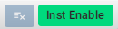

= FlowStorm debugger User's Guide
:source-highlighter: rouge
:author: By Juan Monetta
:lang: en
:encoding: UTF-8
:doctype: book
:toc: left
:toclevels: 4
:sectlinks:
:sectanchors:
:leveloffset: 1
:sectnums:

FlowStorm is a tracing debugger for Clojure and ClojureScript.

It can instrument any Clojure code and provides many tools to explore and analyze your programs executions.

== Quick start

Before you start check FlowStorm minimum requirements.

[IMPORTANT]
.Minimum requirements
====
	- jdk >= 11
	- Clojure >= 1.10.0
====

=== Clojure

If you use https://clojure.org/guides/deps_and_cli[clojure cli] you can start a repl with FlowStorm dependencies loaded like this :

[,bash]
----
clj -Sdeps '{:deps {com.github.jpmonettas/flow-storm-dbg {:mvn/version "RELEASE"} com.github.jpmonettas/flow-storm-inst {:mvn/version "RELEASE"}}}'
----

If you are a https://leiningen.org/[lein] user add both dependencies to your project.clj `:dependencies` and run `lein repl`.

Then require the api namespace and start the debugger :

[,clojure]
----
user> (require '[flow-storm.api :as fs-api]) ;; the only namespace you need to require

user> (fs-api/local-connect) ;; will run the debugger GUI and get everything ready
----

You should now see a empty debugger window.

Lets debug something :

[,clojure]
----
user> #rtrace (reduce + (map inc (range 10))) ;; #rtrace will instrument and run some code
----

image::user_guide_images/quick_start.png[]

After running it, you should get the return value of the expression (as if #rtrace wasn't there) and the debugger
should show the executed form. You can go ahead and use the stepping controls to step over the code.

Now you are sure everything works move on and explore the many features FlowStorm provides. There are many ways of instrumenting
your code, and many ways to explore its executions.

=== ClojureScript

Debugging ClojureScript is a case of remote debugging in FlowStorm. This means the debugger
will run in a separate process and connect to the debuggee by connecting to a ClojureScript repl.

For enabling every debugger feature, remote connections needs a repl. If you don't connect to a repl you
can still use the debugger but you will have to call `flow-storm.api/remote-connect` by hand on your app.

[NOTE]
.Repl connection limitations
====
Currently only shadow-cljs repl over nrepl is supported.
====

Lets say you are using https://github.com/thheller/shadow-cljs[shadow-cljs] to start a ClojureScript repl.

First you need to add FlowStorm dependency to your project dependencies, like this :

[,bash]
----
$ cat shadow-cljs.edn

{...
 :dependencies [... [com.github.jpmonettas/flow-storm-inst "RELEASE"]]
 :nrepl {:port 9000}
 ...} 
----

Then lets say you start your repl like :

[,bash]
----
npx shadow-cljs browser-repl

shadow-cljs - config: /home/jmonetta/demo/shadow-cljs.edn
shadow-cljs - server version: 2.19.0 running at http://localhost:9630
shadow-cljs - nREPL server started on port 9000
[:browser-repl] Configuring build.
[:browser-repl] Compiling ...
[:browser-repl] Build completed. (127 files, 0 compiled, 0 warnings, 6.19s)

cljs.user=> 
----

As you can see from the output log shadow-cljs started a nrepl server on port 9000, this is the port FlowStorm needs to connect to,
so to start the debugger and connect to it you run :

[,bash]
----
clj -Sdeps '{:deps {com.github.jpmonettas/flow-storm-dbg {:mvn/version "RELEASE"}}}' -X flow-storm.debugger.main/start-debugger :port 9000 :repl-type :shadow :build-id :browser-repl
----

And that is all you need, the debugger GUI will pop up and everything will be ready.

Try tracing some code from the repl :

[,clojure]
----
cljs.user> #rtrace (reduce + (map inc (range 10))) ;; #rtrace will instrument and run some code
----

After running it, you should get the return value of the expression (as if #rtrace wasn't there) and the debugger
should show the executed form. You can go ahead and use the stepping controls to step over the code.

Now you are sure everything works move on and explore the many features FlowStorm provides. There are many ways of instrumenting
your code, and many ways to explore its executions.

If you are not using a repl or the repl you are using isn't supported by FlowStorm yet you can still use the debugger
but not all features will be supported (mainly the browser features).

For this you can start the debugger like before but without any parameters, like this :

[,bash]
----
clj -Sdeps '{:deps {com.github.jpmonettas/flow-storm-dbg {:mvn/version "RELEASE"}}}' -X flow-storm.debugger.main/start-debugger
----

And then go to your app code and call `(flow-storm.api/remote-connect)` maybe on your main, so everytime your program starts
will automatically connect to the repl.

[NOTE]
.ClojureScript environments
====

FlowStorm is supported for ClojureScript in :

		  - Browsers
		  - NodeJS
		  - React native
====

[NOTE]
.NodeJs and react-native
====
On NodeJs and react-native you need to install the `websocket` library.
Do this by running `npm install websocket --save`
====

[NOTE]
.App initialization debugging
====
If you need to debug some app initialization, for adding `#trace` tags before the debugger is connected you
will have to require flow-storm.api yourself, probably in your main. All the tarcing will be replayed to the debugger
once it is connected.
====

== Starting the debugger

FlowStorm can run in local or remote mode. Running in local mode will start the debugger
in the same process (which is faster), while running in remote mode means running the debugger in a separate
process and connect to it from the debuggee via sockets.

=== Local debugging

For running FlowStorm locally you need both dependencies in your project :

- com.github.jpmonettas/flow-storm-inst
- com.github.jpmonettas/flow-storm-dbg

You can then start it from your repl like :

[,clojure]
----
user> (require '[flow-storm.api :as fs-api]) 

user> (fs-api/local-connect) 
----

[NOTE]
.Shutdown
====
You can stop the debugger grecefully by calling `(fs-api/stop)`
====

=== Remote debugging

You can remotely debug any Clojure application the exposes a nrepl server to it by running :

[,bash]
----
clj -Sdeps '{:deps {com.github.jpmonettas/flow-storm-dbg {:mvn/version "RELEASE"}}}' -X flow-storm.debugger.main/start-debugger :port 9000
----

assuming your nrepl server is listening on port 9000.

== Instrument code

Code instrumentation in FlowStorm is done by rewriting your code in a way that doesn't change its behavior
but when executed it will trace everything the code is doing.

You can instrument code from the <<#_browser_tool,browser tool>> or the repl.

=== Instrument from the repl

==== Instrument any form with #trace

You can instrument any top level form at the repl by writing `#trace` before it, like this :

[,clojure]
----
#trace
(defn sum [a b]
  (+ a b))
----

and then evaluating the form.

important:: `#trace` is meant to be used with forms that don't run immediately, like: defn, defmethod, extend-type, etc.
Use `#rtrace` to trace and run a form, like `#rtrace (map inc (range 10))`.

==== Run code with #rtrace

`#rtrace` is useful in two situations :

First, when instrumenting and running a simple form at the repl, like:

[,clojure]
----
#rtrace (-> (range) (filter odd?) (take 10) (reduce +))
----

Second, when you want to run a form with a certain flow id (see <<#_flows_tool,flows>>).

`#rtrace` by default will instrument and run the form with flow id 0, but you can use
`#rtrace0`, `#rtrace1`, `#rtrace2`, `#rtrace3`, `#rtrace4`, `#rtrace5` to trace with flows ids [0..5].

==== Conditional tracing with #ctrace

Some times you need to debug a function that is being constantly called many times per second, like in a game loop.

Adding a `#trace` on this functions will make it generate too many traces and everything will get slow.

In most of this cases you probably don't want to trace absolutely everything, but are probably interested in executions under
certain conditions. This is what `#ctrace` is for.

`#ctrace` is exactly like `#trace` but with the difference that you can control when tracing will be disable/enable
by the use of `^{trace:/when ...}` meta.

For example :

[,clojure]
----
#trace
(defn called-many-times [a]
  (+ a 10))

#ctrace
(defn foo []
  (->> (range 10000)
       (map (fn sc [i]
              ^{:trace/when (<= 2 i 4)}
              (called-many-times i)))
       (reduce +)))

(foo) ;; => 50095000
----

If you take a look at the <<#_call_stack_tree_tool, call stack tree>> you will see :

image::user_guide_images/ctrace_example.png[]

Notice that we only added `#ctrace` to the function that needs to control trace disabling, the rest of the
functions can be instrumented normally.

==== Instrument namespaces

FlowStorm allows you to instrument entire namespaces by providing `flow-strom.api/instrument-forms-for-namespaces`.

You call it like this :

[,clojure]
----
(instrument-forms-for-namespaces #{"org.my-app.core" "cljs."} {})
----

The first argument is a set of namespaces prefixes to instrument. In the previous example it means
instrument all namespaces starting with `org.my-app.core`, and all starting with `cljs.`

The second argument is a map supporting the following options :

- `:excluding-ns` a set of strings with namespaces that should be excluded
- `:disable` a set containing any of #{`:expr` `:binding` `:anonymous-fn`} useful for disabling unnecessary traces in code that generate too many
- `:verbose?` when true show more logging

==== What can't be instrumented?

This are some limitations when instrumenting forms :

1. Very big forms can't be fully instrumented. The Clojure compiler has a limit on the size of the form it can process, and instrumentation adds a lot of code.
When instrumenting entire namespaces, if you hit this limit on a form a warning will printed on the console saying `Instrumented expression is too large for the Clojure compiler`
and FlowStorm automatically tries to instrument it with a lighter profile, by disabling some instrumentation.

2. Functions that call recur without a loop

3. Functions that return recursive lazy sequences. Like `(fn foo [] (lazy-seq (... (foo))))`

==== Un-instrument code

Un-instrumenting code that has been instrumented with `#trace` or `#ctrace` is straight forward, just remove the tag and re evaluate the form.

To un-instrument entire namespaces you can use `flow-storm.api/uninstrument-forms-for-namespaces` which accept a set of namespaces prefixes.

=== Instrument with the browser

Most of the time you can instrument code by just clicking in the browser. The only exceptions are functions that were just defined in the repl
and weren't loaded from a file. 

==== Instrument vars

Using the browser you can navigate to the var you are interested in and then use the instrument button to instrument it.

image::user_guide_images/browser_var_instrumentation.png[]

==== Instrument namespaces

Using the browser you can also instrument multiple namespaces. Do this by selecting the namespaces you are interested in
and then a right click should show you a menu with two instrumentation commands.

image::user_guide_images/browser_ns_instrumentation.png[]

- `Instrument namespace :light` (disables expressions, bindings, and anonymous functions instrumentation)

- `Instrument namespace :full` fully instrument everything

Light instrumentation is useful when you know the functions generate too many traces, so you can opt to trace just functions
calls and returns. You can then <<#_fully_instrument_a_form_from_the_code_view, fully instrument>> whatever functions you are interested in.

==== Un-instrument code

The bottom panel shows all instrumented vars and namespaces.

image::user_guide_images/browser_uninstrument.png[]

You can un-instrument them temporarily with the enable/disable checkbox or
permanently with the del button.

=== Fully instrument a form from the code view

image::user_guide_images/fully_instrument_form.png[]

If you have instrumented a form with the <<#_instrument_namespaces_2, :light profile>> you can fully instrument it by right clicking on the current form
and then clicking `Fully instrument this form`.

== Flows tool

The `Flows` tab contains a bunch of tools for analyzing all traced executions flows.

Flows are identified by a flow-id and can be started by running a form with `#rtrace`, `#rtrace1`, `#rtrace2`, etc,.
If you run a flow twice with the same flow id, the first one is going to be replaced.

A flow will happen in one or more threads. A separate tab will show for each thread.

For example if we trace a form that spawns multiple threads :

[,clojure]
----
#rtrace (-> (pmap (fn [i] (* i i)) (range 5)))
----

image::user_guide_images/thread_outer_form.png[]

there will be one thread for the `(-> (pmap ... (range 5)))` form,

image::user_guide_images/thread_inner_form.png[]

and probably one thread for each `(fn [i] (* i i))`.

Since `clojure.core/pmap` is backed by a thread pool, can happen that less than 5 threads are shown, in which case they will accumulate inside the same thread tab.

Anything instrumented that isn't run under #rtrace will end up in the funnel flow, which accumulates all traces that don't contain any flow-id.

image::user_guide_images/funnel_flow.png[]

=== Code tool

image::user_guide_images/code_tool_tab.png[]

The code tool is the first of the `Flows` tab. It provides most of the functionality found in a traditional debugger.
You can use it to step over each expression, visualize values, locals and more.

==== Code stepping

image::user_guide_images/controls.png[]

The numbers at the end show `current_trace_index / total_traces`.

Write any number (less than total_traces) on the text box to jump into that position in time. When jumping around you can write down any interesting
positions you find and then use the text box to jump back to it if you need.

The code tool allows you to step and "travel thought time" in two ways:

- You can use the controls at the top to move one step at a time.

- Or you can click on the highlighted forms to position the debugger at that point in time.

Only the forms that were executed at least once for the flow and thread will be highlighted.

When clicking on a highlighted form two things can happen :

	 - If the form was executed only once for the current frame, the debugger will immediately jump to it.
	 - Else if the form was executed multiple times, a context menu will show all the values that form evaluated to, sorted by time,
	 and clicking on them will make the debugger jump to that specific point in time. This is useful for debugging loops.

image::user_guide_images/loops.png[]

==== Exception debugging

Lets say you just run a instrumented piece of code and an exception bubbled up. One thing you can do to locate the source of the exception
is to click the last trace button, it will move the debugger to the last trace captured for the thread, which almost always point to the expression evaluated before the exception was thrown.

==== Locals

The locals panel will always show the locals bounded for the current point in time.

image::user_guide_images/locals.png[]

Right clicking on them will show a menu where you can :

	  - define the value with a name, so you can use it at the repl
	  - inspect the value with the <<#_value_inspectors,value inspector>>

==== Value inspectors

Value inspectors show in many places in FlowStorm.

image::user_guide_images/value_inspector.png[]

The value inspector in the code tool always display a pretty print of the current expression value.

You can configure the print-level and print-meta for the pretty printing by using the controls at the top.

===== Define value for repl

Use the `def` button to define a var pointing to the current inspector value.

Choose a name for the var in the dialog that pops up and it will be created under the `user` namespace in Clojure and under `js` globals in ClojureScript.

==== Re running a flow

Every time you run a form with #rtrace FlowStorm keeps a copy of the form. You can use the re-run-flow button after instrumenting or un-instrumenting code,
since it allows you to re run the form with a single click.

=== Call Stack tree tool

The call stack tree tool is the second one of the `Flows` tab. It allows you to see the execution flow by expanding its call stack tree.

image::user_guide_images/callstack_tool_tab.png[]

The call stack tree is useful for a high level overview of a complex execution and also as a tool for quickly moving through time.
You can jump to any point in time by right clicking on any node and then clicking in `Goto trace`. 

image::user_guide_images/callstack_tree.png[]

[NOTE]
.Tree refreshing
====
If FlowStorm keeps receiving traces for the thread you are analyzing, it will keep building the tree but will not automatically refresh its visuals.
You can use the refresh button at the root to update it.
====

There are also two <<#_value_inspectors,value inspectors>> at the bottom that show the arguments and return value for the currently selected function call.

==== Searching

You can search over function names and a string serialization of the arguments using the search tool at the top.

`*print-level*` controls how deeply it will serialize the arguments it will search over.

Use `From index` if you don't want to search from the beginning. It will be automatically set after each match so it is easy to keep searching forward.

If the search is taking too long you can always cancel it by hitting `Ctrl-g` on the keyboard. You can always make your search faster by choosing a
lower value for `*print-level*` or by <<#_un_instrument_code_2,un-instrumenting>> unnecessary code so you have less information to search over.

image::user_guide_images/search_match.png[]

Once you have a search match the tree will auto expand but not auto scroll. If the expansion is big you will have to manually
scroll down and use the blue link at the top to help you locate the match.

=== Functions tool

The functions tool is the third one of the `Flows` tab.

image::user_guide_images/functions_tool_tab.png[]

It shows a list of all traced functions sort by how many times the have been called.

image::user_guide_images/functions.png[]

Normal functions will be colored black, multimethods magenta and types/records protocols/interfaces implementations in green.

Together with the <<#_call_stack_tree_tool, call stack tree>> provide a high level overview of a flow thread execution and allows you to
jump through time much quicker than single stepping.

You can search over the functions list by using the bar at the top.

==== Show function calls

Double clicking on any function will display all function calls on the right sorted by time. Each line will show the arguments vector
for each call, and you can use the check boxes at the top to hide some of them.

image::user_guide_images/function_calls.png[]

Double clicking on any item in the functions call list will move the debugger to that specific point in time.

==== Un-instrumenting functions

Since the functions tool shows all the functions sorted by how many time they have been called it is a good tool to
see where most of your traces are coming from. If you want to reduce the number of traces, to make lets say, search faster,
you can right click on any function to un instrument it. You will have to <<#_re_running_a_flow,re run the flow>> after.

== Browser tool

The browser tool is pretty straight forward. It allows you to navigate your namespaces and vars, and also instrument/un-instrument them.

image::user_guide_images/browser.png[]

See <<#_instrument_with_the_browser, instrument with the browser>> for more info.

== Taps tool

Use the taps tool to visualize your `tap>`.

image::user_guide_images/taps.png[]

Every time you (local-connect) or (remote-connect) FlowStorm will add a tap, so whenever you `tap>` something
it show in the taps list.

Double click on any value to start the value inspector for it.

A `#tap` tag will also be available, which will tap and return so you can use it like `(+ 1 2 #tap (* 3 4))`
Use the `clear` button to clear the list.

== Value inspector

Use the value inspector to explore any data.

image::user_guide_images/value_inspector.png[]

Use it to lazily and recursively navigate your data. It will render collections with links that allows you
to dig deeper into the data.

The top bar provides a way of navigating back.

Use the `def` button to define the current value for the repl.

[NOTE]
.Datafy
====
Value inspector uses `clojure.datafy/datafy` under the hood, so you can explore your objects also.
====

== The tool bar

The toolbar provides quick access to some general commands :

From left to right :

- Clean all. Will clean all flows, taps and every value the debugger is retaining.
- Cancel current running task. If the debugger is taking too long with something and you want to cancel it use this button.

== Debug cmd line programs (clj -X, clj -m, etc)

If you run any Clojure programs from the command line, by using `clj -X ...`, `clj -m ...` etc, 
you can use `flow-storm.api/cli-run` as a trampoline, to start a debugger, instrument everything you are interested in an then
run you original command.

As an example, lets say you are compiling ClojureScript code like this :

[,bash]
----
clj -Sdeps '{:deps {org.clojure/clojurescript {:mvn/version "1.11.57"}}}' \
    -M -m cljs.main -t nodejs ./org/foo/myscript.cljs
----

you can then run and debug the execution of the same command like this :

[,bash]
----
clj -Sdeps '{:deps {org.clojure/clojurescript {:mvn/version "1.11.57"} com.github.jpmonettas/flow-storm-dbg {:mvn/version "RELEASE"} com.github.jpmonettas/flow-storm-inst {:mvn/version "RELEASE"}}}' \
	-X flow-storm.api/cli-run :instrument-ns '#{"cljs."}'           \
                              :profile ':light'                     \
                              :require-before '#{"cljs.repl.node"}' \
							  :excluding-ns '#{"cljs.vendor.cognitect.transit"}' \
                              :fn-symb 'cljs.main/-main'            \
                              :fn-args '["-t" "nodejs" "./org/foo/myscript.cljs"]';
----

== Programmable debugging

FlowStorm gives you full access to its internal indexes from the repl so you can write programs to analyze your traces if whats provided by the GUI is not
enough.

Lets say you have traced some code and now you want to analyze the traces from the repl, this are some examples :

[,clojure]
----
(require '[flow-storm.runtime.indexes.api :as index-api]) ;; first require the index-api

(index-api/print-threads) ;; you can print all threads
(index-api/print-forms) ;; print all traced forms
(index-api/select-thread 0 16) ;; select the flow-id and thread-id, so you don't need to be constantly typing it
----

=== Example 1 

Collect all the types information for parameters that flow into a function

[,clojure]
----
(defn fn-signatures [fn-ns fn-name]
  (let [[flow-id thread-id] @index-api/selected-thread
        {:keys [frame-index]} (index-api/get-thread-indexes flow-id thread-id)
        frames (frame-index/timeline-frame-seq frame-index)
        signature-types (->> frames
                             (reduce (fn [coll-samples frame]
                                       (if (and (= fn-ns (:fn-ns frame))
                                                (= fn-name (:fn-name frame)))

                                         (conj coll-samples (mapv type (:args-vec frame)))

                                         coll-samples))
                                     #{}))]
    signature-types))

(fn-signatures "dev-tester" "factorial")
(fn-signatures "dev-tester" "other-function")
----

=== Example 2

Visualization lenses over traces. Say I have a loop-recur process in which I am computing
new versions of an accumulated data structure, but I want to see only some derived data
instead of the entire data-structure (like, a visualization based on every frame of the loop).

Lets say we stepped with the debugger to index 109 (some expression inside a loop),
and we want to work with all the values for that coordinate from the repl, then you can :

[,clojure]
----
(defn frame-similar-values [idx]
  (let [[flow-id thread-id] @index-api/selected-thread
        {:keys [frame-index]} (index-api/get-thread-indexes flow-id thread-id)
        {:keys [expr-executions]} (frame-index/frame-data frame-index idx)
        {:keys [coor]} (frame-index/timeline-entry frame-index idx)]

    (->> expr-executions
         (reduce (fn [coll-vals expr-exec]
                   (if (= coor (:coor expr-exec))
                     (conj coll-vals (:result expr-exec))
                     coll-vals))
                 []))))

(frame-similar-values 109) ;; get all the values
----

=== Example 3

Create a small stepper for the repl

[,clojure]
----
(require '[flow-storm.debugger.form-pprinter :as form-pprinter]) ;; a helper for pprinting forms with highlighted parts

(def idx (atom 0)) ;; the state of our debugger, where we are in the timeline

(defn show-current []
  (let [[flow-id thread-id] @index-api/selected-thread
        {:keys [coor form-id result]} (index-api/timeline-entry flow-id thread-id @idx)
        {:keys [form/form]} (index-api/get-form flow-id thread-id form-id)]
    (when coor
      (form-pprinter/pprint-form-hl-coord form coor)
      (println "\n")
      (println "==[VAL]==>" (utils/colored-string result :yellow)))))

(defn step-next []
  (swap! idx inc)
  (show-current))

(defn step-prev []
  (swap! idx dec)
  (show-current))

;; use the debugger with

(index-api/print-threads)
(index-api/select-thread 0 16)

(step-next)
(step-prev)
----

== Styling and theming

All functions that start the debugger ui (`flow-storm.api/local-connect`, `flow-storm.debugger.main/start-debugger`) accept a map
with the `:styles` and `:theme` keywords. If `:styles` points to a css file it will be used to overwrite the default styles, in case you 
want to change colors, make your fonts bigger, etc. `:theme` could be one of `:auto` (default), `:light`, `:dark`.

Like this :

[,clojure]
----
user> (local-connect {:styles "~/.flow-storm/big-fonts.css" :theme :dark})
----

You can overwrite all the styles defined here https://github.com/jpmonettas/flow-storm-debugger/blob/master/resources/styles.css

== Key bindings

- `Ctrl-g` Cancel any long running task (only search supported yet)
- `Ctrl-l` Clean all debugger state
- `Ctrl-d` Toggle debug-mode. Will log useful debugging information to the console.

== Tutorials and demos

- Presentation at London Clojurians https://www.youtube.com/watch?v=A3AzlqNwUXc
- Flows basics https://www.youtube.com/watch?v=YnpQMrkj4v8
- Instrumenting libraries https://youtu.be/YnpQMrkj4v8?t=332
- Debugging the ClojureScript compiler https://youtu.be/YnpQMrkj4v8?t=533
- Browser https://www.youtube.com/watch?v=cnLwRzxrKDk
- Def button https://youtu.be/cnLwRzxrKDk?t=103
- Conditional tracing https://youtu.be/cnLwRzxrKDk?t=133

== Troubleshooting

=== Instrument verbose

By default functions like `flow-storm.api/instrument-form-for-namespaces` will not print warnings on the console. You can log extra information
by providing `:verbose? true` to the options map.

=== Run verbose

`#rtrace form` just expands to `(flow-storm.api/runi {} form)`.

The first argument is a options map, which accepts `:verbose? :true`, in which case FlowStorm will print to the console tracing stats.

Is useful when you have instrumented a big application and wish to see tracing progress while running.

== Internals, diagrams and documentation

- https://github.com/jpmonettas/flow-storm-debugger/tree/master/docs/high_level_diagram.pdf
- https://github.com/jpmonettas/flow-storm-debugger/tree/master/docs/form_instrumentation.pdf
- https://github.com/jpmonettas/flow-storm-debugger/tree/master/docs/data_structures.pdf
									   
